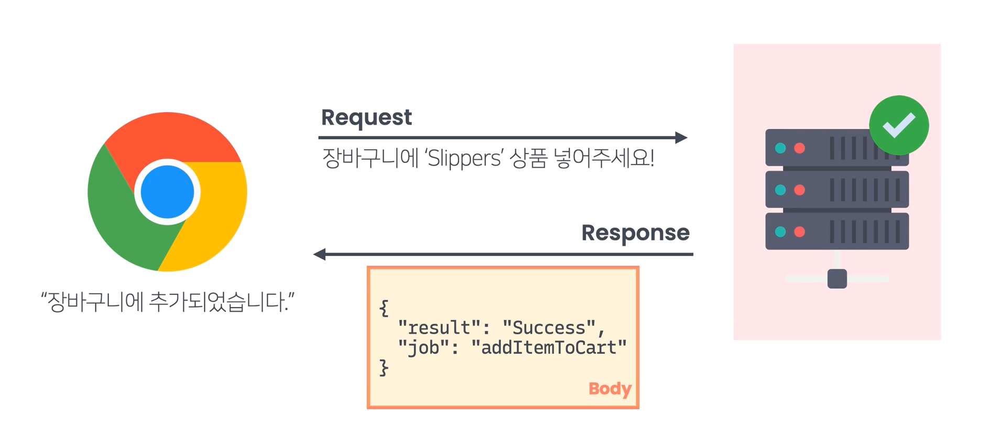

# Express

서버는 사실 두 종류로 나눠진다.  

- 
  - API 서버(많은 API서버들은 Json형식을 사용한다)


# Express 사용해 보기. 

- `npm init`, `npm install express`


# 리소스란?

서버에 존재하는 수 많은 정보들을 모두 리소스 라고 한다. 

- 온라인 쇼핑몰의 각종 정보나 주문 내역 등 모두. 
- 리소스 조회한다. 추가한다. 갱신한다. 삭제한다. => 모두 서버에서 어떤 정보 처리하는 과정. 


# 미들웨어는 하나의 함수이다. 

이전 영상에서 저는

```jsx
const express = require('express');
const app = express();

let members = require('./members');

app.use(express.json()); // 추가된 미들웨어

app.get('/api/members', (req, res) => {
  const { team } = req.query;
  if (team) {
    const teamMembers = members.filter((m) => m.team === team);
    res.send(membersInTheTeam);
  } else {
    res.send(members);
  }
});

~~~
```

첫 번째 라우트 핸들러를 등록하는 코드 이전(get 메소드 등장 이전)에

```jsx
app.use(express.json());
```

이런 코드를 추가함으로써,

- 리퀘스트의 바디에 들어있는 JSON 데이터를
- req 객체의 body 프로퍼티에 설정하도록 했습니다.

이때 express의 `json` 메소드는 미들웨어를 리턴하는 메소드이고, 미들웨어란 리퀘스트를 처리하는 기능을 하는 함수라고 했었는데요. express의 `json`이라는 메소드는 도대체 어떤 미들웨어(함수)를 리턴하는 걸까요? 직접 코드를 파헤치며 살펴봅시다.

사실 express는 그 코드가 GitHub라고 하는 곳에 공개된 오픈 소스 프로젝트입니다.(GitHub가 뭔지 궁금한 분들은 [이 링크](https://www.codeit.kr/learn/courses/version-control-with-git/2882)를 참조하세요. 따라서 그 내부 코드를 직접 살펴볼 수 있는데요. 그곳에서 express의 `json` 메소드를 찾아봅시다. express 패키지가 관리되고 있는 [GitHub 페이지](https://github.com/expressjs/express)로 갑시다.


정말 다양한 파일들이 보이죠? 이 중에서

```jsx
const express = require('express');
```

이 코드가 실행될 때 실제로 참조되는 파일인 **index.js** 파일을 봅시다. (이 코드가 express 패키지의 **index.js** 파일을 참조하는 건지 이해가 안 되시면 'Node.js 기본기' 토픽의 [모듈 검색 순서](https://www.codeit.kr/learn/3732) 레슨을 참고하시면 됩니다.)

자, **index.js** 파일을 잠깐 볼까요?


**index.js** 파일은 그냥 단순하게, lib라는 디렉토리 안에 있는 express라는 파일에서 공개하는 것을 받아서 그대로  공개하네요. 해당 파일을 봐야할 것 같습니다. **lib/express.js** 파일을 열어서 그 상단 부분을 보면


이 파일에서는 `createApplication`라는 함수를 공개하고, `createApplication` 함수는 실행될 때 `app`이라는 함수를 리턴한다는 것을 알 수 있습니다. 그러니까 결국 제가 코드에서

```jsx
const express = require('express');
const app = express();
```

`app` 객체라고 불렀던 것은 결국 `app`이라는 함수였던 겁니다. 스크롤을 좀더 내려보면


이런 식으로 `createApplication` 함수에(바로 이전 이미지에 나와 있는 것처럼 `exports`는 `createApplication` 함수를 가리킵니다) `json`이라는 프로퍼티를 설정하고 있는데요. 그래서 우리가 코드에서

```jsx
app.use(express.json());
```

이라고 쓸 수 있었던 겁니다. 그렇다면 지금 `json` 프로퍼티에 설정된 `bodyParser.json`이라는 건 뭘까요?

지금 보이는 bodyParser는 사실 express 패키지 내부에 있는 객체가 아닙니다. express 패키지가 의존하고 있는 다른 패키지에 존재하는 객체인데요. 잠깐 express 패키지의 package.json 파일을 살펴보면,


이렇게 dependencies 즉, 이 패키지가 의존하고 있는 패키지 중에 body-parser라는 패키지가 있다는 걸 알 수 있습니다. 이 패키지를 봐야 json 함수의 정체를 알 수 있을 것 같죠? [body-parser 패키지의 정보](https://www.npmjs.com/package/body-parser)를 npm 사이트에서 찾아보겠습니다.


설명을 읽어보면 서버로 들어오는 리퀘스트가 (라우트) 핸들러(handler)들에 도달하기 전에 리퀘스트의 바디를 파싱(parsing)해주는 기능을 가진 패키지라는 걸 나타내고 있습니다. 라우트 핸들러가 뭔지 다시 복습하자면

```jsx
app.get('/api/members', async (req, res) => {
  const { team } = req.query;
  if (team) {
    const teamMembers = await Member.findAll({ where: { team } });
    res.send(teamMembers);
  } else {
    const members = await Member.findAll();
    res.send(members);
  }
});
```

특정 path를 대상으로 한, 특정 메소드를 가진 리퀘스트를 처리해주는 함수를 의미합니다. 여기서는 async로 시작되는 함수가 라우트 핸들러인 거죠. 그러니까 body-parser 패키지는 리퀘스트가 라우트 핸들러에 의해 처리되기 전에 리퀘스트의 바디에 관한 전처리(preprocessing) 기능을 갖고 있는 패키지라고 생각하시면 됩니다. 좀더 설명을 읽어보면 body-parser에는 JSON 형식의 데이터를 파싱하는 기능도 있음을 알 수 있습니다. 자, 이제 화면 우측의 GitHub 링크를 클릭해서 body-parser 패키지를 살펴봅시다.


body-parser 패키지에도 여러 디렉토리와 파일들이 들어있는데요.


여기서도 마찬가지로 **index.js** 파일을 볼게요. 파일 중간을 보면 이렇게 생긴 코드가 있습니다.


일단 `exports`가 가리키는 객체가 공개되고 있고, 그 아래 보이는, `Object.defineProperty`로 시작되는 코드는 `exports` 객체에 `json`이라는 프로퍼티를 설정하는 코드입니다. 지금 `defineProperty` 메소드의 세 번째 아규먼트로 들어온 객체는 json이라는 프로퍼티 자체가 가질 속성들인데요. 여기서 `get`이라는 부분은 나중에 이 프로퍼티에 접근할 때 실행될 **getter 함수**를 의미합니다. 혹시 **getter 함수**에 관해서 궁금한 분들은 [이 링크](https://www.codeit.kr/learn/courses/javascript-intermediate/4461)를 참조하세요.

결국 결론은 이렇습니다. `express.json`은 `bodyParser.json`을 의미하고 그것은 지금 보이는 `createParserGetter('json')`의 리턴값을 가리킵니다. 그럼 `createParserGetter('json')`는 무엇을 리턴하는지 알아봅시다. `createParserGetter` 함수도 같은 파일 안에 들어있는데요.


이 `createParserGetter` 함수는 `get`이라는 함수를 리턴하네요. 이 `get`이라는 함수는 다시 `loadParser` 함수의 리턴 결과를 리턴합니다. `loadParser` 함수도 그 밑에 있습니다. `loadParser`에 문자열 'json'을 넣고 실행하면 또다른 파일에서 가져온 `parser`를 `parsers` 객체에 설정하고 `parser`를 리턴합니다. 자, 거의 다 했습니다. 조금만 더 가봅시다. 지금 코드에 보이는 **./lib/types/json** 파일로 가보겠습니다. 자, 이 파일은 `json`이라는 함수를 리턴하고 있습니다. 그리고 `json` 함수는 결국 `jsonParser`라는 함수를 리턴합니다.


결론적으로 우리가 코드에서 봤던 `express.json()` 이 부분은 지금 보이는 `jsonParser`라고 하는 함수를 리턴하는 부분이었던 겁니다. 그러니까

```jsx
app.use(express.json());
```

이 코드는

```jsx
app.use(jsonParser); 
```

이거였다는 뜻이죠. 바로 이 `jsonParser`가 제가 말했던 미들웨어입니다. 잠깐 `jsonParser` 함수의 파라미터 부분에 주목해봅시다.

```jsx
function jsonParser (req, res, next) {
...
}
```

`req, res, next`라는 3개의 파라미터가 보이는데요. 미들웨어에 해당하는 함수는 보통 이렇게 3개의 파라미터를 받습니다. 이 파라미터들로 넘어오는 객체들을 활용해서 미들웨어는 리퀘스트에 관한 처리를 수행하고 리퀘스트를 그 다음 미들웨어나 그 다음 핸들러로 넘겨줍니다. 마지막 `next` 파라미터로 넘어오는 함수를

```jsx
function jsonParser (req, res, next) {
..
  next();
}
```

이런 식으로 마지막에 호출하면 리퀘스트를 다음 미들웨어나 라우트 핸들러로 넘길 수 있는데요. 이 부분은 미들웨어의 중요한 특징이니까 잘 기억해둡시다.

정확히 어떤 방식으로 리퀘스트의 바디를 처리하고 다음 미들웨어나 핸들러로 넘겨주는지는 여기서 더 깊은 내용들을 배워야 합니다. 그 부분은 이번 레슨의 범위를 벗어나니까 생략할게요. 혹시 관심이 있는 분들은 `json` 함수가 있는 [이 파일](https://github.com/expressjs/body-parser/blob/master/lib/types/json.js)에서부터 직접 분석해보세요!

이번 노트에서는 미들웨어라는 것이 라우트 핸들러 이전에 리퀘스트를 받아서 처리하는 함수라는 것을 코드로 직접 확인했습니다. 미들웨어는 나중에 좀더 깊게 다뤄볼 시간이 있을 겁니다. 일단 그 전까지는 이 정도 사실만 기억하고 넘어갑시다.


# package.json 명령어

```js
"scripts": {
    "start": "node app.js",
    "dev": "nodemon app.js"
  },
```

start는 node에 미리 정의된 명령어 이지만, dev는 아니다. 

`npm run dev` 로 실행해야 한다. 