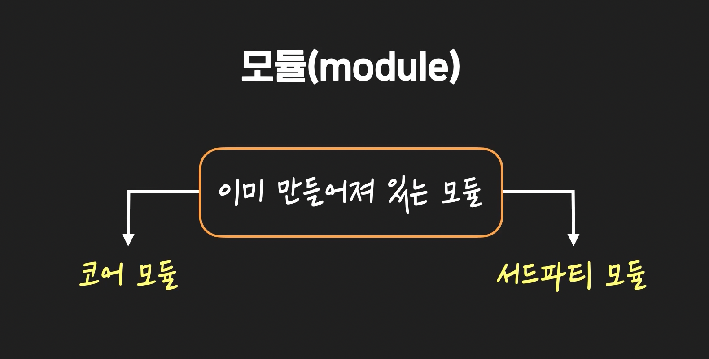
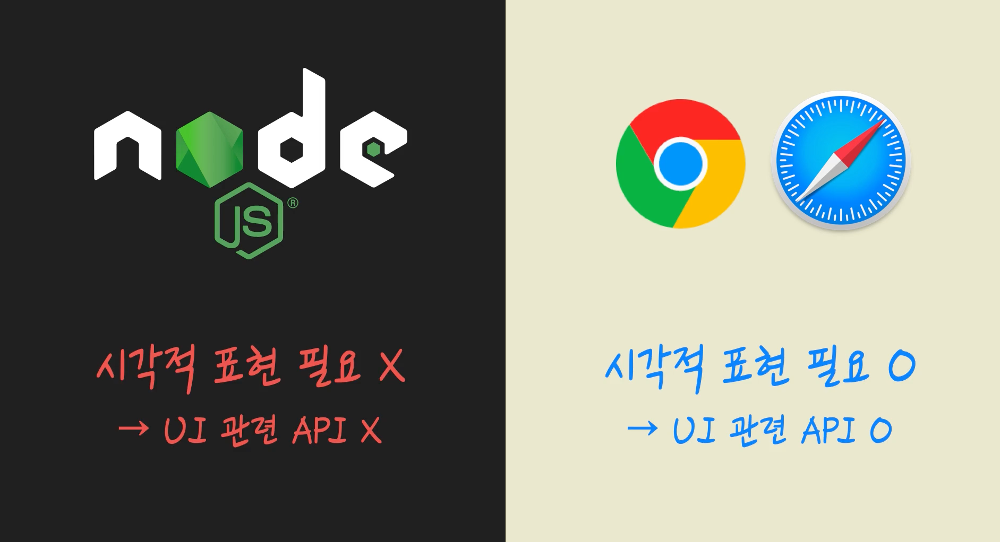
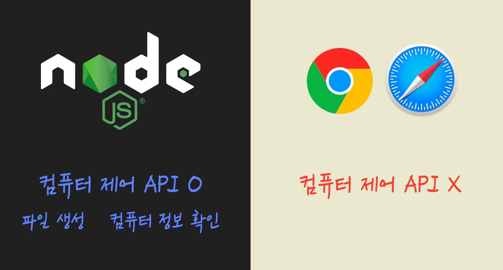
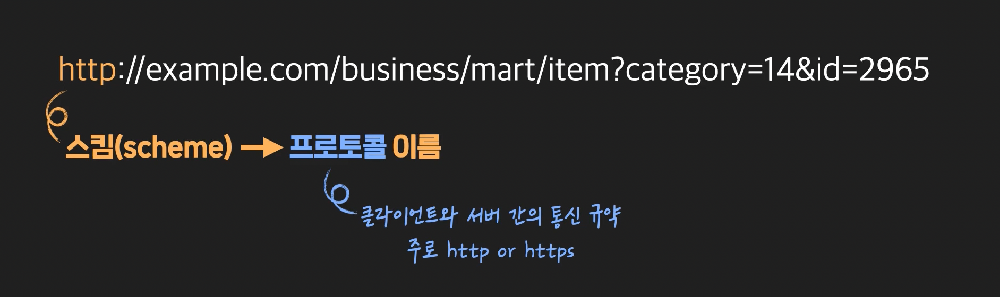

# Node.js

오늘날 하나의 웹사이트나 앱(Application)을 만들 때는, 아무것도 없는 상태에서 바로 코드를 작성하기보다는 **'프레임워크'**를 사용하는 경우가 많습니다. **프레임워크**란 '일정한 틀을 갖고 있어서, 개발자가 특정 부분만 원하는 모습대로 채워 넣으면, 프로그램을 완성할 수 있게 해주는 준비된 코드 체계'를 의미하는데요. '프레임워크'라는 단어가 이밖에 다른 의미를 가질 때도 있지만 일단 이 노트에서는 이런 의미로 사용하겠습니다.

프레임워크 덕분에 우리는 다양한 서비스를 더 빠르고 안정적으로 개발할 수 있는데요. 예를 들어, Java 기반의 **Spring**, Python 기반의 **Django** 같은 프레임워크들이 존재하기 때문에 더 빠르고 편하게 개발할 수 있는 것이죠. 그리고 프레임워크마다 그 특성(기술적인 특성, 그것을 둘러싼 개발자 생태계 등)이 다르기 때문에 회사나 개인은, 제공하려는 서비스에 맞는 프레임워크를 골라서 사용하는 것이고요.

**그렇다면 우리가 배울 Node.js는 프레임워크일까요?**  프레임워크의 의미를 어떻게 보느냐에 따라 다르지만, 위에서 말한 의미를 기준으로 생각한다면 Node.js는 프레임워크가 아닙니다.

Node.js는 프레임워크가 아니고, 자바스크립트라는 언어의 '실행 환경'일 뿐입니다. 컴퓨터에 Node.js를 깔고 나서 개발을 시작하려고 하면, '일정한 틀'이라는 게 없습니다. 주어지는 건 단지 Node.js라는 실행 환경일 뿐이고, 그 위에서 '프로그램의 전반적인 구조'를 설계하고 결정하는 건 전부 개발자의 몫이기 때문입니다.

이와 달리 프레임워크의 경우, 일정한 틀이 있기 때문에 개발자는 이 틀에서 개발하면 됩니다. 예를 들어, Django와 같은 프레임워크를 사용하면, MVT 패턴이 적용된 틀 안에서 개발하면 되는데요. MVT 패턴이란 소프트웨어 아키텍처 패턴(Software Architecture Pattern) 중의 하나이고, 소프트웨어 아키텍처 패턴이란 무수히 많은 프로그램들의 다양한 동작 구조들을, 유사한 것들끼리 모으고 분류하여 정리한 여러 개의 패턴들을 의미합니다. MVT 패턴은 그중 하나로, 프로그램 내부에 크게 3가지 구성요소인 Model, View, Template이라는 단위가 존재하고, 이것들이 상호유기적으로 동작하는 패턴입니다. 혹시 MVT 패턴에 대해 좀 더 자세히 알고 싶은 분은 [이 영상](https://www.youtube.com/watch?v=GGkFg52Ot5o)을 참고하세요.

그래서 Django로 개발을 하게 되면, 개발자는 Model, View, Template에 해당하는 각 부분만 코드로 잘 채워넣어주면 됩니다. 그럼 Django 프레임워크가 그것들을 연동시켜서 프로그램이 실행될 수 있게 해줍니다. 즉, Django를 쓰는 개발자는 MVT 패턴이라는 틀의 특정 부분들만을 채워주면 되는 겁니다. 이렇게 일정한 패턴에 의존해서 개발하도록 하는 점은 Django 뿐만 아니라 다른 프레임워크들도 비슷합니다.

이때까지 설명한 내용을 보기 쉽게 표현한다면 다음 이미지와 같습니다.


왼쪽은 Node.js라는 실행환경 위에서, 개발자 본인이 직접 프로그램의 동작 구조를 설계하고 그것을 자바스크립트(.js) 코드로 구현해나가는 모습을 나타낸 이미지입니다. 그리고 오른쪽은 Python 위에서 실행되는, Django 프레임워크의 정해진 틀 내에서 개발하는 모습을 나타낸 건데요. 지금 Django 프레임워크 자체도 파이썬(.py) 코드로 작성되어 있고, 개발자가 직접 채워 넣은 부분들(별표, 세모)도 파이썬 코드로 작성되어 있습니다. 이제 개발자는 물음표 표시가 있는 원 부분만 완성하면 하나의 온전한 프로그램을 완성할 수 있게 되는 겁니다.

왜 Node.js가 프레임워크가 아닌지, 이제 이해가 되나요?

이번 노트에서는 프레임워크가 무엇인지, 왜 Node.js가 프레임워크가 아니라 단순한 실행환경일 뿐인지에 관해서 설명했습니다. 하지만 이 차이를 제대로 실감하려면 Node.js로도 개발을 해보고, Django 같은 프레임워크로도 개발을 해봐야 하는데요. 혹시 관심이 있다면, 코드잇에서 Node.js 토픽들과 Django 토픽들을 수강하셔서 그 차이점을 실감해보시기를 추천합니다.

참고로, 프레임워크의 개념에 관해 더 자세한 설명을 듣고 싶은 분은 ['컴퓨터 개론' 토픽의 영상들](https://www.codeit.kr/learn/courses/intro-to-computer/2570)을 참고하세요.


- 모듈과 비동기

  - 모듈 : 전체를 이루는 부품 하나하나. JS파일 하나가 모듈이다. 

    

이전 영상에서는 **main.js** 모듈에서 **math_tools.js** 모듈의 **add 함수**를 가져와서 사용해봤는데요. 하나의 모듈에서 다른 모듈의 것을 가져다가 쓸 때, 추가로 알아야 할 내용들이 있습니다. 아래의 내용을 꼼꼼하게 읽어보세요.

# 1. 모듈의 확장자인 .js를 꼭 붙이지 않아도 됩니다.

**main.js** 모듈에서 **math_tool.js** 모듈을 로드할 때

```jsx
let m = require('./math-tools.js');
```

이렇게 파일 이름 뒤에 붙은 **.js**라는 확장자까지 전부 적어줬었죠? 하지만 확장자 없이 그냥 파일 이름만 적어줘도 됩니다. 이렇게요.

```jsx
let m = require('./math-tools');
```

main.js 모듈을 이렇게 저장하고 그대로 실행해보세요. 그래도 잘 실행되는 것을 확인할 수 있을 겁니다. 실전에서는 보통 이렇게 확장자를 생략하는 경우도 많으니까 잘 기억해두세요.

# 2. 모듈의 경로를 정확하게 작성해야 합니다.

이전 영상에서는 main.js 모듈과 math_tools.js 모듈이 같은 디렉토리 안에 있었습니다.

```jsx
let m = require('./math-tools.js');
```

그래서 이렇게 **./** 기호로 main.js 모듈을 기준으로, 현재 디렉토리 안의 math_tools.js 모듈이라는 걸 나타냈는데요.

만약 math_tools.js 모듈의 위치가 다른 곳이라면, 경로 표시도 변경해줘야 합니다. 예를 들어 math-tools 모듈이, main.js 파일이 있는 현재 디렉토리의 부모 디렉토리의 modules라는 디렉토리에 있었다고 가정해봅시다. 그럼 이렇게 변경해줘야 합니다.

```jsx
let m = require('../modules/math-tools.js');
```

`..` 은 부모 디렉토리를 나타내는 상대 경로인데요. 이 내용이 궁금하신 분들은 실용적 유닉스 커맨드 토픽에 있는 [절대 경로와 상대 경로](https://www.codeit.kr/learn/4903) 레슨을 참고하시면 됩니다.

require 함수에 인자를 작성할 때는, 로드하고 싶은 모듈의 위치를 잘 확인하고, 정확하게 경로 표시를 해주세요.

# 3. require 함수가 리턴하는 객체는 상수로 대입하는 게 좋습니다.

자바스크립트에서 **변수**(variable)와 **상수**(constant)의 차이는 알고 계신가요?  변수에는 값을 원할 때마다 새롭게 지정해도 되지만, 상수의 경우 값을 한번 설정한 후에는 다른 값을 설정할 수 없는데요.

저는 이전 영상에서 require 함수가 math-tools.js 모듈을 로드해서 리턴한 객체를 m이라는 변수에 대입했습니다.

```jsx
let m = require('./math-tools.js');
```

하지만 require 함수가 리턴한 객체는 변수보다는 상수로 받는 게 좋습니다. 이런 식으로 말이죠.

```jsx
const m = require('./math-tools.js');
```

왜 그런 걸까요? 모듈이 리턴한 객체를 변수로 받으면, 나중에 본인 또는 다른 개발자가 변수 m에 다른 값을 실수로 다시 지정하게 될 수도 있습니다. 이 경우, 그것 자체만으로는 에러가 발생하지 않지만, 의도하지 않은 오류가 발생할 수 있다는 점에서 오히려 더 위험합니다.

하지만 모듈이 리턴한 객체를 상수로 받으면, 상수 m에 새로운 값을 다시 지정하려는 코드 자체에서 에러가 발생하기 때문에, 잘못된 코드를 작성하는 것을 미리 방지할 수 있죠.

**저도 다음 영상부터는 모든 모듈을 상수로 받을 거니까 미리 기억해주세요!**

# 4. 모듈 안의 모든 것들을 공개할 수 있어요.

이전 영상에서는 math-tools.js 모듈에서 add라는 함수만 공개하고, main 모듈에서 가져다 써봤습니다. 하지만 함수만 이렇게 공개하고, 사용할 수 있는 건 아닙니다.

변수에서부터 객체까지, 모듈 안에 있는 것들은 모두 다른 모듈이 사용하도록 공개할 수 있는데요. 예를 들어 **math-tools.js** 모듈을 이렇게 바꿔볼게요.


영상에서 봤던 add 함수 말고도

변수(author), 상수(PI), 객체(test)를 추가하고 맨 아래에서 exports 키워드로 이것들을 하나씩 다 공개해주었습니다.

그리고 **main.js** 모듈에서


이것들을 모두 가져다 사용했는데요.

터미널에서 main.js 모듈을 실행해보면


이렇게 모두 잘 사용할 수 있다는 것을 알 수 있습니다. 원하는 모든 것들을 모듈 밖으로 공개할 수 있다는 사실, 잘 기억하세요!

객체를 외부에 공개할때, 

```js

let calculator = {
  PI: 3.14,
  add: (a, b) => a + b,
  subtract: (a, b) => a - b,
  multiply: (a, b) => a * b,
  divide: (a, b) => a / b
};
module.exports = calculator;

```


이전 영상에서는 **exports**로 모듈 외부에 공개했던 각각의 것들을, 하나의 객체로 모아서 **module.exports**로 모듈 외부에 공개하는 법을 배웠습니다. 그러니까 원래의 이런 코드를


이렇게 바꿨는데요.


그런데 함수 부분을 보면 원래

```jsx
function add(a, b) { return a + b; }
```

이런 식으로 써있던 것이

```jsx
(a, b) ⇒ { return a + b; }
```

이렇게 바뀐 것을 볼 수 있습니다. 이게 뭘까요? 이건 **Arrow Function**이라고 하는데요. Arrow Function은 함수를 나타내는 또다른 방식입니다. 바로 다음 영상의 내용을 보기 전에 Arrow Function에 대해 짚고 넘어가겠습니다.  
 여러분, 자바스크립트에서는 보통 함수를 이런 식으로 표현하죠?

```jsx
function add(a, b) {
  return a + b;
}
```

이런 식으로 함수를 선언하는 형태를 **Function Declaration(함수 선언식)**이라고 하고,

```jsx
const add = function(a, b) {
  return a + b;
};
```

이런 식으로 함수를 나타내는 형태를 **Function Expression(함수 표현식)**이라고 합니다.

이 두 가지가 자바스크립트에서 전통적으로 사용하는 함수 표현 방법인데요.

그런데 Function Expression(함수 표현식)의 경우, 이런 식으로 표현하는 것도 가능합니다.

```jsx
const add = (a, b) => { 
  return a + b;
};
```

이런 식으로 작성된 함수를 **Arrow Function**(화살표 함수)이라고 하는데요.

지금 여기서 왼쪽의 const add 부분은 단지 함수의 이름일 뿐이고, 그 오른쪽을 자세히 봐야합니다.

```jsx
(a, b) => {
  return a + b;
}
```

이 부분을 자세히 살펴봅시다. 지금 인자들이 괄호 안에 쓰여 있고 그 옆에 화살표(⇒)가 있죠? 화살표를 영어로는 **Arrow**라고 합니다. 화살표가 함수의 몸체(바디, body) **{ return a + b; }**를 가리키고 있는데요. 이런 식으로 나타낸 함수를 Arrow Function이라고 합니다. 이 Arrow Function은 자바스크립트의 최근 문법 [ES6](http://es6-features.org/#ExpressionBodies)에서 새롭게 도입된 표기법인데요.

기존에 함수를 나타내던 방식들과 **Arrow Function**은 하나의 함수를 나타낸다는 점에서는 동일하지만 기능상의 미세한 차이가 있기는 합니다. 일단 그런 부분은 나중에 자바스크립트 중고급 토픽에서 배우도록 하고, 여기서는 일단 Arrow Function 형식으로도 함수를 나타낼 수 있다는 점만 잘 기억합시다.

특히, 다른 함수의 인자로 들어가는 함수를 이 Arrow Function으로 나타내는 경우가 많은데요. 잠깐 아래 코드를 보세요.

```jsx
const arr = [1, 2, 3, 4, 5];

function getSquare(x) {
  return x * x;
}

const newArr = arr.map(getSquare);
console.log(newArr);
```

지금

- 1부터 5까지의 원소가 든 **arr**라는 배열
- 인자로 받은 수의 제곱을 구해주는 **getSquare**라는 함수

가 있습니다. 그리고 세 번째 줄에 있는 **map**이라는 함수는

(1) 배열의 각 원소를, 인자로 받은 함수에 넣고 실행해서  (2) 리턴되는 값을 각각 새 원소로 교체해주는 함수인데요.

지금 **map 함수**에 **getSquare 함수**를 인자로 주었기 때문에  새로운 배열 newArr의 값을 출력해보면 **[1, 4, 9, 16, 25]**가 출력됩니다. 별로 어렵지 않죠?  map 함수에 대해서 더 자세히 알고 싶은 분은 [이 링크](https://developer.mozilla.org/en-US/docs/Web/JavaScript/Reference/Global_Objects/Array/map)를 참조하세요.

그런데 방금처럼 getSquare라는 함수를 별도로 선언하지 않고 이렇게 쓸 수도 있습니다.

```jsx
const arr = [1, 2, 3, 4, 5];

const newArr = arr.map(function(x) {
  return x * x;
});

console.log(newArr);
```

map 함수에 인자로 들어간 함수를 보면 아예 이름이 없고, 그 내용은 getSqure 함수의 바디에 있던 내용과 같다는 걸 알 수 있습니다. 이렇게 이름이 없는 함수를 **Anonymous Function**(익명 함수)이라고 하는데요. 보통 함수에 함수를 인자로 넣을 때는 이렇게 Anonymous Function을 넣을 때가 많습니다. 그런데 이때 Anonymous Function을 Arrow Function 형태로 나타낼 수도 있습니다.

이런 식으로 말이죠.

```jsx
const arr = [1, 2, 3, 4, 5];

const newArr = arr.map((x) => {
    return x * x;
});

console.log(newArr);
```

Arrow Function을 넣어도 코드는 동일하게 잘 작동합니다.

방금 본 것처럼 함수의 인자로 들어가는 함수는 Anonymous Function을 쓸 때가 많고 이때, 전통적인 형식의 함수를 써도 되고, Arrow Function을 써도 됩니다. 그런데 자바스크립트를 어떤 식으로 쓰면 좋을지에 관한 여러 회사들의 코드 스타일 가이드(code style guide)를 보면 **Anonymous Function의 경우, Arrow Function을 쓰는 것을 권장하는 경우가 많습니다.** 이 점을 잘 기억해두세요. 이렇게 함수의 인자로, Arrow Function을 넣는 것은 [나중 영상](https://www.codeit.kr/learn/3749)에서도 아래 이미지처럼 등장하니까 그때 낯설게 느끼지 않도록 꼭 기억해두세요!


일단 'Node.js 기본기' 토픽에서는

- 전통적인 형식의 함수
- Arrow Function

이 두 가지를 **혼용**해서 사용하도록 하겠습니다. 아직 초보 단계인 여러분은 어느 코드를 봐도 잘 해석할 수 있어야 하기 때문이죠. 여러분이 회사에서 일을 할 때는 Arrow Function이 아닌 형태로 작성된 오래된 코드(legacy code)를 보게 될 확률도 높습니다. 따라서 여러분이 두 가지 다 익숙하게 느낄 수 있도록, 두 가지를 혼용할게요. 나중에 여러분이 자바스크립트 코드를 읽는 것에 어느 정도 익숙해지기 전까지는 두 가지를 섞어서 사용할 테니까, 앞으로 매 영상의 내용을 보면서 제가 어떤 형태로 함수를 표현하고 있는지 잘 살펴보세요.


# 1. 이전 내용 정리

이전까지

(1) 모듈 안의 것들을 '하나씩' 밖으로 공개할 때는, **exports**를 사용하고,  (2) 모듈 안에서 공개할 것들을 하나의 객체로 만들어서 공개할 때는 **module.exports**를 쓰면 된다

고 배웠습니다.

그런데 사실 그 이유를 완벽하게 이해하려면 **Node.js에서 모듈이 로드되는 과정**에 대해 상세하게 알아야 합니다. 아래 내용을 이해하면, exports와 module.exports에 대해 확실히 이해할 수 있으니까 집중해서 읽어보세요!

# 2. Module wrapper function

이때까지 자바스크립트 파일 하나가, 하나의 모듈이라고 했죠?

그런데 Node.js가 모듈을 로드할 때는, 한 가지 해주는 작업이 있습니다. 바로 **'Module wrapper function'**이라는 것으로 모듈 내의 전체 코드를 감싸주는 작업입니다. 'Module wrapper function'이란, 말 그대로 '모듈을 감싸주는 코드'를 의미하는데, 아래처럼 생겼습니다.

```jsx
(function (exports, require, module, __filename, __dirname) {
  // 모듈 코드
});
```

인자가 5개나 있는 함수가 보이죠? 그러니까 Node.js가 모듈을 로드할 때 이런 함수로 모듈 전체 코드를 감싸준다는 건데요. 예를 들면, 아래와 같은 **math-tools.js** 모듈을 로드할 때

```jsx
function add(a, b) {
  return a + b;
}

exports.add = add;
```

이렇게 감싸준다는 뜻입니다.

```jsx
(function (exports, require, module, __filename, __dirname) {
  function add(a, b) {
    return a + b;
  }
exports.add = add;
});
```

그리고 Module wrapper function의 다섯 가지 인자

**(1) exports**

**(2) require**

**(3) module**

**(4) _ _filename**

**(5) _ _dirname**

에는 **Node.js가 각각 알맞은 것들을 전달**하는데요. 이 때문에 이 다섯 가지 인자는, 우리가 직접 정의해준 적이 없더라도, 모듈 안에서 항상 자유롭게 접근할 수 있습니다. **math-tools.js** 모듈의 코드를 좀 바꿔서 예를 들자면,

```jsx
function add(a, b) {
  return a + b;
}

exports.add = add;

console.dir(exports);
console.dir(require);
console.dir(module);
console.dir(__filename);
console.dir(__dirname);
```

이렇게 5가지 인자에 자유롭게 접근할 수 있는 겁니다. 참고로, console.dir는 특정 객체의 내부 속성들을 모두 출력해주는 함수입니다. 좀더 읽기 쉬운 결과를 볼 수 있도록 코드를 아래처럼 살짝 바꾸고,

```jsx
function add(a, b) {
  return a + b;
}

console.log('exports ------------------------->');
console.dir(exports);
console.log('require ------------------------->');
console.dir(require);
console.log('module ------------------------->');
console.dir(module);
console.log('__filename ------------------------->');
console.dir(__filename);
console.log('__dirname ------------------------->');
console.dir(__dirname);
```

실행해볼게요.


뭔가 복잡한 결과가 출력되는데요. 이 중에서 **exports 객체**와 **module 객체** 이 2가지의 출력 결과만 가져와서 볼게요.

**(1) exports 객체**

 

**(2) module 객체**


exports 객체는 안에 아무 프로퍼티(속성)도 없는 텅 비어있는 객체이고, module 객체는 다양한 프로퍼티를 갖고 있는 객체입니다.  module 객체 안을 자세히 보면, exports라는 프로퍼티가 있고, 그 프로퍼티가 빈 객체 하나를 가리키고 있는데요.

자, 여기서 바로 핵심을 말씀드리겠습니다.

> **exports 객체**와 **module 객체의 exports 프로퍼티가 가리키는 객체**는 '동일한' 객체입니다. 그리고 우리가 모듈 내부의 것들을 외부로 공개하기 위해 exports나 module.exports를 썼던 것은 바로 이 객체에 접근하기 위해서였습니다.

정말 그런지 한번 실험해볼까요?

**math-tools.js** 모듈에서 add 함수를 plus라는 이름으로 공개해볼게요.

```jsx
function add(a, b) {
  return a + b;
}

exports.plus = add; // add 함수를 plus라는 이름으로 공개

console.log('exports ------------------------->');
console.dir(exports);
console.log('require ------------------------->');
console.dir(require);
console.log('module ------------------------->');
console.dir(module);
console.log('__filename ------------------------->');
console.dir(__filename);
console.log('__dirname ------------------------->');
console.dir(__dirname);
```

**math-tools.js** 모듈을 다시 실행해보면,

**(1) exports 객체**

 

**(2) module 객체**


**exports 객체에 plus라는 프로퍼티가 추가되었고, 프로퍼티의 값이 add 함수인 것을 확인할 수 있습니다.** 그리고 module 객체의 exports 프로퍼티가 가리키는 객체도 동일한 객체라고 했으니까 당연히 똑같이 변했습니다.

자, 이번엔 또 새로운 핵심 내용입니다.

> 바로 이 객체가 다른 모듈에서 require 함수로 이 모듈을 로드할 때 리턴되는 객체입니다.

그러니까 다른 모듈에서 이 **math-tools.js** 모듈을

```jsx
const m = require('./math-tools');
```

이런 식으로 로드하면, require 함수는 **'exports 객체(=module 객체의 exports 프로퍼티가 가리키는 객체)'**를 리턴합니다.

# 3. 정리 및 주의할 점

자, 이제 정리해보겠습니다. 우리가 모듈 내부에서 require 함수로 다른 모듈을 로드했을 때 리턴되는 것은 하나의 객체입니다. 그리고 그 객체는 로드되는 모듈의 코드에서 exports 또는 module.exports라고 써서 접근할 수 있죠.

그래서 이전 영상에서 제가

```
exports.속성 = 값`  또는 `module.exports = 객체
```

이런 식으로 공개하고 싶은 것들을 공개하라고 했던 겁니다. 그런데 여기서 **"그럼 그냥 exports로도 `exports = 객체`, 이런 식으로 객체 하나를 통째로 공개하면 되지 않나요?"**라는 질문을 할 수도 있습니다.  아주 좋은 질문입니다. 하지만 아쉽게도 Node.js는 내부적으로 require 함수가 실행될 때 위에서 본 module 객체의 exports 프로퍼티가 가리키는 객체를 리턴하도록 되어 있습니다.

그러니까 모듈을 로드할 때, Node.js가 Module wrapper function의 'exports이라는 인자로 넣어주는 객체'와 'module이라는 인자로 넣어주는 객체의 exports 프로퍼티가 가리키는 객체'는 아래 이미지처럼 분명 동일한 객체이지만,


**require 함수는 'module 객체의 exports 프로퍼티가 가리키는 객체'를 리턴하기 때문에**, exports 객체를 아예 새로 설정해버리면 안 되는 겁니다. 새로 설정해버리면 아래 이미지처럼 더이상 exports 키워드로는 원래의 객체에 접근할 수 없게 되는 거죠.


그래서 **어쩔 수 없이 exports 키워드로는 'exports.속성 =  ~' 이런 식으로 해당 객체에 프로퍼티를 추가하는 식으로만 사용할 수 있는 겁니다.** 그 대신, module.exports를 사용하면 'module.exports = 객체' 형식 뿐만 아니라 'module.exports.속성 = ~' 이런 식으로도 사용할 수 있는 거구요.

자, 이때까지의 내용, 잘 이해하셨나요? 간단하게 정리해보면 다음과 같습니다.

(1) Node.js는 모듈을 로드하기 전에 그 전체 코드를 **Module wrapper function**이라는 것으로 감싸줍니다.

(2) Module wrapper function은 그 5개의 인자에 각각 적절한 값이나 객체를 설정해주는데

(3) 우리가 모듈 내의 코드에서 exports 인자로 넘어와서 그 프로퍼티를 하나씩 채워나가는 객체(또는 module 인자의 exports 프로퍼티로 설정되는 객체)가

(4) 다른 모듈에서 이 모듈을 require 함수로 로드했을 때 리턴되는 객체입니다.

방금 설명한 내용들은 Node.js가 내부적으로 처리하는 작업이라서 당장 개발할 때는 몰라도 되는 내용일 수도 있습니다. 하지만 이 내용을 알게되면 exports 또는 module.exports라는 키워드로 모듈 내부의 것들을, 외부에 공개할 수 있는 원리를 확실하게 이해할 수 있게 됩니다. 잘 기억해두세요!


# 코어 모듈



코어모듈 : 노드 실행파일 안에 있는 모듈. 노드 설치하면 바로 사용 가능. 

써드파티 모듈 : 여러 개발자 혹은 회사들, 제 3자가 만든 모듈. 

코어모듈 예시 

- `const fs = require("fs");` 파일시스템. 


# 노드js와 브라우져의 차이

1. 제공하는 API가 다르다. 

   

   
   
   

2. 엔진이 다르다. 
   - Node와 Chrome은 V8, Firefox는 Spider Monkey


# 써드파티 모듈

- 다른 개발자나 회사들이 만들어서 인터넷 상의 공개 저장소에 제공하는 모듈. 
  - 공개 저장소에서 내 컴퓨터로 가져와야 쓸 수 있음. 
- ex)
  - `npm install cowsay`


이전 영상에서는 **cowsay**라는 서드파티 모듈을 설치해서 사용해봤습니다.  그런데 이 서드파티 모듈은 도대체 어디에 설치되는 걸까요?

**cowsay** 서드파티 모듈을 설치한 직후의, **nodeStudy 디렉토리**의 내부를 살펴보겠습니다.


확인해보면,

(1) **node_modules**라는 디렉토리 (2) **package-lock.json**이라는 파일

이 새로 생긴 것을 알 수 있는데요. 이것들이 뭔지 설명해드릴게요. 일단 package-lock.json 파일부터 설명할게요.

# 1. package-lock.json 파일

package-lock.json 파일에는, nodeStudy 디렉토리 안에 설치된 모든 서드파티 모듈들에 관한 정보가 기록되어 있습니다.  파일 내용을 간단히 살펴볼까요?


package-lock.json 파일의 내용 중 **dependencies**(별표 표시)라는 필드에는, **현재 nodeStudy 디렉토리에 설치된 서드파티 모듈들의 정보**가 담겨있습니다. dependencies는 우리말로 '의존하고 있는 것들'이라는 뜻인데요. 제 프로젝트가 이 서드파티 모듈들에 의존하고 있기 때문에 이 필드 안에 그 정보들이 담긴 것입니다. dependencies 필드를 자세히 보면, 이전 영상에서 설치했던 **cowsay** 서드파티 모듈의 이름이 빨간색 박스 안에 보이네요.

그런데 뭔가 이상합니다. 저는 cowsay라는 서드파티 모듈**만** 설치했는데, 왜 지금 파란 박스들에 보이는 것처럼 다른 서드파티 모듈들의 이름이 보이는 걸까요? 그건 바로 cowsay가 이 서드파티 모듈들에 또다시 의존하고 있기 때문입니다.


잠깐 cowsay 모듈에 관한 정보 중 **requires**라고 써있는 필드(주황색 표시)를 자세히 보세요. requires 필드에는 cowsay 모듈이 필요로 하는(의존하는) 다른 서드파티 모듈들의 이름이 적혀있는데요. 이 중에서 get-stdin이라는 서드파티 모듈의 이름이 보이죠? 이렇게 cowsay 모듈이 필요로 하는 모듈이기 때문에 get-stdin 모듈도 함께 설치된 겁니다. **즉, 하나의 서드파티 모듈이 설치될 때는 그것이 의존하는 다른 서드파티 모듈들도 함께 설치됩니다.** 중요한 사실이니까 잘 기억해두세요.

그럼 가장 위의 ansi-regex 모듈은 왜 설치됐을까요? 지금 cowsay 모듈 정보의 requires 필드에서 이름이 보이지 않는데 말이죠. ansi-regex 모듈은 cowsay 모듈이 간접적으로 의존하는 모듈입니다. 아래 이미지를 볼까요?


지금 보면,

**cowsay 모듈 → string-width 모듈 → strip-ansi 모듈 → ansi-regex 모듈**, 이렇게 여러 단계에 걸쳐 cowsay 모듈은 결국 ansi-regex라는 모듈에 의존하고 있습니다. 그래서 cowsay 모듈의 requires 필드에서 당장 ansi-regex 모듈이 보이지 않았지만, 함께 설치가 되었던 겁니다. 모듈 간의 이런 '다단계 의존 관계'를 이해하는 것이 Node.js 세계에서는 아주 중요합니다. 하나의 서드파티 모듈을 설치할 때, 그것이 의존하는 다른 서드파티 모듈들도 계단식으로 모두 함께 설치된다는 사실, 어찌 보면 자연스럽죠? package-lock.json 파일은 **챕터 4**에서도 등장하니까 잘 기억해두세요.

# 2. node_modules 디렉토리

이제 node_modules 디렉토리에 대해서 알아보겠습니다. 방금 봤던 package-lock.json 파일이 어떤 서드파티 모듈들이 설치되었는지에 관한 정보를 담고 있다면, **node_modules 디렉토리는 서드파티 모듈들이 실제로 설치되는 공간**입니다. node_modules 디렉토리의 내부를 한번 살펴보겠습니다.


cowsay 서드파티 모듈의 이름이 잘 보이고, cowsay가 의존하는 다른 서드파티 모듈들의 이름들도 잘 보입니다. 그런데 여기서 신기한 사실이 하나 있습니다. 왼쪽의 노락색 강조 표시를 보면, 지금 **모든 서드파티 모듈들은 각각 하나의 디렉토리입니다.** 이게 어떻게 된 걸까요? 이때까지 우리는 모듈을 그냥 '하나의 자바스크립트 파일'이라고 배웠는데 말이죠. 하지만 **사실 모듈은 하나의 파일일 수도 있고, 하나의 디렉토리일 수도 있습니다.**

이게 무슨 말인지는 **챕터 4**에서 설명할 건데요. 일단은 여기서 멈춥시다. 나중에 챕터 4의 내용을 잘 이해하려면 이 노트의 내용을 꼭 기억해두세요!


이전 영상을 보고 '비동기 실행'이 무슨 의미인지 잘 이해하셨나요?  이전 영상에서 본

- **readFile 함수(비동기 실행 함수)**와
- **readFileSync 함수(동기 실행 함수)**에 대한 설명을 [Node.js 공식 홈페이지](https://nodejs.org/api/fs.html#fs_fs_readfile_path_options_callback)에서 직접 찾아보면서 그 개념을 다시 복습해봅시다.

# 1. readFile 함수

먼저 **readFile 함수**를 보겠습니다.


비동기 함수인 readFile 함수를 보면 다음과 같은 총 세 개의 인자가 필요한데요.

(1) **path** : 내용을 읽을 파일의 경로

(2) **options** : 파일의 내용을 읽을 때 적용할 옵션

(3) **callback** : 파일의 내용을 다 읽었을 때 실행될 콜백

이때 (1),(3)이 필수 인자이고, (2)는 넣어도 되고 안 넣어도 되는 선택적인 인자입니다. 선택적인 인자는 맨 위에 보이는 **[,options]**처럼 대괄호 안에 쓰여 있는데요. 저는 파일 내용을 utf-8이라는 인코딩으로 읽기 위해 이전 영상에서 options 인자로, 'utf8'이라고 썼던 것, 기억나시죠?(인코딩이라는 건 컴퓨터에서 1과 0의 조합을 봤을 때, 어떤 문자로 해석해야 할지에 관한 기준을 의미합니다, utf8은 여러 인코딩 중에서도 프로그래밍 세계에서 거의 표준에 가까운 인코딩입니다) 지금 설명을 보면, options 인자로 { 'encoding' : 'utf8', 'flag' : 'r' }' 이런 식의 객체(Object)를 넣어도 되는데요. 정말로 그런지 직접 실험해보세요. 참고로 flag는 파일을 열 때, 그 파일의 내용을 읽기 위한 목적으로 여는지, 파일에 내용을 새로 추가하거나 덧붙이기 위해서 여는지 등을 나타내는 일종의 모드를 지정하기 위해 씁니다. options 인자는 지금 당장 중요한 내용은 아니니까 이 정도만 설명하고 넘어갈게요.

자, 여기서 중요한 인자는 **(3) callback**인데요. callback의 구조를 보면 이렇게 생겼습니다.

```jsx
(err, data) => {
  // 함수 내용
}
```

지금 콜백이 **Arrow Function**의 형태로 쓰여 있는데요. 파일 읽기가 완료되면, 이 콜백이 실행되면서 data 인자로 파일의 내용이 전달됩니다. 그리고 파일을 읽다가 만약 에러가 발생하면(파일이 존재하지 않는 경우나, 작업 도중 컴퓨터에 이상이 생긴 경우 등) err 인자로 해당 에러 정보를 담은 객체가 전달됩니다. 참고로, **Node.js에서 많은 콜백은 일반적으로 err 인자를 첫 번째 인자로 두고, data와 같이 작업 결과를 나타내는 인자를 더 뒤에 둡니다.** 알아두면 유용한 규칙이니까 잘 기억해주세요. 그리고 콜백의 err 인자는 error, problem 등의 이름으로 써도 되고, data는 result, output 등의 이름으로 써도 코드 실행에는 문제가 없습니다. 이런 식으로 말이죠.

```jsx
(error, result) =>{
  // 함수 내용
}
```

중요한 것은 어차피 인자의 순서니까요. 하지만 이렇게 순서를 잘못 써버리면

```jsx
(result, error) =>{
  // 함수 내용
}
```

result에 에러 정보가 들어오고, error에 작업 결과가 들어와서 코드를 작성할 때 혼동이 생길 수 있습니다. 따라서, 인자 순서에 알맞은 단어를 썼는지 항상 확인해줘야 합니다.

# 2. readFileSync 함수

이제 **readFileSync 함수**를 살펴보겠습니다.


readFileSync 함수는 readFile 함수와 반대로 동기 실행되는 함수입니다. 이전 영상에서 배웠죠? 지금 설명을 보면 **인자에 콜백이 없고, (1) path, (2) options 인자만 있네요.** 그리고 마지막 줄에 지금, '자세한 설명은 readFile 함수 설명 부분을 참고하라'고 쓰여 있구요. 이것 외에 딱히 특별한 내용은 없습니다.

앞으로 Node.js에서 프로그래밍을 할 때는 비동기 함수를 주로 사용하게 될 겁니다. 간혹 초기화 코드 등에서는 동기 함수를 써야만 하는 경우도 있지만 그런 경우에는 따로 언급해드릴게요. 방금 본 readFile 함수와 readFileSync 함수는 fs라는 코어 모듈의 함수인데요. fs 코어 모듈 안의 함수들은 이렇게 비동기 함수가 있으면, 비동기 함수의 이름 뒤에 Sync가 붙은 동기 함수도 쌍으로 존재하는 경우가 많습니다. 직접 [공식 문서](https://nodejs.org/api/fs.html)로 들어가서 한번 확인해보세요!


이번 노트에서는 여러분이 **'비동기 실행'**을 제대로 이해했는지 간단히 확인하는 시간을 가져볼게요.

# 1. 이전 내용 복습

아래 코드를 보세요.

```jsx
const fs = require('fs');

let test = 1;

fs.readFile('./new', 'utf8', (err, data) => {
  test = 2;
});

console.log(test); // Question!
```

지금 주석에 **Question!**이라고 표시된 곳에서 출력되는 test 변수의 값은 뭘까요?

**답은 1**입니다. 왜냐하면 코드의 실행 순서는

```jsx
const fs = require('fs');

let test = 1; // '첫 번째'

fs.readFile('./new', 'utf8', (err, data) => {
  test = 2; // '세 번째'
});

console.log(test); // '두 번째'
```

이기 때문입니다. readFile 함수가 비동기 실행되는 함수이기 때문에

- 일단 console.log(test)가 먼저 실행되고,
- 그 후에야 test 변수에 2가 대입되기 때문입니다.

혹시 왜 이렇게 실행되는지 이해가 안되는 분은 이전 내용을 복습하고 와주세요.

# 2. 비동기 실행에 자주 쓰이는 setTimeout 함수

자, 이제 다음 문제입니다. 이 코드를 보세요.

```jsx
let num = 1;

setTimeout(() => {
  num = 2;
}, 1000);

num = 3;

console.log(num);
```

지금 처음 보는 함수가 등장했죠? 이 코드에 보이는 **setTimeout**이라는 함수는

```jsx
setTimeout(callback, milliseconds)
```

형식의 함수로 milliseconds(밀리세컨즈, 1000분의 1초) 후에 callback 인자에 설정한 함수를 실행합니다.

그러니까

```jsx
setTimeout(() => {
  num = 2;
}, 1000);
```

이 코드는 1000 밀리세컨즈 초, 그러니까 1초 후에 num 변수에 2를 대입하라는 뜻입니다. setTimeout 함수는 개발자가 직접 비동기 실행을 구현하고 싶을 때 사용할 수 있는 유용한 함수입니다.

그럼 아래 코드의 실행 결과는 무엇일까요.

```jsx
let num = 1;

setTimeout(() => {
  num = 2;
}, 1000);

num = 3;

console.log(num);
```

**답은 3**입니다. 왜냐하면 이번에도 작업 순서는 이렇게 되기 때문입니다.

```jsx
let num = 1; // 첫번째

setTimeout(() => {
  num = 2; // 세번째
}, 1000);

num = 3; // 두번째

console.log(num);
```

지금 코드는

(1) num 변수에 1을 대입

(2) setTimeout 함수 실행(1초 후에 실행될 콜백 설정)

(3) num 변수에 3을 대입

(4) num 변수의 값 출력

(5) setTimeout에서 설정해둔 콜백 실행

이런 순서로 실행됩니다. 비동기 실행이라는 관점에서 보니까 이 코드도 이해하기 별로 어렵지 않죠? 이밖에도 개발자가 비동기 실행을 직접 구현할 수 있게 해주는 함수에는 여러가지가 있습니다. 일단 여러분은 **setTimeout 함수**만 잘 기억해주세요.


이번 노트에서는 여러분이 **'비동기 실행'**을 제대로 이해했는지 간단히 확인하는 시간을 가져볼게요.

# 1. 이전 내용 복습

아래 코드를 보세요.

```jsx
const fs = require('fs');

let test = 1;

fs.readFile('./new', 'utf8', (err, data) => {
  test = 2;
});

console.log(test); // Question!
```

지금 주석에 **Question!**이라고 표시된 곳에서 출력되는 test 변수의 값은 뭘까요?

**답은 1**입니다. 왜냐하면 코드의 실행 순서는

```jsx
const fs = require('fs');

let test = 1; // '첫 번째'

fs.readFile('./new', 'utf8', (err, data) => {
  test = 2; // '세 번째'
});

console.log(test); // '두 번째'
```

이기 때문입니다. readFile 함수가 비동기 실행되는 함수이기 때문에

- 일단 console.log(test)가 먼저 실행되고,
- 그 후에야 test 변수에 2가 대입되기 때문입니다.

혹시 왜 이렇게 실행되는지 이해가 안되는 분은 이전 내용을 복습하고 와주세요.

# 2. 비동기 실행에 자주 쓰이는 setTimeout 함수

자, 이제 다음 문제입니다. 이 코드를 보세요.

```jsx
let num = 1;

setTimeout(() => {
  num = 2;
}, 1000);

num = 3;

console.log(num);
```

지금 처음 보는 함수가 등장했죠? 이 코드에 보이는 **setTimeout**이라는 함수는

```jsx
setTimeout(callback, milliseconds)
```

형식의 함수로 milliseconds(밀리세컨즈, 1000분의 1초) 후에 callback 인자에 설정한 함수를 실행합니다.

그러니까

```jsx
setTimeout(() => {
  num = 2;
}, 1000);
```

이 코드는 1000 밀리세컨즈 초, 그러니까 1초 후에 num 변수에 2를 대입하라는 뜻입니다. setTimeout 함수는 개발자가 직접 비동기 실행을 구현하고 싶을 때 사용할 수 있는 유용한 함수입니다.

그럼 아래 코드의 실행 결과는 무엇일까요.

```jsx
let num = 1;

setTimeout(() => {
  num = 2;
}, 1000);

num = 3;

console.log(num);
```

**답은 3**입니다. 왜냐하면 이번에도 작업 순서는 이렇게 되기 때문입니다.

```jsx
let num = 1; // 첫번째

setTimeout(() => {
  num = 2; // 세번째
}, 1000);

num = 3; // 두번째

console.log(num);
```

지금 코드는

(1) num 변수에 1을 대입

(2) setTimeout 함수 실행(1초 후에 실행될 콜백 설정)

(3) num 변수에 3을 대입

(4) num 변수의 값 출력

(5) setTimeout에서 설정해둔 콜백 실행

이런 순서로 실행됩니다. 비동기 실행이라는 관점에서 보니까 이 코드도 이해하기 별로 어렵지 않죠? 이밖에도 개발자가 비동기 실행을 직접 구현할 수 있게 해주는 함수에는 여러가지가 있습니다. 일단 여러분은 **setTimeout 함수**만 잘 기억해주세요.


이번 노트에서는 Node.js에 구현된 '비동기 실행'에 대해서 더 깊게 공부해보겠습니다.  일단 '비동기 실행'과 '동기 실행'이 뭔지 확실하게 이해한 분들만 이 노트를 읽어주시고, 아직 이해하지 못한 분들은 꼭 이전 영상의 내용을 확실하게 이해하고 와주세요.

# 1. '비동기 실행'의 장점

'비동기 실행'이 뭔지 이해했다면, 이제 **'비동기 실행'이 '동기 실행'에 비해 어떤 점이 좋은지 배워봅시다.** 이전 영상에서 예로 들었던 '식당 종업원' 예시를 다시 생각해봅시다. 그때 저는 식당에서 이루어지는 하나의 작업은

> '손님으로부터 주문을 받고,

> 해당 메뉴를 만든 다음,

> 그것을 다시 손님에게 전달하는 것'

이라고 했는데요. 하나의 작업을 이렇게 3가지의 작은 단위로 쪼갰을 때, 각각 다음과 같은 시간이 걸린다고 해봅시다.

**(1) 손님으로부터 주문을 받는 시간 - 1분**

**(2) 해당 메뉴를 요리하는 시간 - 쉬운 메뉴는 5분 / 어려운 메뉴는 10분**

**(3) 메뉴를 손님에게 전달하는 시간 - 1분**

이런 가정하에 , '동기 실행'과 '비동기 실행'의 차이를 알아봅시다.

만약 식당에 손님 총 3명이 온 경우, 종업원이 '동기 실행' 방식으로 작업을 한다고 했을 때, 모든 손님이 자신의 메뉴를 주문하고 받기까지 총 몇 분이 걸릴까요?

**동기 실행의 경우, 손님 한 명에 관한 작업 하나(주문받기, 요리하기, 전달하기)가 완료되지 않으면 다음 손님에 관한 작업을 처리할 수 없습니다.** 지금 작업 하나당 걸리는 시간은 손님이 쉬운 메뉴를 시킨 경우 **7분**이고, 손님이 어려운 메뉴를 시킨 경우 **12분**입니다.

만약 '쉬운 메뉴를 시킨 손님 - 어려운 메뉴를 시킨 손님 - 쉬운 메뉴를 시킨 손님', 이 순서라면


위 그림처럼 '7분 + 12분 + 7분'으로 **총 26분**이 걸립니다.

그렇다면 '비동기 실행' 방식으로 종업원이 작업하는 경우는 어떨까요? 바로 아래 그림을 보세요.


**'비동기 실행' 방식의 경우 종업원은 주문을 받고, 그 메뉴가 준비될 때까지 기다리지 않습니다. 바로 그다음 손님의 주문을 받아버리죠.** 그 대신, 요리가 완성되면 요리사가 전광판을 통해 알려주기 때문에 종업원이 완성된 메뉴를 손님에게 전달하는 데는 문제가 없습니다. 이렇게 비동기 실행에서는 **요리사들이 요리를 하는 도중에도 종업원은 자신의 일을 진행할 수 있기 때문에 전체 시간이 훨씬 단축됩니다.** 조금 전과 같은 세 명의 손님이라도 **13분**밖에 걸리지 않죠.

자, 어떤가요? '동기 실행'에 비해 '비동기 실행'이 훨씬 더 빠르죠?

Node.js가 등장하기 이전에는 동기 실행되는 서버 프로그램이 많았습니다. 그래서 개발자들도 동기 실행만 생각하고 코드를 작성하는 경우가 많았죠. 하지만 Ryan Dahl이 동기 실행 방식으로만 프로그래밍하는 것의 문제점을 제기하고 Node.js를 발표하면서, 개발자들은 이제 '비동기 실행'되는 프로그램을 훨씬 쉽게 만들 수 있게 되었습니다.

# 2. Node.js에서의 비동기 실행

이제 Node.js에서 '비동기 실행'이 구체적으로 어떤 방식으로 이루어지는지 간단히 살펴보겠습니다.  **사실 Node.js에서는 작업의 종류에 따라 '비동기 실행'이 다른 방식으로 구현되어 있습니다.** 하지만 이번 노트에서는 일단 여러분이 이해하기 쉬운 한 가지만 설명하도록 하겠습니다.

그 전에 한 가지 알아야 하는 개념이 있습니다. 바로 컴퓨터 공학에서 배우는 중요 개념인

- **'프로세스(Process)'**와
- **'스레드(Thread)'**

라는 개념입니다. 프로세스와 스레드는 프로그램의 실행 흐름에 관한 개념인데요. 프로세스가 하나의 실행 흐름이라면, 스레드는 그 안에 있는, 더 작은 단위의 실행 흐름입니다.

예를 하나 들어볼게요.

우리가 노트북에서 크롬 브라우저를 실행했을 때를 잠깐 생각해봅시다.  크롬 브라우저는 노트북에 저장된 하나의 **'프로그램(Program)'**인데요. 우리가 크롬 브라우저 아이콘을 더블 클릭하면, 이 프로그램이 **'실행'**됩니다.  이 '실행'이라는 건

(1) **하드디스크(hard-disk)나 SSD**에 저장되어 있던 프로그램의 내용을,  (2) **메모리(memory)**에 올려서  (3) **CPU(Central Processing Unit)**가 실행하도록 만드는 것을 의미하는데요.

크롬 브라우저를 실행하면, 그 실행 흐름으로

> 하나의 크롬 '프로세스'라는 것이 생성되고,  그 안에서 하나의 '스레드'가 실행 중인 상태가 됩니다.

바로 이런 상태죠.


그 뒤에 만약 크롬 브라우저에서 **영화 파일 하나를 다운로드하고(Thread-2)**, **최신 유행 음악을 재생하면서(Thread-3)**, **구글 검색(Thread-4)**을 하는 등 새로운 작업을 시작할 때마다, 크롬 프로세스 안의 스레드 수는 하나씩 늘어납니다. 아래 그림처럼요.


컴퓨터가 가끔 먹통이 되면, 우리는 '프로세스 강제 종료'라는 걸 하죠? 이때 우리가 '강제 종료'를 하는 단위가 프로세스인 것이고, 프로세스 안에서 만들어낼 수 있는 '실행의 최소 단위'가 바로 스레드인 겁니다. 프로세스와 스레드가 뭔지 이해되시나요? 일단은 이 정도까지만 이해하고 넘어갑시다. 혹시 더 깊이 알고 싶은 분은 **'운영체제(OS)' 과목**을 공부해보세요.

자, 이제 우리는 **스레드**라는 단위에 집중해보겠습니다. 스레드를 '식당 종업원 예시'에 적용해볼게요. 예시로 봤던 식당에서,

- '주문을 받는 종업원 1명',
- '요리사 10명'이 일하는 중이라고 해봅시다.

이 식당에서 **'비동기 실행'** 방식으로 일을 하는 경우, 각자의 역할을 정리해보면

**1) 카운터 종업원 1명**

- 손님 주문받기
- 메뉴 요리 시작해달라고 요리사에게 요청하기
- 바로 다음 손님의 주문받기
- 메뉴가 완성되었다는 알림을 받으면
- 완성된 메뉴를 손님에게 전달해주기

**2) 요리사 10명**

- 메뉴 요리하기**(오래 걸리는 일)**
- 요리 완료되면 종업원에게 전광판으로 알리면서 메뉴 전달하기

이렇게 되는데요. 위 내용을 **사람 한 명이 스레드 하나**라고 가정하고 설명해볼게요.


**-Node.js 내부에서의 비동기 실행 구현 방법 중 한 가지-**


**1) 스레드 1개**(이 스레드를 **'메인 스레드'**라고 합니다)

- 자바스크립트 코드 실행하기
- 이때 오래 걸리는 작업(작업 A)은 다른 스레드에 넘기기(ex. fs.readFile('new', callback)에서 파일 읽기는 별도 스레드에 넘기기)
- 그리고 일단 그다음 작업 B를 시작하기
- 작업 A가 완료되었다는 알림과 그 작업 결과를 받으면
- 작업 결과를 가지고 콜백 실행하기(ex. 읽어 들인 파일 내용을 인자로 넣고, callback 실행)

**2) 스레드 10개**

- 메인 스레드가 요청한 작업 처리하기(ex. 파일 읽기)
- 작업이 완료되면 끝났다고 메인 스레드에 알려주고, 작업 결과 전달하기(ex. 파일 내용을 다 읽고, 그 내용을 메인 스레드에 전달)

비유가 이해되시나요? 이 구조의 특징을 정리하자면,

**1. 메인 스레드는 빠르게 처리할 수 있는 작업들을 집중해서 '혼자' 처리하고,** **2. 파일 읽기와 같이 시간이 오래 걸리는 작업은 다른 스레드에 맡긴다는 점인데요.**

잠깐 '비동기 실행'을 설명한 이미지를 다시 보면서 설명할게요.


여기서

- '손님으로부터 주문받기(분홍색)', '손님에게 완성된 메뉴 전달하기(초록색)' 작업, 이 2가지는 비교적 빠르게 처리할 수 있는 작업,
- '메뉴 요리하기(파란색)'가 파일 내용 읽기 작업처럼 비교적 시간이 오래 걸리는 작업

이라고 생각하면 됩니다.

비동기 실행이 Node.js에서 어떤 식으로 이루어지는지, 조금은 이해되시죠?  그런데 사실 **방금은 Node.js가 File I/O(File Input/Output, 파일 입출력)라는 특정 작업에 관한 비동기 실행을 어떻게 지원하는지에 대해서만 설명한 건데요.** 다른 종류의 작업에 대해서 Node.js는 또다른 방식으로 비동기 실행을 지원합니다. 하지만 여기서 그런 것들까지 다 설명하려면 내용이 길어지고 난이도가 높아지기 때문에 생략하겠습니다. Node.js의 비동기 실행은 libuv라는 라이브러리를 통해서 이루어지기 때문에 따로 더 공부하고 싶은 분들은 [libuv 공식 문서](http://docs.libuv.org/en/v1.x/design.html)의 내용을 참조하세요.

# 3. Node.js로 개발할 때의 주의점

이제 Node.js로 개발할 때 주의해야할 점을 하나 말씀드리겠습니다. 다시 '식당 종업원 예시'를 들어볼게요.  만약 비동기 방식으로 작업을 하고 있는 **종업원이 손님과 다툼이 났거나, 손님의 주문 내용이 너무 많다면 어떻게 될까요?**  그럼 제아무리 비동기 작업 방식이라고 해도 전체 서비스 속도는 급속도로 저하될 겁니다.  그 뒤의 손님들은 '왜 빨리 내 주문을 받지 않느냐'며 불평을 늘어놓을 거구요.

사실 이 경우는 개발자가 Node.js로 개발을 할 때 **메인 스레드가 하는 작업에 큰 부하를 주는 경우**를 비유한 겁니다.  Node.js에서 메인 스레드는

- CPU로 하는 수치 계산 작업이나
- 네트워크로 들어오는 클라이언트의 요청을 받아들이고 응답하는 작업

을 수행하는데요. 예를 들어, 무거운 CPU 수치 계산 작업을 생각해봅시다.  고화질의 이미지를 처리하거나, 복잡한 수식 처리를 할 때는 CPU를 집중적으로 사용하게 됩니다. 이런 작업을 **CPU intensive job**이라고 하는데요. Node.js에서는 CPU 수치 계산 작업을 메인 스레드가 처리하기 때문에, CPU intensive job은 Node.js의 성능을 극도로 저하시키는 원인이 됩니다.

예를 들어, 아래 이미지에서 가장 마지막의 14분짜리 작업을 봅시다.


이 작업이 **14분**이 걸리는 CPU 작업이라고 해봅시다.  그럼 **Node.js의 메인 스레드는 이 14분짜리 작업을 끝내기 전에는 다른 클라이언트의 요청을 처리하지 못하게 됩니다. File I/O 작업만큼은 빠르게 다른 스레드에 맡길 수 있었지만, CPU 수치 계산 작업은 메인 스레드에서 수행하도록 설계되었기 때문입니다.**  그래서 다른 클라이언트의 요청이 그만큼 늦게 처리(이미지에서 깃발이 꽂힌 시점부터 가능)되는 결과를 가져옵니다.

정리하면, **Node.js는 CPU-intensive job(고화질 이미지 처리, 복잡한 시뮬레이션 계산, 딥러닝 작업 등)에는 적절하지 않습니다.** 그리고 혹시라도 이런 job을 처리해야하는 경우라면 해당 작업을 최적화하도록 노력해야하구요. 만약 CPU-intensive job을 메인으로 처리해야하는 서버라면 Node.js보다는 다른 서버 프레임워크 등을 사용하는 게 좋습니다. 하지만 우리가 일반적으로 만들 서비스(채팅 서버 등)에서는 CPU intentsive job을 해야할 경우가 많지 않기 때문에 너무 걱정하지는 마세요.

방금 배운 것처럼 Node.js로 개발할 때는 메인 스레드에 부하를 주면 안 된다는 사실, 잘 기억하세요!


# 이벤트

Node.js의 이벤트는 어떤 일이 발생했음을 알리는 신호를 의미한다. 

코어 모듈의 많은 객체들은 결국 `EventEmitter` 객체이다. 

하나의 이벤트에 대해서 여러가지의 콜백을 설정할 수 있다. 

```js
const EventEmitter = require("events");
const myEmitter = new EventEmitter();

// test라는 이름의 이벤트 발생했을때의 콜백을 등록한 것.
myEmitter.on("test", () => {
  console.log("1");
});

myEmitter.on("test", () => {
  console.log("2");
});

myEmitter.on("test", () => {
  console.log("3");
});

myEmitter.emit("test");
```

또한 헷갈리면 안되는 것

```js
const EventEmitter = require("events");
const myEmitter = new EventEmitter();
const myEmitter2 = new EventEmitter();

// test라는 이름의 이벤트 발생했을때의 콜백을 등록한 것.
myEmitter.on("test", () => {
  console.log("1");
});

myEmitter.on("test", () => {
  console.log("2");
});

myEmitter2.on("test", () => {
  console.log("3");
});

myEmitter.emit("test");
```

하나의 이벤트가 이름이 같더라도, 하나만 실행된다. 


이번 노트에서는 우리가 배운 **EventEmitter** 객체의 메소드를 정리하고, EventEmitter 객체의 다른 메소드들도 추가로 배워보겠습니다.

# 1. on 메소드

```jsx
const EventEmitter = require('events');

const myEmitter = new EventEmitter();

myEmitter.on('test', () => {
  console.log('Success!');
});

myEmitter.emit('test');
```

on 메소드는 **이벤트 핸들러**를 설정하는 메소드입니다. 참고로, on 메소드와 같은 용도를 가진 addListener라는 메소드도 있습니다. 아래 이미지에 나온 것처럼요.


보통 길이가 더 짧은 on 메소드를 쓰지만 다른 개발자가 addListener라고 쓴 코드를 봐도 바로 이해할 수 있도록 기억해두세요. addListener 메소드도 on 메소드와 인자 형식은 동일합니다.

# 2. emit 메소드

emit 메소드는 인위적으로 이벤트를 발생시키기 위해 쓰는 메소드입니다. 그런데 사실 emit 메소드는 나만의 독특한 EventEmitter 객체를 만들지 않는 이상, 사용할 일이 그리 많지는 않을 겁니다. 왜냐하면 우리는 이미 코어 모듈에 존재하는 EventEmitter 객체를 사용하는 경우가 많을텐데, 이때 이벤트를 발생시키는 건 우리가 아니기 때문입니다. 예를 들어

- 파일의 내용을 읽을 때, 데이터를 읽어들일 때마다 발생하는 이벤트라든지,
- 외부로부터의 클라이언트 요청이 발생했을 때 발생하는 이벤트 등은

우리가 emit 메소드로 직접 발생시키는 게 아니라 해당 이벤트가 실제로 발생했을 때 Node가 발생시켜주는 것이기 때문입니다. 그래도 emit 메소드는 on 메소드와 한 쌍을 이루는 메소드니까 잘 기억해두세요.

# 3. once 메소드

once 메소드는 특정 이벤트에 대한 이벤트 핸들러를 등록한다는 점에서 on 메소드와 유사한 메소드입니다. 하지만 한 가지 특이한 점이 있는데요. 그건 바로 그 이벤트 핸들러가 해당 이벤트에 대해서 **딱 한 번만 반응**해서 실행되도록 한다는 점이죠. 다음 코드를 보세요.

```jsx
const EventEmitter = require('events');

const myEmitter = new EventEmitter();

myEmitter.once('test', () => {
  console.log('Success!');
});

myEmitter.emit('test');
myEmitter.emit('test');
myEmitter.emit('test');
```

우리가 배운 코드에서 on 메소드를 once 메소드로 바꿨습니다. 그리고 test 이벤트를 총 3번 발생시켜(emit)줬는데요. 이 코드를 실행해보면


'Success!'가 딱 한 번만 출력된 것을 알 수 있습니다. test 이벤트에 대한 이벤트 핸들러가 딱 한 번만 실행된 거죠. once 메소드로 등록된 이벤트 핸들러는 한번 실행된 후에는 삭제된다고 생각하시면 됩니다. 특정 이벤트가 어차피 한 번밖에 발생하지 않는 경우나, 이벤트 핸들러가 딱 한 번만 실행되기를 바라는 경우 이 once 메소드를 사용하세요.

# 4. listeners 메소드

특정 이벤트에 대한 이벤트 핸들러들을 출력해주는 메소드입니다. 이전 영상에서 **하나의 이벤트에 관해 여러 개의 이벤트 핸들러를 설정할 수 있다는 점**을 잘 기억하라고 했죠?

잠깐, 아래의 코드를 보면

```jsx
const EventEmitter = require('events');

const myEmitter = new EventEmitter();

myEmitter.once('test', () => {
  console.log('A');
});

myEmitter.once('test', () => {
  console.log('B');
});

myEmitter.once('test', () => {
  console.log('C');
});

console.log(myEmitter.listeners('test'));
```

지금 test 이벤트에 총 3개의 이벤트 핸들러가 설정된 상황입니다. 그리고 그 후에 listeners 메소드를 호출하고 그 결과를 출력하면


이렇게 총 3개의 이벤트 핸들러(함수, Function)들이 설정돼있다는 걸 알 수 있습니다. 코드를 작성하다가 특정 이벤트에 지금 어떤 이벤트 핸들러들이 설정되어 있는지 조회하고 싶다면, 코드를 처음부터 다시 보기보다는 이 listeners 메소드를 사용하면 되겠죠?

# 5. off 메소드

이벤트 핸들러를 설정하는 메소드가 있으면, **이벤트 핸들러를 해제하는 메소드**도 있어야겠죠? 해제하는 메소드는 바로 off 메소드입니다. 설정은 on, 해제는 off, 외우기 쉽죠?

그런데 off 메소드를 사용할 때는 주의할 점이 있습니다. 그건 바로 해제할 이벤트 핸들러를 정확히 지정해줘야 한다는 겁니다. 잠깐 아래 코드를 보세요.

```jsx
const EventEmitter = require('events');

const myEmitter = new EventEmitter();

myEmitter.on('test', () => { // --- (A)
  console.log('Success!');
});

myEmitter.off('test', () => { // --- (B)
  console.log('Success!');
});

myEmitter.emit('test');
```

이 코드를 실행하면 Success!가 출력될까요, 출력되지 않을까요? 답은 바로 '출력된다'입니다.


off 메소드를 썼는데도 이렇게 이벤트에 반응한 이유는 (A) 이벤트 핸들러와 (B) 이벤트 핸들러는 똑같이 생겼지만 **서로 다른 함수이기 때문**입니다. 따라서 off 메소드를 사용하려면 아래 코드와 같이

```jsx
const EventEmitter = require('events');

const myEmitter = new EventEmitter();

const callback = () => {
  console.log('Success!');
};

myEmitter.on('test', callback);

myEmitter.off('test', callback);

myEmitter.emit('test');
```

이벤트 핸들러를 나중에 off 메소드에서도 참조할 수 있도록 변수에 할당해주거나, 여러 개의 이벤트 핸들러인 경우

```jsx
const EventEmitter = require('events');

const myEmitter = new EventEmitter();

const cbArr = [];

cbArr[0] = () => {
  console.log('A');
};

cbArr[1] = () => {
  console.log('B');
};

myEmitter.on('test', cbArr[0]);
myEmitter.on('test', cbArr[1]);

myEmitter.off('test', cbArr[0]);
myEmitter.off('test', cbArr[1]);

myEmitter.emit('test');
```

이렇게 배열에 넣어서 관리해줘야 합니다.

위의 두 코드들을 실행하면,


이렇게 이벤트에 반응하지 않는다는 걸 알 수 있습니다. 이벤트 핸들러가 잘 해제된 거죠. off 메소드를 사용할 때는 설정했던 이벤트 핸들러를 정확하게 off하고 있는 게 맞는 건지 꼭 확인하세요. 
 EventEmitter 객체의 다른 메소드들에 대해서도 알고 싶은 분은 [공식 문서의 내용](https://nodejs.org/api/events.html#events_class_eventemitter)을 참조하세요.

```js
const EventEmitter = require("events");

const myEmitter = new EventEmitter();

// test라는 이름의 이벤트 발생했을때의 콜백을 등록한 것.
const obj = {
  type: "text",
  data: "Hello CodeIt",
  date: "2020-09-01"
};
myEmitter.on("test", info => {
  console.log(info);
});

myEmitter.emit("test", obj);

```


# 1. 비동기 실행의 내부 원리

이번 노트에서는 Node.js에서 이루어지는 비동기 실행의 원리에 대해서 조금 더 깊게 배워보겠습니다. 혹시 [이전 노트](https://www.codeit.kr/learn/3752)에 배웠던 **setTimeout 함수** 기억나시나요? setTimeout 함수는 특정 밀리세컨즈 초 후에 특정 코드를 실행하도록 설정하는 함수였는데요. 예를 들어,

```jsx
setTimeout(() => {
  console.log('test');
}, 1000);
```

이 코드를 실행하면 1000밀리세컨즈 초(1초) 후에 test라는 단어가 화면에 출력됩니다.

또 다른 예시 코드를 보면,

```jsx
let num = 1; // 1번

setTimeout(() => { // 2번
  num = 2; // 5번
}, 1000);

num = 3; // 3번

console.log(num); // 4번
```

이 코드에서는 마지막에 num 변수의 값으로 3이 출력됩니다. 왜냐하면 지금 주석에 적힌 순서대로 코드가 실행되기 때문입니다.

> 자, 그런데 여기서 한 가지 엉뚱한 문제를 내보겠습니다.

**만약 제가 setTimeout의 두 번째 인자로 1000이 아닌 0을 주면 어떻게 될까요?** 이렇게 말입니다.

```jsx
let num = 1;

setTimeout(() => {
  num = 2;
}, 0); // 1000 -> 0 밀리세컨즈로 수정

num = 3;

console.log(num);
```

이렇게 setTimeout 함수의 두 번째 인자로 0 밀리세컨즈를 주었습니다. 0초 후에 콜백을 실행하라는 뜻인데요.  자, 이 경우에 출력되는 num 변수의 값은 무엇일까요? 2가 출력될까요? 3이 출력될까요? **답은 3입니다.**

사실, 이 문제의 답은 이때까지 배운 내용만 가지고는 여러분이 해결하기 힘든 문제입니다. 왜냐하면 Node.js에서 비동기 실행이 구체적으로 어떻게 동작하는지 그 깊은 원리까지 알아야 답을 구할 수 있는 문제이기 때문입니다. 잠깐 아래 이미지를 볼까요?


지금 왼쪽 흰색 바탕에 있는 자바스크립트 코드를 node로 실행한다고 해봅시다. 그럼 다음과 같은 일이 벌어집니다. node는

- 하나의 스레드로 자바스크립트 코드를 차례대로 실행하고,
- 그 스레드는 그 후에 바로 **Event Loop**라는 걸 돌게 됩니다.

**Event Loop란 각종 콜백들의 실행 조건(특정 시간이 경과했는지 등)을 확인하고, 실제로 콜백을 실행하는 로직**을 말하는데요. Event Loop는 특정 콜백의 실행 조건이 만족된 것을 확인하면 Queue라는 곳에 콜백(callback)들을 삽입합니다. Queue라는 것은 [자료 구조에서 배우는 큐(queue)](https://www.codeit.kr/learn/courses/data-structures/2246)처럼 구현된 저장소입니다. 여기서는 콜백들이 저장되는 저장소죠.

이 경우에는 1초가 지났다면, 하늘색 표시된 콜백이 Queue에 담기게 됩니다. 이렇게 말이죠.


그리고 Queue에 담긴 콜백을 Event Loop가 실행합니다.

**콜백이 한 개 이상인 경우도 볼까요?**


이렇게 콜백이 여러 개일 때는 각 콜백의 실행 조건이 충족될 때, 차례대로 Queue에 들어가게 되고,


콜백들은 Queue에 들어간 순서대로 Event Loop에 의해 실행됩니다.

> 자, 이제 아까 그 문제에 대한 답을 해보도록 합시다.

```jsx
let num = 1;

setTimeout(() => {
  num = 2;
}, 0); // 1000 -> 0 밀리세컨즈로 수정

num = 3;

console.log(num);
```

왜 이 코드에서는 변수 num의 값으로 3이 출력된 걸까요? 방금 배운 콜백의 실행 원리를 생각해보면 당연한 겁니다.


일단 node는 자바스크립트 코드를 하나의 스레드로 실행합니다.  이때 중요한 것은 지금 setTimeout에 있는 콜백을 실행해도 되는지(0초가 지났는지)에 대한 **판단을 하는 것은 아니라는 점**입니다. 이 순간에는 단지 콜백을 등록만 해둘 뿐입니다. 그리고나서 연이어 3번 코드, 4번 코드를 실행하기 때문에 num 변수의 값으로 3이 출력된 건데요.

자바스크립트 코드를 다 실행한 스레드는 이제 **Event Loop**를 돌면서


콜백 중에 Queue에 담아야할 것들은 없는지 확인합니다. 현재 하늘색 콜백은 '0초 후 실행되어야 한다는 조건'을 만족하면 되니까 당연히 바로 Queue에 담습니다.


그리고 이렇게 큐에 담긴 콜백(callback)을 실행하는 겁니다. **이때서야 num 변수에 2가 대입되는 거죠.**

그런데 이렇게 되면 제가 setTimeout 함수에 인자로 준 0이라는 시간보다 한참 후에야(물론 컴퓨터에서는 아주 짧은 시간이겠지만요) 콜백이 실행되는 거 같은데 억울하지 않을까요? 하지만 이건 **Node.js의 비동기 실행 구조상 어쩔 수 없는 부분**입니다.

이것과 비슷한 예로, setTimeout 함수에 300 밀리세컨즈 초를 두 번째 인자로 주었다고 가정했을 때,  만약 Queue에 실행해야할 콜백들이 이미 앞에 밀려있다면 300 밀리세컨즈 초보다 늦게 실행되는 경우도 있습니다. 한 가지 확신할 수 있는 것은 300 밀리세컨즈 초가 지나기 전에 더 일찍 실행되는 경우는 없다는 점뿐이죠.

자, 이때까지의 내용을 간단히 정리해보면 Node로 자바스크립트 파일을 실행하면 다음과 같은 일들이 수행됩니다.

**1단계 : 하나의 스레드가 자바스크립트 코드를 죽 실행하고**

**2단계 : 그 후에, 그 스레드가 Event Loop라는 로직에서 각각의 콜백들에 대한 실행 여부를 판단하고, Queue에 넣은 후, Queue에 담긴 콜백들을 실행한다.**

그리고 바로 이 스레드가 제가 ['비동기 프로그래밍의 장점과 Node.js의 내부(심화)' 노트](https://www.codeit.kr/learn/3753)에서 말했던 Node.js에서 '빠르게 끝나는 일을 담당하는 **메인 스레드**'입니다. 해당 노트와 연결지어서 이해하시면 좋을 것 같네요.

# 2. 테스트

자, 그럼 여러분이 내용을 제대로 이해했는지 응용 문제를 통해 테스트해봅시다.

아래 코드에서 'test'라는 단어는 출력이 될까요?

```jsx
console.log('Start!');

setTimeout(() => {
  console.log('test');
}, 0); // 0 밀리세컨즈

while (true) { // 의미없는 while 문이 자바스크립트 실행의 종료를 막고 있음

}
```

답은 '절대 출력되지 않는다'입니다. 이 코드를 실행해보면


test라는 단어는 절대 출력되지 않는 것을 알 수 있습니다.

그 이유는 맨 마지막에 있는 **무한 반복되는 while 문** 때문인데요. 일단 자바스크립트의 실행 자체가, 무한 반복되는 while 문 때문에 종료될 수가 없어서, **EventLoop에서 콜백을 다루는 그다음 단계로 아예 넘어가지 못하기 때문에** 그렇습니다.

이런 것은 setTimeout 함수뿐만 아니라 다른 비동기 함수들도 마찬가지입니다. 예를 들어 아래와 같이 readFile 함수를 쓴 코드를 실행한다고 해봅시다.

```jsx
const fs = require('fs');

console.log('Start!');

fs.readFile('./new', 'utf8', (err, data) => {
  console.log('test'); // 절대 실행되지 않음
});

while (true) { // 의미없는 while 문이 자바스크립트 실행의 종료를 막고 있음

}
```

마지막의 무한 반복되는 while 문으로 인해 자바스크립트 실행 자체는 종료되지 않습니다. 그럼 마찬가지로 콜백을 다루는 단계로 넘어가지 못하기 때문에 아무리 파일 내용을 다 읽었다고 해도 'test'라는 단어는 절대 출력될 수 없는 거죠.

Node.js에서 비동기 함수의 콜백이 어떤 식으로 실행되는지 이제 어느 정도 이해되시죠? 그런데 아쉽게도 제가 설명드린 내용은 설명을 위해 실제보다 정말 간소화한 내용입니다. 실제 Node.js의 내부 구현을 보면,


이런 식으로 여러 종류의 Queue들이 있고, 각 콜백들은 그것을 등록한 함수에 따라 서로 다른  Queue에 담기게 됩니다. 그리고 Event Loop가 각 Queue의 콜백을 판단하고 처리하는 방식에도 조금씩 차이가 있는데요. 이 부분까지 들어가게 되면 너무 내용이 어려워지기 때문에 일단은 이 정도에서 멈추겠습니다. 혹시 이 부분에 대해 더 깊게 공부하고 싶은 분들은 'Node.js EventLoop'라고 인터넷에 검색해보시거나, Node.js 공식 문서에 있는 [이 문서](https://nodejs.org/en/docs/guides/event-loop-timers-and-nexttick/)와 [이 문서](https://nodejs.org/en/docs/guides/dont-block-the-event-loop/)를 참조하세요.

이번 노트에서는 Node.js에서 비동기 함수의 콜백이 어떤 식으로 실행되는지 그 내부 원리를 공부해봤습니다. 이번 노트의 내용만 알아도 당장 Node.js 개발을 하는 데 큰 문제는 없겠지만, Node.js 개발을 계속하다 보면, Node.js에서 이루어지는 비동기 실행에 대해 좀더 깊게 공부해야 할 때가 올 겁니다. 혹시 관심이 있는 분이라면 별도로 더 깊게 공부해보시는 것을 추천합니다.

*참고로 [공식 문서의 내용](https://nodejs.org/api/timers.html#timers_settimeout_callback_delay_args)에 따르면 setTimeout 함수에서 시간(delay) 인자로 2147483647보다 큰 값 또는 1보다 작은 값을 주면, 시간(delay) 인자에 실제로는 1이 설정됩니다.


이번 노트에서는 서버 프로그램을 개발하기 위해서 반드시 알아야 할 네트워크 기초 지식을 살펴볼 겁니다. 이 내용을 모르고 개발을 한다면, 답답할 때가 자주 생기기 때문에 미리 제대로 짚고 가는 게 좋습니다. 하나씩 잘 읽어보세요.

# 1. 프로토콜(Protocol)

이전 영상에서 저는 서버 프로그램을 만들기 위해 **http라는 코어 모듈**을 로드했습니다. 이때 http라는 단어는 클라이언트와 서버 간의 '통신 규약' 혹인 '프로토콜'의 이름이라고 했는데요. **프로토콜(protocol)**이란 '약속', '규약'이라는 뜻의 영어 단어로, 컴퓨터 네트워크에서는 '클라이언트와 서버가 서로 통신하기 위해 사용하는 규약'을 의미합니다. 그러니까 클라이언트는 어떤 식으로 데이터를 보내줘야 하고, 서버는 또 어떤 식으로 데이터를 보내줘야 하는지에 관한 규약이라는 거죠. 프로토콜에는 ftp, telnet, ssh, pop3, smtp, http, https 등 다양한 것들이 있는데요. 이 중에서도 웹 개발을 할 때는, 브라우저 주소창에서 쉽게 볼 수 있는 **http**, **https** 라는 프로토콜이 중요합니다.

잠깐 코드잇 사이트의 URL을 브라우저에서 복사해서 살펴볼까요?


맨 앞에 **https**라는 단어를 볼 수 있는데요. https는 http보다 좀 더 안전한 방식(s는 secure의 줄임말입니다)의 프로토콜입니다.

프로토콜을 지키면서 통신을 한다는 게 뭔지, https가 http보다 안전한 방식이라는 게 무슨 의미인지는 사실 네트워크를 깊게 공부해야 알 수 있습니다. 그런 내용은 나중에 코드잇의 네트워크 관련 토픽이 생길 때 다뤄보도록 합시다. 지금 여러분이 기억하고 가야 할 것은 클라이언트와 서버가 요청과 응답을 주고받을 때는 항상 프로토콜이 필요하고, 프로토콜의 종류에는 여러 가지가 있다는 사실입니다.

# 2. 특수한 IP 주소, 127.0.0.1

이전 영상에서 저는 제 컴퓨터에서 실행 중인 서버 프로그램에 접속하기 위해 **127.0.0.1**이라는 IP 주소를 썼습니다. 127.0.0.1이라는 IP 주소는 특별한 주소라고 했었죠? 왜냐하면, 이 주소는 **외부의 다른 컴퓨터가 아니라 컴퓨터 자기 자신을 나타내는 주소**로 특별히 약속된 주소이기 때문입니다. 그래서 이 IP 주소는 외부의 서버와 통신하기 위해 사용되는 것이 아니라

- 개발자들이 자신이 만든 서버 프로그램을 테스트하기 위한 용도

로 주로 사용됩니다.


위 이미지에 보이는 것처럼 당분간은 127.0.0.1 주소만 사용할 거니까 그 의미를 확실하게 기억하고 가세요.

*참고로 **127.0.0.1** 자리에 **localhost**라고 써도 똑같이 내 컴퓨터에 접속할 수 있습니다. 궁금한 분들은 직접 실험해보세요. 간혹 다른 곳에서는 내가 만든 서버 프로그램을 테스트하기 위해 127.0.0.1 말고 localhost를 쓰는 경우도 있기 때문에 알려드립니다. 보다 자세한 설명은 [이 페이지](https://ko.wikipedia.org/wiki/Localhost)를 참조하세요.

# 3. 포트(Port) 번호란?


위 이미지를 보면 IP 주소 뒤에 **:3000**이라고 하는 포트 번호가 붙어있습니다. '포트 번호'는 이전 영상에서도 간단하게 언급했는데요. **포트 번호란 클라이언트가 서버에 요청을 보내려고 할 때, 서버에서 실행되고 있는 여러 프로그램 중 어느 프로그램과 통신할 것인지를 나타내기 위해 지정하는 번호**입니다. 서버에서 실행되는 모든 프로그램 중 클라이언트와의 통신이 필요한 것들은 처음에 '포트 번호'를 할당받은 상태에서 실행됩니다. 아래 이미지를 보세요.


지금 서버에서 각 프로그램이 서로 다른 포트 번호를 할당받아서 실행되고 있죠? 이럴 때 클라이언트는 원하는 프로그램의 포트 번호를 지정하고 접속하면 됩니다.

잠깐, 이전 영상에서 썼던 코드를 보면

```jsx
const http = require('http');

const server = http.createServer(function (request, response) {
  response.end('<h1>Hello World<h1>');
});

server.listen(3000);
```

이 코드에서

```jsx
server.listen(3000);
```

이 부분이 바로 server 객체가 3000번 포트를 할당받아 실행되도록 하는 부분입니다. 즉, 제가 만든 서버 프로그램은 포트 번호 3000번을 갖고 실행 중이었고, 그래서 제가 브라우저에서 포트 번호 3000번을 써주고 접속했던 겁니다. 포트 번호가 왜 필요한지 이제 아시겠죠?

# 4. 종합

자, 이제 이번 노트의 내용을 종합해서 이전 영상의 내용을 복습해볼게요. 이전 영상에서 브라우저의 주소창에 입력했던

> [http://127.0.0.1](http://127.0.0.1/):3000

이 주소는

- 제 컴퓨터에서(127.0.0.1)
- 3000번 포트 번호를 가지고 실행되고 있던(:3000) 서버 프로그램과
- http라는 프로토콜로 통신을 시작하겠다는

뜻이었던 겁니다.

이번 노트의 내용을 잘 기억해두세요!


# URL

- Uniform Resource Locator : 웹 상의 특정 자원의 위치를 나타낸 문자열. 
  - 여기서의 특정 자원은 **HTML/CSS/Javascript/이미지**/영상을 의미함. 




# 1. 도메인 네임(Domain Name)

이전 영상에서는

> http://example.com/business/mart/item?category=14&id=2965

이 URL을 예시로 사용해서, URL의 구조에 대해 설명했는데요.

여기서 **example.com** 이 부분이 **호스트(host)**, 그러니까 특정 서버를 나타내는 부분이라고 했습니다.

이 '호스트' 부분에는 example.com과 같은 문자열들이 들어가도 되고, 이전 영상에서 한 것처럼


127.0.0.1 같은 IP 주소를 넣어도 됩니다. 127.0.0.1은 내 컴퓨터를 나타내기 때문에, 다른 서버에 접속하려면 그 서버의 IP 주소를 넣어주면 됩니다. 예를 들어, 브라우저에서 우리가 흔히 접속하는 https://www.google.com 대신 https://172.217.175.100 라고 쓰고 접속해보세요.(보안 경고 창이 뜨면 '고급' 버튼을 누르고 접속을 강제 시도해주세요)

그래도 여전히 구글 메인 페이지에 잘 접속할 수 있을 겁니다. 왜냐하면 www.google.com이라고 치고 접속하면 결국 172.217.175.100라는 IP 주소를 가진 서버에 접속하는 것이기 때문입니다.(상황에 따라 IP 주소는 달라집니다)

그런데 여기서 한 가지 궁금한 점이 생기지 않나요? 어떻게 **example.com** 같은 문자열 주소만으로 하나의 서버를 특정할 수 있는 걸까요? 사실 example.com 같은 것을 **도메인 네임(Domain Name)**이라고 하는데요. 우리가 흔히 보는 www.google.com, www.daum.net, www.naver.com 등이 모두 도메인 네임입니다. 도메인(Domain)이란 우리 말로 '영역, 범위' 이런 뜻인데요. 도메인 네임은 **Domain Name System이라고 하는 체계를 바탕으로 생성되는 문자열 이름으로, 인터넷 세계에 존재하는 수많은 영역을 추상적으로 나타내기 위해 사용되는 개념**입니다.

하나의 도메인 네임은 여러 개의 도메인으로 구성됩니다. 그리고 더 상위의 도메인일수록 도메인 네임 중에서 오른쪽에 있습니다. 코드잇 사이트의 주소인 codeit.kr 도메인 네임을 예로 들어볼게요.

도메인에는 최상단에 **루트 도메인(root domain)**이라는 것이 있습니다. 이 루트 도메인은 그냥 인터넷 전체를 나타내는 단위라고 생각하면 되는데요. 루트 도메인은 사실 그냥 '빈 문자열'로 나타내고 우리가 도메인 네임을 입력할 때도 표시하지 않는 경우가 많습니다. 만약 도메인 네임에서 루트 도메인까지 나타내려면 도메인 네임의 오른쪽 끝에 점을 하나 더 찍어주면 됩니다. 그러니까 codeit.kr도 codeit.kr**.**로 바꾸어 쓰면 루트 도메인까지 나타낸 **이론적으로 더욱 완벽한 도메인 네임**이 됩니다. 실제로 브라우저에서 어떤 도메인 네임이든 이렇게 맨 끝에 점을 하나 더 쓰고 엔터를 쳐도 잘 접속이 되는데요. 여러분이 자주 쓰는 도메인 네임으로 한번 직접 실험해보세요.

루트 도메인 바로 하위에는 **Top-Level Domain(TLD)**이라는 것이 있습니다. 도메인 네임 끝에서 일반적으로 볼 수 있는 .kr, .jp, .net, .gov 등이 Top-level Domain에 해당하는데요. 이런 Top-Level Domain은 사이트가 속한 국가 또는 사이트가 제공하는 서비스의 카테고리를 나타냅니다.

그리고 각각의 Top-level Domain 하위에는 **Second-Level Domain**이 있는데요. codeit.kr에서는 codeit이 Second-Level Domain입니다. 인터넷에서는 무수히 많은 Second-level Domain들이 있겠죠? codeit, naver, daum, google 등 서비스를 대표하는 이름이 바로 Second-Level Domain이 되는 것입니다.

그리고 여기서 한 단계씩 더 내려가서 www.codeit.kr의 www(Third-Level 도메인), test.www.codeit.kr의 test(Fourth-Level 도메인)까지 쭉 도메인이 생겨날 수 있는데요. 하지만 실제 서비스에서는 보통 Third-Level 도메인 정도까지만 사용하는 경우가 많습니다.

자, 우리가 매번 **검색창에 입력했던 것이 도메인 네임이라는 사실과 도메인 네임을 쓰는 것이 사실은 계층적인 구조를 이루고 있는 각 도메인의 이름을 오른쪽부터(상위 도메인부터), 왼쪽으로(점점 하위 도메인으로), 점(dot)으로 구분하면서 써나가는 작업이었다는 사실**을 이제 아시겠죠? 도메인 네임은 사람이 IP 주소보다는 의미 있는 문자열을 외우기가 더 쉽기 때문에 사용됩니다. 아까 살펴본 예처럼 구글 메인 페이지를 보여주는 서버의 주소로, IP 주소인 172.217.25.100은 기억하기 어렵지만, 도메인 네임인 www.google.com은 기억하기 쉽잖아요?

# 2. Domain Name Resolution의 원리

도메인 네임이 뭔지 배웠으니, 이제 codeit.kr 같은 도메인 네임만으로 어떻게 특정 서버와 통신할 수 있는지 알아보겠습니다. 우리가 브라우저에서 도메인 네임만으로도 특정 컴퓨터와 통신할 수 있는 것은 **본격적인 통신을 시작하기 전에 도메인 네임을 IP 주소로 변환해주는 절차가 존재하기 때문**입니다.

우리가 브라우저에 codeit.kr 이라고 쓰고 엔터를 치면, 가장 먼저 어떤 일이 발생하는지, 이미지와 함께 순서대로 설명해드리겠습니다.


**1단계** : 일단 내 컴퓨터는 기본적으로 설정된 네임 서버(Name Server)에 codeit.kr 의 IP 주소를 알려달라는 요청을 보냅니다. 네임 서버라는 건 도메인 네임을 IP 주소로 변환하는 과정에 참여하는 서버들입니다. 내 컴퓨터에서 맨 처음 어떤 네임 서버에 요청할 것인지는 미리 설정되어 있고, 기존의 설정에서 다른 네임 서버로 바꾸는 것도 가능합니다. 내 컴퓨터가 사용하는 네임 서버에 관한 설정은 OS마다 다른데요. 이 부분은 여러분이 별도로 검색해보기를 추천합니다.

**2, 3단계** : 제 컴퓨터의 요청을 받은 네임 서버는 이제 루트 네임 서버(Root Name Server)에 이런 요청을 보냅니다. '.kr'로 끝나는 도메인 네임들을 관리하는 네임 서버의 주소를 알려달라는 요청을요. 그럼 루트 네임 서버는 '.kr' 네임 서버의 IP 주소를 알려줍니다.

**4, 5단계** : 그럼 네임 서버는 '.kr' 네임 서버에게 'codeit.kr'의 IP 주소를 알려줄 수 있는, 'codeit.kr' 네임 서버의 IP 주소를 알려달라고 요청합니다. 그럼 '.kr' 네임 서버는 'codeit.kr' 네임 서버의 IP 주소를 알려주죠.

**6, 7단계** : 그럼 네임 서버는 'codeit.kr' 네임 서버에게 'codeit.kr'의 IP 주소를 알려달라고 요청합니다. 마침내, 네임 서버는 'codeit.kr'의 실제 IP 주소를 응답으로 얻게 되죠.

**8단계** : 네임 서버는 제 컴퓨터에게 codeit.kr의 IP 주소를 알려주고, 제 컴퓨터는 이 IP 주소를 갖고 코드잇 서버와 본격적인 통신을 시작합니다.  
 자, 어떻게 도메인 네임만을 가지고 특정 서버와 통신할 수 있는 건지 이제 아시겠죠? 방금 살펴본 이런 과정을 조금 어려운 말로, **Domain Name Resolution** 이라고 합니다. 참고로, 제가 codeit.kr에 접속할 때마다 매번 1부터 8까지의 단계가 항상 발생하는 것은 아닙니다. 왜냐하면 제가 이미 한번 codeit.kr의 IP 주소를 받은 후에는 제 컴퓨터의 OS가 그 IP 주소를 보통 별도로 저장해두고 계속 사용하기 때문입니다. 이뿐만 아니라 제 컴퓨터가 사용하는 가장 근처의 네임 서버 또한 자주 요청받는 도메인 네임에 대해서는 별도로 외부에 요청할 필요가 없도록 캐시(cache)로 관리하는 경우가 많습니다. 즉, 1~8 까지의 과정이 일어나는 경우는 일반적으로 처음 접속하는 도메인 주소인 경우에만 그렇습니다.

Domain Name Resolution은 웹 개발자의 단골 면접 질문 소재입니다. 혹시 관심이 있는 분은 더 깊은 내용을 인터넷에서 검색해보세요.


```js
let url = new URL("http://example.com/business/mart/item?category=14&id=2965");

console.log(url.protocol);
console.log(url.host);
console.log(url.pathname);
console.log(url.search);
```


이때까지 URL의 구조에 대해서 자세히 배워봤습니다. 그런데 여기서 한 가지 알아야 할 사실이 있습니다. 우리가 보통 사용하는 URL(https://www.google.com, https://www.naver.com)들을 생각해보면 한 가지 중요한 부분이 빠져있는데도 잘 동작을 합니다.

그 빠진 부분은 바로 **'포트 번호(port number)'**인데요.

**서버와 통신을 하려면 서버 안에서 실행되는 프로그램들 중 어느 프로그램과 통신할지를 지정하기 위해 포트 번호를 반드시 써줘야한다고 배웠습니다.**


이전 영상에서 본 이미지처럼 말이죠. 이전 영상에서 제가 만든 코드를 테스트하기 위해 3000번 포트 번호를 써넣었잖아요? 그런데 왜 일반적인 URL에서는 포트 번호가 없는데도 문제없이 원하는 페이지에 잘 접속이 되는 걸까요?

그건 바로 **특정 프로토콜로 통신을 하는 서버 프로그램은 특정 포트 번호를 사용하도록 정해져 있기 때문입니다.**

예를 들어,

- http 프로토콜로 통신하는 서버 프로그램은 포트 번호 80번을,
- https 프로토콜로 통신하는 서버 프로그램은 포트 번호 443번을

쓰도록 정해져 있습니다.

이 밖에도 여러 프로토콜에는 포트 번호가 하나씩 할당되어 있는데요.

잠깐 [위키피디아](https://en.wikipedia.org/wiki/Port_(computer_networking))에 있는 이미지를 보면


각 프로토콜마다 포트 번호가 하나씩 할당되어 있다는 걸 알 수 있습니다. 특정 프로토콜 기반으로 통신을 하는 서버 프로그램은 여기 나온 것처럼 지정된 포트 번호를 갖고 실행되어야 합니다. 그리고 많은 서비스들이 이 규칙을 지켜서 서버 프로그램을 실행하고 있는데요.

사실 https://www.google.com도 [https://www.google.com**:443**](https://www.google.com/) 이렇게 써야 정확하고, http://example.com/business/mart/item?category=14&id=2965 도 http://example.com**:80**/business/mart/item?category=14&id=2965 이렇게 포트 번호를 써줘야 정확한 URL입니다.

하지만 **포트 번호를 생략해도 맨 앞의 http, https 같은 프로토콜 정보를 보고 브라우저는 자동으로 그에 맞는 포트 번호를 설정하고 서버에 접속을 시도합니다.** 왜 이때까지 살아오면서 포트 번호를 한 번도 써준 적이 없어도 아무런 문제가 없었는지, 이제 아시겠죠?

그럼 제 컴퓨터에서 http 프로토콜로 통신하는 서버 프로그램을 80번이 아니라 1000번 포트에서 실행하고, 브라우저에서 127.0.0.1:1000 이렇게 접속을 하면 문제가 생길까요? 당연히 문제가 생기지 않습니다. 'http 프로토콜 기반으로 통신하는 서버 프로그램은 포트 번호 80번을 사용하라'는 것은 일종의 약속일 뿐 다른 포트 번호를 사용해도 **기술적으로는 아무런 문제가 없기 때문이죠.**

**다만, 여러분이 만들 서버 프로그램은 여러분뿐만 아니라 다른 사람들도 나중에 외부에서 접속할 수 있어야 하고, 이때는 보통 포트 번호 없는 URL로 접속하는 경우가 많기 때문에, 위에서 본 약속대로 포트 번호를 설정하고 서버 프로그램을 실행해야 합니다.** 저는 아직 개발 단계에 있기 때문에 제가 원하는 아무 포트 번호(3000번)를 쓰고 있는 것뿐이고, 나중에 이 프로그램을 본격적으로 서비스로 배포하려면 당연히 정해진 포트 번호(80번 또는 443번)를 사용해야 합니다.


# 권장되는 스타일의 코드로 개선해 보기 

잠깐 이전 영상에서 작성했던 코드를 다시 볼까요?

```jsx
const http = require("http");

let users = ['Tom', 'Andy', 'Jessica', 'Paul'];

let server = http.createServer(function (request, response) {
    
  if(request.url === '/') {
    response.end('<h1>Welcome!</h1>');
  } else if (request.url === '/users') {
    response.end('<h1>' + users + '</h1>');
  } else if (request.url.split('/')[1] === 'users') {
    //url : /users/1, /users/2, ..
    let userIdx = request.url.split('/')[2];
    let userName = users[userIdx-1];
    
    response.end('<h1>' + userName + '</h1>');     
  } else {
    response.end('<h1>Page Not Available</h1>');
  }
});

server.listen(3000);
```

이번 노트에서는 이 코드의 가독성을 좀더 높여볼 건데요. 다음 영상으로 넘어가기 전에 몇 군데만 더 깔끔하게 만들고 넘어가 봅시다.

# 1. 함수를 Arrow Function 형태로 바꾸기

이전에 ['함수를 나타내는 새로운 방식, Arrow Function' 노트](https://www.codeit.kr/learn/3750/)에서 Arrow Function에 대해서 배웠죠? 그때 함수에 인자로 넣는 함수인 경우 스타일 가이드 상 Arrow Function으로 나타내는 것이 좋다고 배웠는데요. 위 코드를 보면 지금 createServer 메소드의 인자로 들어간 익명 함수(Anonymous Function)가 바로 이런 경우에 해당합니다. 익명 함수를 기존의 형태에서 Arrow Function 형태로 바꿔볼게요.

```jsx
const http = require("http");

let users = ['Tom', 'Andy', 'Jessica', 'Paul'];

let server = http.createServer((request, response) => { // Arrow Function
  if (request.url === '/') {
    response.end('<h1>Welcome!</h1>');
  } else if (request.url === '/users') {
    response.end('<h1>' + users + '</h1>');
  } else if (request.url.split('/')[1] === 'users') {
    //url : /users/1, /users/2, ..
    let userIdx = request.url.split('/')[2];
    let userName = users[userIdx-1];

    response.end('<h1>' + userName + '</h1>');
  } else {
    response.end('<h1>Page Not Available</h1>');
  }
});

server.listen(3000);
```

Arrow Function이라는 주석이 써있는 부분을 보세요. 원래의 함수 형태를 Arrow Function으로 수정했습니다. 참고로 if문 위에 있던 불필요한 빈 줄도 없앴습니다.

# 2. 변수는 가능하다면 최대한 상수로 바꾸기

현재 코드를 보면 let이 앞에 붙은 변수들이 많이 보입니다.

그런데 보통 **나중에 다시 새로운 것을 대입할 일이 없는 것들은 변수보다는 상수로 설정하는 것이 좋습니다.** 그래야 추후에 실수로라도 잘못된 것을 대입했을 때 오류를 발견할 수 있기 때문입니다.

users와 server 앞, 그리고 userIdx와 userName 앞에 변수를 나타내는 let 말고, 상수를 나타내는 const를 붙여주겠습니다.

```jsx
const http = require("http");

const users = ['Tom', 'Andy', 'Jessica', 'Paul']; // const

const server = http.createServer((request, response) => { // Arrow Function, const
  if (request.url === '/') {
    response.end('<h1>Welcome!</h1>');
  } else if (request.url === '/users') {
    response.end('<h1>' + users + '</h1>');
  } else if (request.url.split('/')[1] === 'users') {
    //url : /users/1, /users/2, ..
    const userIdx = request.url.split('/')[2]; // const
    const userName = users[userIdx-1]; // const

    response.end('<h1>' + userName + '</h1>');
  } else {
    response.end('<h1>Page Not Available</h1>');
  }
});

server.listen(3000);
```

생각보다 많은 경우에 변수(let)보다는 상수(const)로 나타내는 것이 더 낫습니다. 잘 기억해두세요.

# 3. 변수가 섞인 문자열은 + 기호보다는 템플릿 문자열 사용하기

위 코드를 보면

```jsx
response.end('<h1>' + userName + '</h1>');
 
```

이런 부분이 있습니다.

지금 userName이라는 변수의 앞뒤에 h1 여는 태그와, 닫는 태그를 붙여주고 있는데요. 그런데 이런 식으로 문자열들을 변수와 이어붙일 때는 + 연산자를 사용하는 것보다 일반적으로 더 권장되는 스타일 가이드 규정이 있습니다. 그건 바로 템플릿 문자열을 사용하는 겁니다.  (혹시 템플릿 문자열(Template Strings) 문법이 궁금하신 분들은 '프로그래밍 핵심 개념 in Javascript' 토픽에 있는 [템플릿 문자열](https://www.codeit.kr/learn/3394) 레슨을 참고하시면 됩니다.) 템플릿 문자열은 전체 문자열을 작은따옴표가 아닌 백틱(`)으로 감싸주고 그 안에 등장하는 변수는 **${ } 기호** 안에 넣음으로써 원하는 문자열을 나타냅니다. 그러니까 위 코드는

```jsx
response.end(`<h1>${userName}</h1>`);
```

이렇게 수정해주는 것이 좋습니다. 수정해볼게요.

```jsx
const http = require("http");

const users = ['Tom', 'Andy', 'Jessica', 'Paul']; // const

const server = http.createServer((request, response) => { // Arrow Function, const
  if (request.url === '/') {
    response.end('<h1>Welcome!</h1>');
  } else if (request.url === '/users') {
    response.end(`<h1>${users}/h1>`); // Template String
  } else if (request.url.split('/')[1] === 'users') {
    //url : /users/1, /users/2, ..
    const userIdx = request.url.split('/')[2]; // const
    const userName = users[userIdx-1]; // const

    response.end(`<h1>${userName}</h1>`); // Template String
  } else {
    response.end('<h1>Page Not Available</h1>');
  }
});

server.listen(3000);
```

템플릿 문자열을 쓰니까 좀더 보기 깔끔해진 것 같죠?

# 4. 기타

이때까지 제가 말한 '스타일 가이드'라는 건 사실 **Airbnb**라는 회사(숙박 대여 서비스를 중개해주는 유명한 회사죠?)에서 제공하는 '자바스크립트 스타일 가이드'를 의미합니다. 그러니까 저는 ['Airbnb 자바스크립트 스타일 가이드'](https://github.com/airbnb/javascript)에 따라 코드를 수정한 건데요. 사실 어느 스타일 가이드를 따를지는 자유이고, 자신만의 스타일 가이드를 만들어서 사용하는 것도 가능합니다. 하지만 되도록 이렇게 큰 회사에서 제공하는 가이드를 따르는 게 좋습니다. 해당 스타일 가이드는 이미 많은 개발자들의 경험이 반영된 결과니까요. 자, 가이드의 내용에 따라 나머지 미세한 부분들도 수정할게요.

- 문자열은 double-quote(")가 아닌 single-quote(')로 나타내야 함 : "http" -> 'http'로 수정
- 주석 내용은 스페이스 하나를 두고 시작해야 함 : //url : ~ -> // url : ~ 로 수정
- `-` 기호 앞 뒤로 스페이스가 필요함 : users[userIdx-1] -> users[userIdx - 1] 로 수정

수정한 결과는 다음과 같습니다.

```jsx
const http = require('http'); // etc

const users = ['Tom', 'Andy', 'Jessica', 'Paul']; // const

const server = http.createServer((request, response) => { // Arrow Function, const
  if (request.url === '/') {
    response.end('<h1>Welcome!</h1>');
  } else if (request.url === '/users') {
    response.end(`<h1>${users}/h1>`); // Template String
  } else if (request.url.split('/')[1] === 'users') {
    // url : /users/1, /users/2, .. // etc
    const userIdx = request.url.split('/')[2];
    const userName = users[userIdx - 1]; // etc

    response.end(`<h1>${userName}</h1>`); // Template String
  } else {
    response.end('<h1>Page Not Available</h1>');
  }
});

server.listen(3000);
```

자, 이때까지 기존의 코드를 Airbnb 자바스크립트 스타일 가이드에 따라 더 좋게 수정해봤는데요. 이밖에 [구글에서 제공하는 스타일 가이드](https://google.github.io/styleguide/jsguide.html)도 있으니까 관심이 있는 분들은 참고하세요. 사실 프로그래밍을 이제 막 배울 때는 기능 하나하나를 구현하기에 바빠서 이런 스타일적인 부분은 신경쓰기 힘들 수도 있습니다. 하지만 처음부터 무엇이 좀 더 권장되는 표기법인지를 인지하고 그것을 사용하는 습관을 들인다면 더 가독성 있는 코드를 작성할 수 있게 될 것입니다. 이제 바뀐 새 코드를 가지고 다음 영상을 시작하겠습니다.


# 라우팅을 할 때 *의 의미

```jsx
const express = require('express');

const app = express();

const users = ['Tom', 'Andy', 'Jessica', 'Paul'];

app.get('/', (request, response) => {
  response.end('<h1>Welcome!</h1>');
});

app.get('/users', (request, response) => {
  response.end(`<h1>${users}</h1>`);
});

app.get('/users/:id', (request, response) => {
  const userName = users[request.params.id - 1];
  response.end(`<h1>${userName}</h1>`);
});

app.get('*', (request, response) => {
  response.end('<h1>Page Not Available</h1>');
});

app.listen(3000);
```

이 코드는 이전 영상에서 본 코드에서 주석 부분을 삭제한 후의 코드입니다. **express**라는 서드파티 모듈을 사용해서 간단한 라우팅을 해본 코드죠? 그런데 여기서 가장 마지막에 있는

```jsx
app.get('*', (request, response) => {
  response.end('<h1>Page Not Available</h1>');
});
```

이 코드에서, path 인자로 들어간 `*`(별표, asterisk) 이 표시의 의미는 무엇일까요? 이전 영상에서 이 표시는 **'나머지 모든 URL'**을 의미한다고 했는데요. 여기서 path가 들어가야 할 자리에 들어간 `*`는 **모든 path**를 의미합니다. 즉, 그 어떤 형태의 URL이라도

```sh
response.end('<h1>Page Not Available</h1>');
```

이 코드를 실행하겠다는 뜻이죠.

하지만 이 코드를 실행해보면

- /
- /users
- /users/2

이런 URL에 대해서는 정상적인 페이지를 보여주고, 그 밖의 모든 URL에 대해서만 'Page Not Available'을 출력하는데요. 제 설명대로라면 `*`는 모든 URL을 나타내니까 어떤 path든 상관없이 항상 'Page Not Available'을 출력해야 할 것 같은데 이상합니다.

이런 현상이 보이는 이유는 바로 라우팅을 하는 코드의 순서 때문입니다. 위 코드 중 라우팅에 관한 코드 부분만 가져와 보면

```jsx
app.get('/', (request, response) => {
  response.end('<h1>Welcome!</h1>');
});

app.get('/users', (request, response) => {
  response.end(`<h1>${users}</h1>`);
});

app.get('/users/:id', (request, response) => {
  const userName = users[request.params.id - 1];
  response.end(`<h1>${userName}</h1>`);
});

app.get('*', (request, response) => {
  response.end('<h1>Page Not Available</h1>');
});
```

이렇게

> (1) /,  (2) /users,  (3) /users/:id,  (4) `*`

이 순서대로 각 path에 대한 처리를 하고 있습니다. 이 순서에는 중요한 의미가 있습니다. 그건 바로 클라이언트의 요청이 왔을 때 제 코드는 path가

> (1) '/' 인지 확인,  (2) '/users' 인지 확인, (3) '/users' 뒤에 '/어떤 문자열'이 붙은 형태인지 확인하고

> (4) 그다음에야 `*`를 보고 그 외의 모든 path에 대해서 'Page Not Available'을 출력하기 때문입니다.

그래서 모든 경우에 'Page Not Available'이 보였던 것은 아닌 겁니다.

하지만 만약 아래 코드와 같이

```jsx
app.get('*', (request, response) => { // 맨 위로 올림
  response.end('<h1>Page Not Available</h1>');
});

app.get('/', (request, response) => {
  response.end('<h1>Welcome!</h1>');
});

app.get('/users', (request, response) => {
  response.end(`<h1>${users}</h1>`);
});

app.get('/users/:id', (request, response) => {
  const userName = users[request.params.id - 1];
  response.end(`<h1>${userName}</h1>`);
});
```

`*` path에 관한 라우팅 코드를 가장 첫 번째로 이동시키면, 이제 / 또는 /users 또는 /users/2 같은 path로 요청을 보내더라도 **항상** Page Not Available만 응답으로 보게 됩니다. 하지만 이건 우리가 원하는 결과가 아니기 때문에 원래 코드로 다시 바꿔야겠죠?

이번 노트에서는  라우팅에서 `*` 의 의미에 대해 알아봤는데요. 라우팅 코드를 쓸 때는 코드 상의 순서도 중요하다는 점. 함께 알아두시면 좋을 거 같습니다.