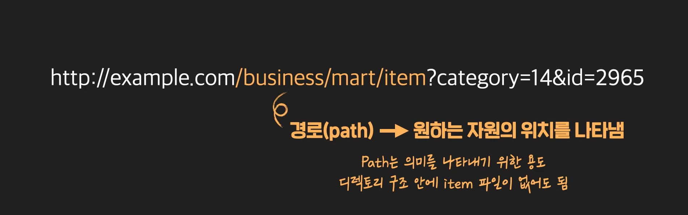
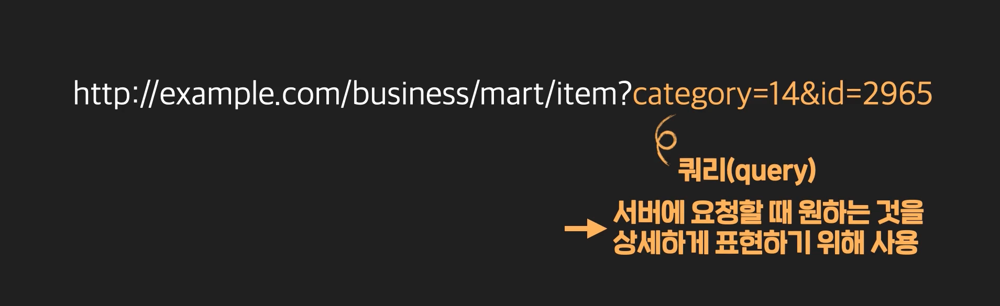
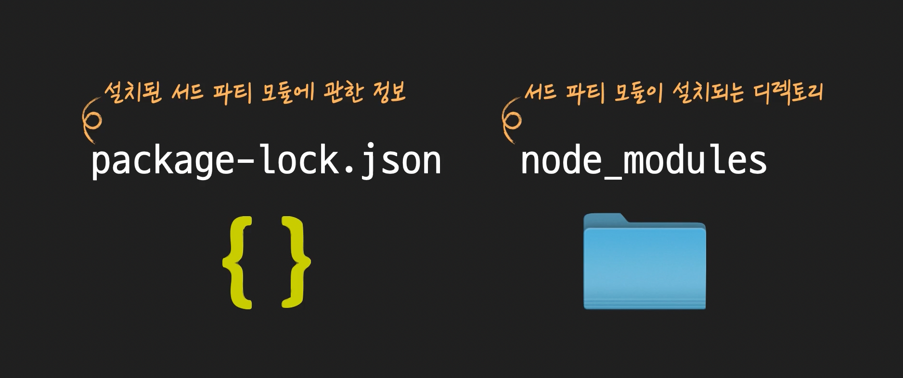
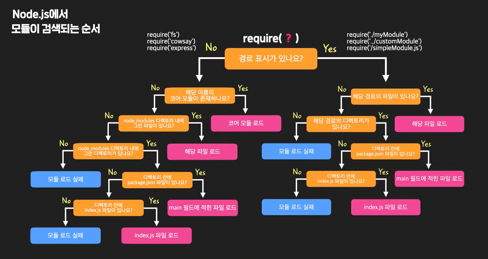
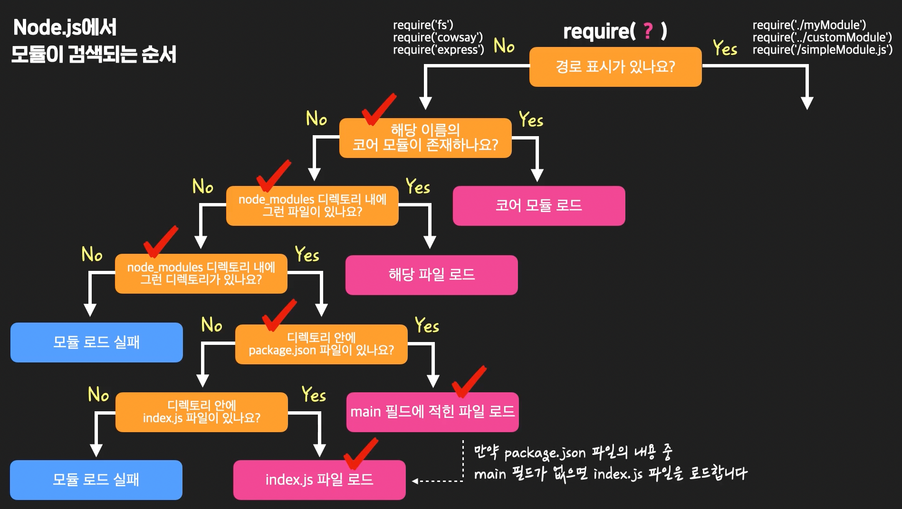
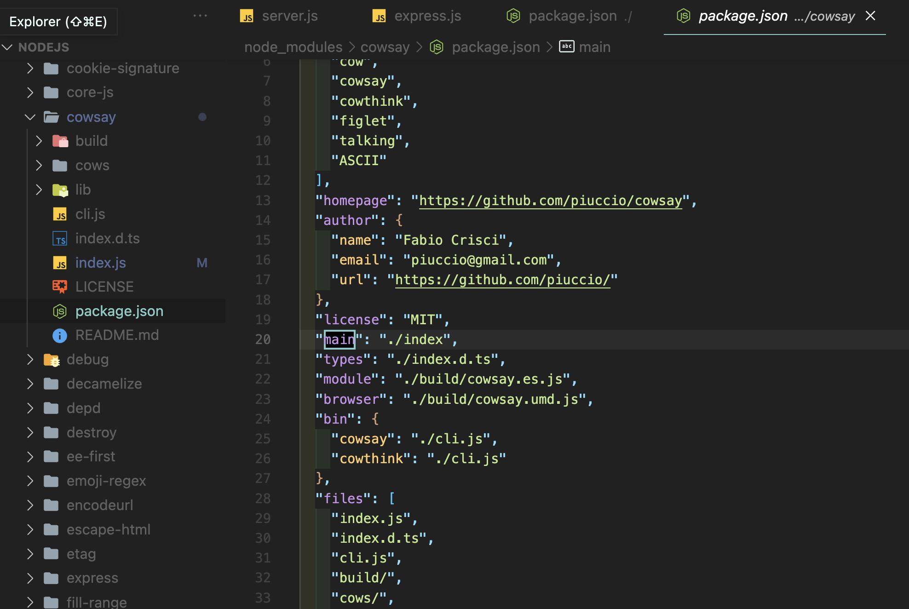
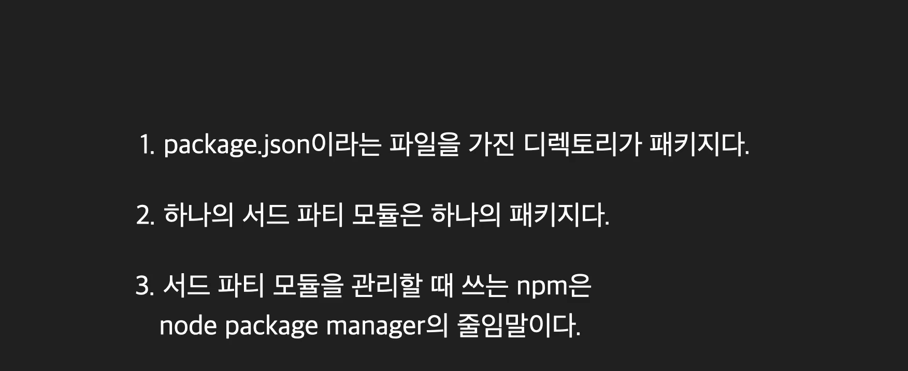
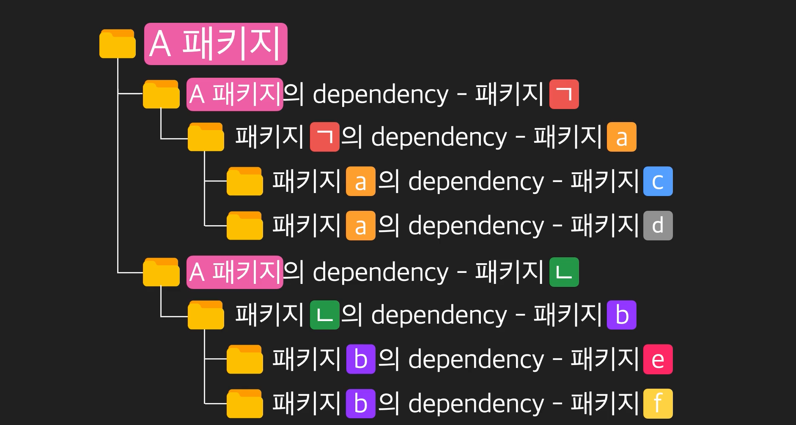

# Node.js

오늘날 하나의 웹사이트나 앱(Application)을 만들 때는, 아무것도 없는 상태에서 바로 코드를 작성하기보다는 **'프레임워크'**를 사용하는 경우가 많습니다. **프레임워크**란 '일정한 틀을 갖고 있어서, 개발자가 특정 부분만 원하는 모습대로 채워 넣으면, 프로그램을 완성할 수 있게 해주는 준비된 코드 체계'를 의미하는데요. '프레임워크'라는 단어가 이밖에 다른 의미를 가질 때도 있지만 일단 이 노트에서는 이런 의미로 사용하겠습니다.

프레임워크 덕분에 우리는 다양한 서비스를 더 빠르고 안정적으로 개발할 수 있는데요. 예를 들어, Java 기반의 **Spring**, Python 기반의 **Django** 같은 프레임워크들이 존재하기 때문에 더 빠르고 편하게 개발할 수 있는 것이죠. 그리고 프레임워크마다 그 특성(기술적인 특성, 그것을 둘러싼 개발자 생태계 등)이 다르기 때문에 회사나 개인은, 제공하려는 서비스에 맞는 프레임워크를 골라서 사용하는 것이고요.

**그렇다면 우리가 배울 Node.js는 프레임워크일까요?**  프레임워크의 의미를 어떻게 보느냐에 따라 다르지만, 위에서 말한 의미를 기준으로 생각한다면 Node.js는 프레임워크가 아닙니다.

Node.js는 프레임워크가 아니고, 자바스크립트라는 언어의 '실행 환경'일 뿐입니다. 컴퓨터에 Node.js를 깔고 나서 개발을 시작하려고 하면, '일정한 틀'이라는 게 없습니다. 주어지는 건 단지 Node.js라는 실행 환경일 뿐이고, 그 위에서 '프로그램의 전반적인 구조'를 설계하고 결정하는 건 전부 개발자의 몫이기 때문입니다.

이와 달리 프레임워크의 경우, 일정한 틀이 있기 때문에 개발자는 이 틀에서 개발하면 됩니다. 예를 들어, Django와 같은 프레임워크를 사용하면, MVT 패턴이 적용된 틀 안에서 개발하면 되는데요. MVT 패턴이란 소프트웨어 아키텍처 패턴(Software Architecture Pattern) 중의 하나이고, 소프트웨어 아키텍처 패턴이란 무수히 많은 프로그램들의 다양한 동작 구조들을, 유사한 것들끼리 모으고 분류하여 정리한 여러 개의 패턴들을 의미합니다. MVT 패턴은 그중 하나로, 프로그램 내부에 크게 3가지 구성요소인 Model, View, Template이라는 단위가 존재하고, 이것들이 상호유기적으로 동작하는 패턴입니다. 혹시 MVT 패턴에 대해 좀 더 자세히 알고 싶은 분은 [이 영상](https://www.youtube.com/watch?v=GGkFg52Ot5o)을 참고하세요.

그래서 Django로 개발을 하게 되면, 개발자는 Model, View, Template에 해당하는 각 부분만 코드로 잘 채워넣어주면 됩니다. 그럼 Django 프레임워크가 그것들을 연동시켜서 프로그램이 실행될 수 있게 해줍니다. 즉, Django를 쓰는 개발자는 MVT 패턴이라는 틀의 특정 부분들만을 채워주면 되는 겁니다. 이렇게 일정한 패턴에 의존해서 개발하도록 하는 점은 Django 뿐만 아니라 다른 프레임워크들도 비슷합니다.

이때까지 설명한 내용을 보기 쉽게 표현한다면 다음 이미지와 같습니다.


왼쪽은 Node.js라는 실행환경 위에서, 개발자 본인이 직접 프로그램의 동작 구조를 설계하고 그것을 자바스크립트(.js) 코드로 구현해나가는 모습을 나타낸 이미지입니다. 그리고 오른쪽은 Python 위에서 실행되는, Django 프레임워크의 정해진 틀 내에서 개발하는 모습을 나타낸 건데요. 지금 Django 프레임워크 자체도 파이썬(.py) 코드로 작성되어 있고, 개발자가 직접 채워 넣은 부분들(별표, 세모)도 파이썬 코드로 작성되어 있습니다. 이제 개발자는 물음표 표시가 있는 원 부분만 완성하면 하나의 온전한 프로그램을 완성할 수 있게 되는 겁니다.

왜 Node.js가 프레임워크가 아닌지, 이제 이해가 되나요?

이번 노트에서는 프레임워크가 무엇인지, 왜 Node.js가 프레임워크가 아니라 단순한 실행환경일 뿐인지에 관해서 설명했습니다. 하지만 이 차이를 제대로 실감하려면 Node.js로도 개발을 해보고, Django 같은 프레임워크로도 개발을 해봐야 하는데요. 혹시 관심이 있다면, 코드잇에서 Node.js 토픽들과 Django 토픽들을 수강하셔서 그 차이점을 실감해보시기를 추천합니다.

참고로, 프레임워크의 개념에 관해 더 자세한 설명을 듣고 싶은 분은 ['컴퓨터 개론' 토픽의 영상들](https://www.codeit.kr/learn/courses/intro-to-computer/2570)을 참고하세요.


- 모듈과 비동기

  - 모듈 : 전체를 이루는 부품 하나하나. JS파일 하나가 모듈이다. 

    

이전 영상에서는 **main.js** 모듈에서 **math_tools.js** 모듈의 **add 함수**를 가져와서 사용해봤는데요. 하나의 모듈에서 다른 모듈의 것을 가져다가 쓸 때, 추가로 알아야 할 내용들이 있습니다. 아래의 내용을 꼼꼼하게 읽어보세요.

# 1. 모듈의 확장자인 .js를 꼭 붙이지 않아도 됩니다.

**main.js** 모듈에서 **math_tool.js** 모듈을 로드할 때

```jsx
let m = require('./math-tools.js');
```

이렇게 파일 이름 뒤에 붙은 **.js**라는 확장자까지 전부 적어줬었죠? 하지만 확장자 없이 그냥 파일 이름만 적어줘도 됩니다. 이렇게요.

```jsx
let m = require('./math-tools');
```

main.js 모듈을 이렇게 저장하고 그대로 실행해보세요. 그래도 잘 실행되는 것을 확인할 수 있을 겁니다. 실전에서는 보통 이렇게 확장자를 생략하는 경우도 많으니까 잘 기억해두세요.

# 2. 모듈의 경로를 정확하게 작성해야 합니다.

이전 영상에서는 main.js 모듈과 math_tools.js 모듈이 같은 디렉토리 안에 있었습니다.

```jsx
let m = require('./math-tools.js');
```

그래서 이렇게 **./** 기호로 main.js 모듈을 기준으로, 현재 디렉토리 안의 math_tools.js 모듈이라는 걸 나타냈는데요.

만약 math_tools.js 모듈의 위치가 다른 곳이라면, 경로 표시도 변경해줘야 합니다. 예를 들어 math-tools 모듈이, main.js 파일이 있는 현재 디렉토리의 부모 디렉토리의 modules라는 디렉토리에 있었다고 가정해봅시다. 그럼 이렇게 변경해줘야 합니다.

```jsx
let m = require('../modules/math-tools.js');
```

`..` 은 부모 디렉토리를 나타내는 상대 경로인데요. 이 내용이 궁금하신 분들은 실용적 유닉스 커맨드 토픽에 있는 [절대 경로와 상대 경로](https://www.codeit.kr/learn/4903) 레슨을 참고하시면 됩니다.

require 함수에 인자를 작성할 때는, 로드하고 싶은 모듈의 위치를 잘 확인하고, 정확하게 경로 표시를 해주세요.

# 3. require 함수가 리턴하는 객체는 상수로 대입하는 게 좋습니다.

자바스크립트에서 **변수**(variable)와 **상수**(constant)의 차이는 알고 계신가요?  변수에는 값을 원할 때마다 새롭게 지정해도 되지만, 상수의 경우 값을 한번 설정한 후에는 다른 값을 설정할 수 없는데요.

저는 이전 영상에서 require 함수가 math-tools.js 모듈을 로드해서 리턴한 객체를 m이라는 변수에 대입했습니다.

```jsx
let m = require('./math-tools.js');
```

하지만 require 함수가 리턴한 객체는 변수보다는 상수로 받는 게 좋습니다. 이런 식으로 말이죠.

```jsx
const m = require('./math-tools.js');
```

왜 그런 걸까요? 모듈이 리턴한 객체를 변수로 받으면, 나중에 본인 또는 다른 개발자가 변수 m에 다른 값을 실수로 다시 지정하게 될 수도 있습니다. 이 경우, 그것 자체만으로는 에러가 발생하지 않지만, 의도하지 않은 오류가 발생할 수 있다는 점에서 오히려 더 위험합니다.

하지만 모듈이 리턴한 객체를 상수로 받으면, 상수 m에 새로운 값을 다시 지정하려는 코드 자체에서 에러가 발생하기 때문에, 잘못된 코드를 작성하는 것을 미리 방지할 수 있죠.

**저도 다음 영상부터는 모든 모듈을 상수로 받을 거니까 미리 기억해주세요!**

# 4. 모듈 안의 모든 것들을 공개할 수 있어요.

이전 영상에서는 math-tools.js 모듈에서 add라는 함수만 공개하고, main 모듈에서 가져다 써봤습니다. 하지만 함수만 이렇게 공개하고, 사용할 수 있는 건 아닙니다.

변수에서부터 객체까지, 모듈 안에 있는 것들은 모두 다른 모듈이 사용하도록 공개할 수 있는데요. 예를 들어 **math-tools.js** 모듈을 이렇게 바꿔볼게요.


영상에서 봤던 add 함수 말고도

변수(author), 상수(PI), 객체(test)를 추가하고 맨 아래에서 exports 키워드로 이것들을 하나씩 다 공개해주었습니다.

그리고 **main.js** 모듈에서


이것들을 모두 가져다 사용했는데요.

터미널에서 main.js 모듈을 실행해보면


이렇게 모두 잘 사용할 수 있다는 것을 알 수 있습니다. 원하는 모든 것들을 모듈 밖으로 공개할 수 있다는 사실, 잘 기억하세요!

객체를 외부에 공개할때, 

```js

let calculator = {
  PI: 3.14,
  add: (a, b) => a + b,
  subtract: (a, b) => a - b,
  multiply: (a, b) => a * b,
  divide: (a, b) => a / b
};
module.exports = calculator;

```


이전 영상에서는 **exports**로 모듈 외부에 공개했던 각각의 것들을, 하나의 객체로 모아서 **module.exports**로 모듈 외부에 공개하는 법을 배웠습니다. 그러니까 원래의 이런 코드를


이렇게 바꿨는데요.


그런데 함수 부분을 보면 원래

```jsx
function add(a, b) { return a + b; }
```

이런 식으로 써있던 것이

```jsx
(a, b) ⇒ { return a + b; }
```

이렇게 바뀐 것을 볼 수 있습니다. 이게 뭘까요? 이건 **Arrow Function**이라고 하는데요. Arrow Function은 함수를 나타내는 또다른 방식입니다. 바로 다음 영상의 내용을 보기 전에 Arrow Function에 대해 짚고 넘어가겠습니다.  
 여러분, 자바스크립트에서는 보통 함수를 이런 식으로 표현하죠?

```jsx
function add(a, b) {
  return a + b;
}
```

이런 식으로 함수를 선언하는 형태를 **Function Declaration(함수 선언식)**이라고 하고,

```jsx
const add = function(a, b) {
  return a + b;
};
```

이런 식으로 함수를 나타내는 형태를 **Function Expression(함수 표현식)**이라고 합니다.

이 두 가지가 자바스크립트에서 전통적으로 사용하는 함수 표현 방법인데요.

그런데 Function Expression(함수 표현식)의 경우, 이런 식으로 표현하는 것도 가능합니다.

```jsx
const add = (a, b) => { 
  return a + b;
};
```

이런 식으로 작성된 함수를 **Arrow Function**(화살표 함수)이라고 하는데요.

지금 여기서 왼쪽의 const add 부분은 단지 함수의 이름일 뿐이고, 그 오른쪽을 자세히 봐야합니다.

```jsx
(a, b) => {
  return a + b;
}
```

이 부분을 자세히 살펴봅시다. 지금 인자들이 괄호 안에 쓰여 있고 그 옆에 화살표(⇒)가 있죠? 화살표를 영어로는 **Arrow**라고 합니다. 화살표가 함수의 몸체(바디, body) **{ return a + b; }**를 가리키고 있는데요. 이런 식으로 나타낸 함수를 Arrow Function이라고 합니다. 이 Arrow Function은 자바스크립트의 최근 문법 [ES6](http://es6-features.org/#ExpressionBodies)에서 새롭게 도입된 표기법인데요.

기존에 함수를 나타내던 방식들과 **Arrow Function**은 하나의 함수를 나타낸다는 점에서는 동일하지만 기능상의 미세한 차이가 있기는 합니다. 일단 그런 부분은 나중에 자바스크립트 중고급 토픽에서 배우도록 하고, 여기서는 일단 Arrow Function 형식으로도 함수를 나타낼 수 있다는 점만 잘 기억합시다.

특히, 다른 함수의 인자로 들어가는 함수를 이 Arrow Function으로 나타내는 경우가 많은데요. 잠깐 아래 코드를 보세요.

```jsx
const arr = [1, 2, 3, 4, 5];

function getSquare(x) {
  return x * x;
}

const newArr = arr.map(getSquare);
console.log(newArr);
```

지금

- 1부터 5까지의 원소가 든 **arr**라는 배열
- 인자로 받은 수의 제곱을 구해주는 **getSquare**라는 함수

가 있습니다. 그리고 세 번째 줄에 있는 **map**이라는 함수는

(1) 배열의 각 원소를, 인자로 받은 함수에 넣고 실행해서  (2) 리턴되는 값을 각각 새 원소로 교체해주는 함수인데요.

지금 **map 함수**에 **getSquare 함수**를 인자로 주었기 때문에  새로운 배열 newArr의 값을 출력해보면 **[1, 4, 9, 16, 25]**가 출력됩니다. 별로 어렵지 않죠?  map 함수에 대해서 더 자세히 알고 싶은 분은 [이 링크](https://developer.mozilla.org/en-US/docs/Web/JavaScript/Reference/Global_Objects/Array/map)를 참조하세요.

그런데 방금처럼 getSquare라는 함수를 별도로 선언하지 않고 이렇게 쓸 수도 있습니다.

```jsx
const arr = [1, 2, 3, 4, 5];

const newArr = arr.map(function(x) {
  return x * x;
});

console.log(newArr);
```

map 함수에 인자로 들어간 함수를 보면 아예 이름이 없고, 그 내용은 getSqure 함수의 바디에 있던 내용과 같다는 걸 알 수 있습니다. 이렇게 이름이 없는 함수를 **Anonymous Function**(익명 함수)이라고 하는데요. 보통 함수에 함수를 인자로 넣을 때는 이렇게 Anonymous Function을 넣을 때가 많습니다. 그런데 이때 Anonymous Function을 Arrow Function 형태로 나타낼 수도 있습니다.

이런 식으로 말이죠.

```jsx
const arr = [1, 2, 3, 4, 5];

const newArr = arr.map((x) => {
    return x * x;
});

console.log(newArr);
```

Arrow Function을 넣어도 코드는 동일하게 잘 작동합니다.

방금 본 것처럼 함수의 인자로 들어가는 함수는 Anonymous Function을 쓸 때가 많고 이때, 전통적인 형식의 함수를 써도 되고, Arrow Function을 써도 됩니다. 그런데 자바스크립트를 어떤 식으로 쓰면 좋을지에 관한 여러 회사들의 코드 스타일 가이드(code style guide)를 보면 **Anonymous Function의 경우, Arrow Function을 쓰는 것을 권장하는 경우가 많습니다.** 이 점을 잘 기억해두세요. 이렇게 함수의 인자로, Arrow Function을 넣는 것은 [나중 영상](https://www.codeit.kr/learn/3749)에서도 아래 이미지처럼 등장하니까 그때 낯설게 느끼지 않도록 꼭 기억해두세요!


일단 'Node.js 기본기' 토픽에서는

- 전통적인 형식의 함수
- Arrow Function

이 두 가지를 **혼용**해서 사용하도록 하겠습니다. 아직 초보 단계인 여러분은 어느 코드를 봐도 잘 해석할 수 있어야 하기 때문이죠. 여러분이 회사에서 일을 할 때는 Arrow Function이 아닌 형태로 작성된 오래된 코드(legacy code)를 보게 될 확률도 높습니다. 따라서 여러분이 두 가지 다 익숙하게 느낄 수 있도록, 두 가지를 혼용할게요. 나중에 여러분이 자바스크립트 코드를 읽는 것에 어느 정도 익숙해지기 전까지는 두 가지를 섞어서 사용할 테니까, 앞으로 매 영상의 내용을 보면서 제가 어떤 형태로 함수를 표현하고 있는지 잘 살펴보세요.


# 1. 이전 내용 정리

이전까지

(1) 모듈 안의 것들을 '하나씩' 밖으로 공개할 때는, **exports**를 사용하고,  (2) 모듈 안에서 공개할 것들을 하나의 객체로 만들어서 공개할 때는 **module.exports**를 쓰면 된다

고 배웠습니다.

그런데 사실 그 이유를 완벽하게 이해하려면 **Node.js에서 모듈이 로드되는 과정**에 대해 상세하게 알아야 합니다. 아래 내용을 이해하면, exports와 module.exports에 대해 확실히 이해할 수 있으니까 집중해서 읽어보세요!

# 2. Module wrapper function

이때까지 자바스크립트 파일 하나가, 하나의 모듈이라고 했죠?

그런데 Node.js가 모듈을 로드할 때는, 한 가지 해주는 작업이 있습니다. 바로 **'Module wrapper function'**이라는 것으로 모듈 내의 전체 코드를 감싸주는 작업입니다. 'Module wrapper function'이란, 말 그대로 '모듈을 감싸주는 코드'를 의미하는데, 아래처럼 생겼습니다.

```jsx
(function (exports, require, module, __filename, __dirname) {
  // 모듈 코드
});
```

인자가 5개나 있는 함수가 보이죠? 그러니까 Node.js가 모듈을 로드할 때 이런 함수로 모듈 전체 코드를 감싸준다는 건데요. 예를 들면, 아래와 같은 **math-tools.js** 모듈을 로드할 때

```jsx
function add(a, b) {
  return a + b;
}

exports.add = add;
```

이렇게 감싸준다는 뜻입니다.

```jsx
(function (exports, require, module, __filename, __dirname) {
  function add(a, b) {
    return a + b;
  }
exports.add = add;
});
```

그리고 Module wrapper function의 다섯 가지 인자

**(1) exports**

**(2) require**

**(3) module**

**(4) _ _filename**

**(5) _ _dirname**

에는 **Node.js가 각각 알맞은 것들을 전달**하는데요. 이 때문에 이 다섯 가지 인자는, 우리가 직접 정의해준 적이 없더라도, 모듈 안에서 항상 자유롭게 접근할 수 있습니다. **math-tools.js** 모듈의 코드를 좀 바꿔서 예를 들자면,

```jsx
function add(a, b) {
  return a + b;
}

exports.add = add;

console.dir(exports);
console.dir(require);
console.dir(module);
console.dir(__filename);
console.dir(__dirname);
```

이렇게 5가지 인자에 자유롭게 접근할 수 있는 겁니다. 참고로, console.dir는 특정 객체의 내부 속성들을 모두 출력해주는 함수입니다. 좀더 읽기 쉬운 결과를 볼 수 있도록 코드를 아래처럼 살짝 바꾸고,

```jsx
function add(a, b) {
  return a + b;
}

console.log('exports ------------------------->');
console.dir(exports);
console.log('require ------------------------->');
console.dir(require);
console.log('module ------------------------->');
console.dir(module);
console.log('__filename ------------------------->');
console.dir(__filename);
console.log('__dirname ------------------------->');
console.dir(__dirname);
```

실행해볼게요.


뭔가 복잡한 결과가 출력되는데요. 이 중에서 **exports 객체**와 **module 객체** 이 2가지의 출력 결과만 가져와서 볼게요.

**(1) exports 객체**

 

**(2) module 객체**


exports 객체는 안에 아무 프로퍼티(속성)도 없는 텅 비어있는 객체이고, module 객체는 다양한 프로퍼티를 갖고 있는 객체입니다.  module 객체 안을 자세히 보면, exports라는 프로퍼티가 있고, 그 프로퍼티가 빈 객체 하나를 가리키고 있는데요.

자, 여기서 바로 핵심을 말씀드리겠습니다.

> **exports 객체**와 **module 객체의 exports 프로퍼티가 가리키는 객체**는 '동일한' 객체입니다. 그리고 우리가 모듈 내부의 것들을 외부로 공개하기 위해 exports나 module.exports를 썼던 것은 바로 이 객체에 접근하기 위해서였습니다.

정말 그런지 한번 실험해볼까요?

**math-tools.js** 모듈에서 add 함수를 plus라는 이름으로 공개해볼게요.

```jsx
function add(a, b) {
  return a + b;
}

exports.plus = add; // add 함수를 plus라는 이름으로 공개

console.log('exports ------------------------->');
console.dir(exports);
console.log('require ------------------------->');
console.dir(require);
console.log('module ------------------------->');
console.dir(module);
console.log('__filename ------------------------->');
console.dir(__filename);
console.log('__dirname ------------------------->');
console.dir(__dirname);
```

**math-tools.js** 모듈을 다시 실행해보면,

**(1) exports 객체**

 

**(2) module 객체**


**exports 객체에 plus라는 프로퍼티가 추가되었고, 프로퍼티의 값이 add 함수인 것을 확인할 수 있습니다.** 그리고 module 객체의 exports 프로퍼티가 가리키는 객체도 동일한 객체라고 했으니까 당연히 똑같이 변했습니다.

자, 이번엔 또 새로운 핵심 내용입니다.

> 바로 이 객체가 다른 모듈에서 require 함수로 이 모듈을 로드할 때 리턴되는 객체입니다.

그러니까 다른 모듈에서 이 **math-tools.js** 모듈을

```jsx
const m = require('./math-tools');
```

이런 식으로 로드하면, require 함수는 **'exports 객체(=module 객체의 exports 프로퍼티가 가리키는 객체)'**를 리턴합니다.

# 3. 정리 및 주의할 점

자, 이제 정리해보겠습니다. 우리가 모듈 내부에서 require 함수로 다른 모듈을 로드했을 때 리턴되는 것은 하나의 객체입니다. 그리고 그 객체는 로드되는 모듈의 코드에서 exports 또는 module.exports라고 써서 접근할 수 있죠.

그래서 이전 영상에서 제가

```
exports.속성 = 값`  또는 `module.exports = 객체
```

이런 식으로 공개하고 싶은 것들을 공개하라고 했던 겁니다. 그런데 여기서 **"그럼 그냥 exports로도 `exports = 객체`, 이런 식으로 객체 하나를 통째로 공개하면 되지 않나요?"**라는 질문을 할 수도 있습니다.  아주 좋은 질문입니다. 하지만 아쉽게도 Node.js는 내부적으로 require 함수가 실행될 때 위에서 본 module 객체의 exports 프로퍼티가 가리키는 객체를 리턴하도록 되어 있습니다.

그러니까 모듈을 로드할 때, Node.js가 Module wrapper function의 'exports이라는 인자로 넣어주는 객체'와 'module이라는 인자로 넣어주는 객체의 exports 프로퍼티가 가리키는 객체'는 아래 이미지처럼 분명 동일한 객체이지만,


**require 함수는 'module 객체의 exports 프로퍼티가 가리키는 객체'를 리턴하기 때문에**, exports 객체를 아예 새로 설정해버리면 안 되는 겁니다. 새로 설정해버리면 아래 이미지처럼 더이상 exports 키워드로는 원래의 객체에 접근할 수 없게 되는 거죠.


그래서 **어쩔 수 없이 exports 키워드로는 'exports.속성 =  ~' 이런 식으로 해당 객체에 프로퍼티를 추가하는 식으로만 사용할 수 있는 겁니다.** 그 대신, module.exports를 사용하면 'module.exports = 객체' 형식 뿐만 아니라 'module.exports.속성 = ~' 이런 식으로도 사용할 수 있는 거구요.

자, 이때까지의 내용, 잘 이해하셨나요? 간단하게 정리해보면 다음과 같습니다.

(1) Node.js는 모듈을 로드하기 전에 그 전체 코드를 **Module wrapper function**이라는 것으로 감싸줍니다.

(2) Module wrapper function은 그 5개의 인자에 각각 적절한 값이나 객체를 설정해주는데

(3) 우리가 모듈 내의 코드에서 exports 인자로 넘어와서 그 프로퍼티를 하나씩 채워나가는 객체(또는 module 인자의 exports 프로퍼티로 설정되는 객체)가

(4) 다른 모듈에서 이 모듈을 require 함수로 로드했을 때 리턴되는 객체입니다.

방금 설명한 내용들은 Node.js가 내부적으로 처리하는 작업이라서 당장 개발할 때는 몰라도 되는 내용일 수도 있습니다. 하지만 이 내용을 알게되면 exports 또는 module.exports라는 키워드로 모듈 내부의 것들을, 외부에 공개할 수 있는 원리를 확실하게 이해할 수 있게 됩니다. 잘 기억해두세요!


# 코어 모듈


코어모듈 : 노드 실행파일 안에 있는 모듈. 노드 설치하면 바로 사용 가능. 

써드파티 모듈 : 여러 개발자 혹은 회사들, 제 3자가 만든 모듈. 

코어모듈 예시 

- `const fs = require("fs");` 파일시스템. 


# 노드js와 브라우져의 차이

1. 제공하는 API가 다르다. 

   

   
   
   

2. 엔진이 다르다. 
   - Node와 Chrome은 V8, Firefox는 Spider Monkey


# 써드파티 모듈

- 다른 개발자나 회사들이 만들어서 인터넷 상의 공개 저장소에 제공하는 모듈. 
  - 공개 저장소에서 내 컴퓨터로 가져와야 쓸 수 있음. 
- ex)
  - `npm install cowsay`


이전 영상에서는 **cowsay**라는 서드파티 모듈을 설치해서 사용해봤습니다.  그런데 이 서드파티 모듈은 도대체 어디에 설치되는 걸까요?

**cowsay** 서드파티 모듈을 설치한 직후의, **nodeStudy 디렉토리**의 내부를 살펴보겠습니다.


확인해보면,

(1) **node_modules**라는 디렉토리 (2) **package-lock.json**이라는 파일

이 새로 생긴 것을 알 수 있는데요. 이것들이 뭔지 설명해드릴게요. 일단 package-lock.json 파일부터 설명할게요.

# 1. package-lock.json 파일

package-lock.json 파일에는, nodeStudy 디렉토리 안에 설치된 모든 서드파티 모듈들에 관한 정보가 기록되어 있습니다.  파일 내용을 간단히 살펴볼까요?


package-lock.json 파일의 내용 중 **dependencies**(별표 표시)라는 필드에는, **현재 nodeStudy 디렉토리에 설치된 서드파티 모듈들의 정보**가 담겨있습니다. dependencies는 우리말로 '의존하고 있는 것들'이라는 뜻인데요. 제 프로젝트가 이 서드파티 모듈들에 의존하고 있기 때문에 이 필드 안에 그 정보들이 담긴 것입니다. dependencies 필드를 자세히 보면, 이전 영상에서 설치했던 **cowsay** 서드파티 모듈의 이름이 빨간색 박스 안에 보이네요.

그런데 뭔가 이상합니다. 저는 cowsay라는 서드파티 모듈**만** 설치했는데, 왜 지금 파란 박스들에 보이는 것처럼 다른 서드파티 모듈들의 이름이 보이는 걸까요? 그건 바로 cowsay가 이 서드파티 모듈들에 또다시 의존하고 있기 때문입니다.


잠깐 cowsay 모듈에 관한 정보 중 **requires**라고 써있는 필드(주황색 표시)를 자세히 보세요. requires 필드에는 cowsay 모듈이 필요로 하는(의존하는) 다른 서드파티 모듈들의 이름이 적혀있는데요. 이 중에서 get-stdin이라는 서드파티 모듈의 이름이 보이죠? 이렇게 cowsay 모듈이 필요로 하는 모듈이기 때문에 get-stdin 모듈도 함께 설치된 겁니다. **즉, 하나의 서드파티 모듈이 설치될 때는 그것이 의존하는 다른 서드파티 모듈들도 함께 설치됩니다.** 중요한 사실이니까 잘 기억해두세요.

그럼 가장 위의 ansi-regex 모듈은 왜 설치됐을까요? 지금 cowsay 모듈 정보의 requires 필드에서 이름이 보이지 않는데 말이죠. ansi-regex 모듈은 cowsay 모듈이 간접적으로 의존하는 모듈입니다. 아래 이미지를 볼까요?


지금 보면,

**cowsay 모듈 → string-width 모듈 → strip-ansi 모듈 → ansi-regex 모듈**, 이렇게 여러 단계에 걸쳐 cowsay 모듈은 결국 ansi-regex라는 모듈에 의존하고 있습니다. 그래서 cowsay 모듈의 requires 필드에서 당장 ansi-regex 모듈이 보이지 않았지만, 함께 설치가 되었던 겁니다. 모듈 간의 이런 '다단계 의존 관계'를 이해하는 것이 Node.js 세계에서는 아주 중요합니다. 하나의 서드파티 모듈을 설치할 때, 그것이 의존하는 다른 서드파티 모듈들도 계단식으로 모두 함께 설치된다는 사실, 어찌 보면 자연스럽죠? package-lock.json 파일은 **챕터 4**에서도 등장하니까 잘 기억해두세요.

# 2. node_modules 디렉토리

이제 node_modules 디렉토리에 대해서 알아보겠습니다. 방금 봤던 package-lock.json 파일이 어떤 서드파티 모듈들이 설치되었는지에 관한 정보를 담고 있다면, **node_modules 디렉토리는 서드파티 모듈들이 실제로 설치되는 공간**입니다. node_modules 디렉토리의 내부를 한번 살펴보겠습니다.


cowsay 서드파티 모듈의 이름이 잘 보이고, cowsay가 의존하는 다른 서드파티 모듈들의 이름들도 잘 보입니다. 그런데 여기서 신기한 사실이 하나 있습니다. 왼쪽의 노락색 강조 표시를 보면, 지금 **모든 서드파티 모듈들은 각각 하나의 디렉토리입니다.** 이게 어떻게 된 걸까요? 이때까지 우리는 모듈을 그냥 '하나의 자바스크립트 파일'이라고 배웠는데 말이죠. 하지만 **사실 모듈은 하나의 파일일 수도 있고, 하나의 디렉토리일 수도 있습니다.**

이게 무슨 말인지는 **챕터 4**에서 설명할 건데요. 일단은 여기서 멈춥시다. 나중에 챕터 4의 내용을 잘 이해하려면 이 노트의 내용을 꼭 기억해두세요!


이전 영상을 보고 '비동기 실행'이 무슨 의미인지 잘 이해하셨나요?  이전 영상에서 본

- **readFile 함수(비동기 실행 함수)**와
- **readFileSync 함수(동기 실행 함수)**에 대한 설명을 [Node.js 공식 홈페이지](https://nodejs.org/api/fs.html#fs_fs_readfile_path_options_callback)에서 직접 찾아보면서 그 개념을 다시 복습해봅시다.

# 1. readFile 함수

먼저 **readFile 함수**를 보겠습니다.


비동기 함수인 readFile 함수를 보면 다음과 같은 총 세 개의 인자가 필요한데요.

(1) **path** : 내용을 읽을 파일의 경로

(2) **options** : 파일의 내용을 읽을 때 적용할 옵션

(3) **callback** : 파일의 내용을 다 읽었을 때 실행될 콜백

이때 (1),(3)이 필수 인자이고, (2)는 넣어도 되고 안 넣어도 되는 선택적인 인자입니다. 선택적인 인자는 맨 위에 보이는 **[,options]**처럼 대괄호 안에 쓰여 있는데요. 저는 파일 내용을 utf-8이라는 인코딩으로 읽기 위해 이전 영상에서 options 인자로, 'utf8'이라고 썼던 것, 기억나시죠?(인코딩이라는 건 컴퓨터에서 1과 0의 조합을 봤을 때, 어떤 문자로 해석해야 할지에 관한 기준을 의미합니다, utf8은 여러 인코딩 중에서도 프로그래밍 세계에서 거의 표준에 가까운 인코딩입니다) 지금 설명을 보면, options 인자로 { 'encoding' : 'utf8', 'flag' : 'r' }' 이런 식의 객체(Object)를 넣어도 되는데요. 정말로 그런지 직접 실험해보세요. 참고로 flag는 파일을 열 때, 그 파일의 내용을 읽기 위한 목적으로 여는지, 파일에 내용을 새로 추가하거나 덧붙이기 위해서 여는지 등을 나타내는 일종의 모드를 지정하기 위해 씁니다. options 인자는 지금 당장 중요한 내용은 아니니까 이 정도만 설명하고 넘어갈게요.

자, 여기서 중요한 인자는 **(3) callback**인데요. callback의 구조를 보면 이렇게 생겼습니다.

```jsx
(err, data) => {
  // 함수 내용
}
```

지금 콜백이 **Arrow Function**의 형태로 쓰여 있는데요. 파일 읽기가 완료되면, 이 콜백이 실행되면서 data 인자로 파일의 내용이 전달됩니다. 그리고 파일을 읽다가 만약 에러가 발생하면(파일이 존재하지 않는 경우나, 작업 도중 컴퓨터에 이상이 생긴 경우 등) err 인자로 해당 에러 정보를 담은 객체가 전달됩니다. 참고로, **Node.js에서 많은 콜백은 일반적으로 err 인자를 첫 번째 인자로 두고, data와 같이 작업 결과를 나타내는 인자를 더 뒤에 둡니다.** 알아두면 유용한 규칙이니까 잘 기억해주세요. 그리고 콜백의 err 인자는 error, problem 등의 이름으로 써도 되고, data는 result, output 등의 이름으로 써도 코드 실행에는 문제가 없습니다. 이런 식으로 말이죠.

```jsx
(error, result) =>{
  // 함수 내용
}
```

중요한 것은 어차피 인자의 순서니까요. 하지만 이렇게 순서를 잘못 써버리면

```jsx
(result, error) =>{
  // 함수 내용
}
```

result에 에러 정보가 들어오고, error에 작업 결과가 들어와서 코드를 작성할 때 혼동이 생길 수 있습니다. 따라서, 인자 순서에 알맞은 단어를 썼는지 항상 확인해줘야 합니다.

# 2. readFileSync 함수

이제 **readFileSync 함수**를 살펴보겠습니다.


readFileSync 함수는 readFile 함수와 반대로 동기 실행되는 함수입니다. 이전 영상에서 배웠죠? 지금 설명을 보면 **인자에 콜백이 없고, (1) path, (2) options 인자만 있네요.** 그리고 마지막 줄에 지금, '자세한 설명은 readFile 함수 설명 부분을 참고하라'고 쓰여 있구요. 이것 외에 딱히 특별한 내용은 없습니다.

앞으로 Node.js에서 프로그래밍을 할 때는 비동기 함수를 주로 사용하게 될 겁니다. 간혹 초기화 코드 등에서는 동기 함수를 써야만 하는 경우도 있지만 그런 경우에는 따로 언급해드릴게요. 방금 본 readFile 함수와 readFileSync 함수는 fs라는 코어 모듈의 함수인데요. fs 코어 모듈 안의 함수들은 이렇게 비동기 함수가 있으면, 비동기 함수의 이름 뒤에 Sync가 붙은 동기 함수도 쌍으로 존재하는 경우가 많습니다. 직접 [공식 문서](https://nodejs.org/api/fs.html)로 들어가서 한번 확인해보세요!


이번 노트에서는 여러분이 **'비동기 실행'**을 제대로 이해했는지 간단히 확인하는 시간을 가져볼게요.

# 1. 이전 내용 복습

아래 코드를 보세요.

```jsx
const fs = require('fs');

let test = 1;

fs.readFile('./new', 'utf8', (err, data) => {
  test = 2;
});

console.log(test); // Question!
```

지금 주석에 **Question!**이라고 표시된 곳에서 출력되는 test 변수의 값은 뭘까요?

**답은 1**입니다. 왜냐하면 코드의 실행 순서는

```jsx
const fs = require('fs');

let test = 1; // '첫 번째'

fs.readFile('./new', 'utf8', (err, data) => {
  test = 2; // '세 번째'
});

console.log(test); // '두 번째'
```

이기 때문입니다. readFile 함수가 비동기 실행되는 함수이기 때문에

- 일단 console.log(test)가 먼저 실행되고,
- 그 후에야 test 변수에 2가 대입되기 때문입니다.

혹시 왜 이렇게 실행되는지 이해가 안되는 분은 이전 내용을 복습하고 와주세요.

# 2. 비동기 실행에 자주 쓰이는 setTimeout 함수

자, 이제 다음 문제입니다. 이 코드를 보세요.

```jsx
let num = 1;

setTimeout(() => {
  num = 2;
}, 1000);

num = 3;

console.log(num);
```

지금 처음 보는 함수가 등장했죠? 이 코드에 보이는 **setTimeout**이라는 함수는

```jsx
setTimeout(callback, milliseconds)
```

형식의 함수로 milliseconds(밀리세컨즈, 1000분의 1초) 후에 callback 인자에 설정한 함수를 실행합니다.

그러니까

```jsx
setTimeout(() => {
  num = 2;
}, 1000);
```

이 코드는 1000 밀리세컨즈 초, 그러니까 1초 후에 num 변수에 2를 대입하라는 뜻입니다. setTimeout 함수는 개발자가 직접 비동기 실행을 구현하고 싶을 때 사용할 수 있는 유용한 함수입니다.

그럼 아래 코드의 실행 결과는 무엇일까요.

```jsx
let num = 1;

setTimeout(() => {
  num = 2;
}, 1000);

num = 3;

console.log(num);
```

**답은 3**입니다. 왜냐하면 이번에도 작업 순서는 이렇게 되기 때문입니다.

```jsx
let num = 1; // 첫번째

setTimeout(() => {
  num = 2; // 세번째
}, 1000);

num = 3; // 두번째

console.log(num);
```

지금 코드는

(1) num 변수에 1을 대입

(2) setTimeout 함수 실행(1초 후에 실행될 콜백 설정)

(3) num 변수에 3을 대입

(4) num 변수의 값 출력

(5) setTimeout에서 설정해둔 콜백 실행

이런 순서로 실행됩니다. 비동기 실행이라는 관점에서 보니까 이 코드도 이해하기 별로 어렵지 않죠? 이밖에도 개발자가 비동기 실행을 직접 구현할 수 있게 해주는 함수에는 여러가지가 있습니다. 일단 여러분은 **setTimeout 함수**만 잘 기억해주세요.


이번 노트에서는 여러분이 **'비동기 실행'**을 제대로 이해했는지 간단히 확인하는 시간을 가져볼게요.

# 1. 이전 내용 복습

아래 코드를 보세요.

```jsx
const fs = require('fs');

let test = 1;

fs.readFile('./new', 'utf8', (err, data) => {
  test = 2;
});

console.log(test); // Question!
```

지금 주석에 **Question!**이라고 표시된 곳에서 출력되는 test 변수의 값은 뭘까요?

**답은 1**입니다. 왜냐하면 코드의 실행 순서는

```jsx
const fs = require('fs');

let test = 1; // '첫 번째'

fs.readFile('./new', 'utf8', (err, data) => {
  test = 2; // '세 번째'
});

console.log(test); // '두 번째'
```

이기 때문입니다. readFile 함수가 비동기 실행되는 함수이기 때문에

- 일단 console.log(test)가 먼저 실행되고,
- 그 후에야 test 변수에 2가 대입되기 때문입니다.

혹시 왜 이렇게 실행되는지 이해가 안되는 분은 이전 내용을 복습하고 와주세요.

# 2. 비동기 실행에 자주 쓰이는 setTimeout 함수

자, 이제 다음 문제입니다. 이 코드를 보세요.

```jsx
let num = 1;

setTimeout(() => {
  num = 2;
}, 1000);

num = 3;

console.log(num);
```

지금 처음 보는 함수가 등장했죠? 이 코드에 보이는 **setTimeout**이라는 함수는

```jsx
setTimeout(callback, milliseconds)
```

형식의 함수로 milliseconds(밀리세컨즈, 1000분의 1초) 후에 callback 인자에 설정한 함수를 실행합니다.

그러니까

```jsx
setTimeout(() => {
  num = 2;
}, 1000);
```

이 코드는 1000 밀리세컨즈 초, 그러니까 1초 후에 num 변수에 2를 대입하라는 뜻입니다. setTimeout 함수는 개발자가 직접 비동기 실행을 구현하고 싶을 때 사용할 수 있는 유용한 함수입니다.

그럼 아래 코드의 실행 결과는 무엇일까요.

```jsx
let num = 1;

setTimeout(() => {
  num = 2;
}, 1000);

num = 3;

console.log(num);
```

**답은 3**입니다. 왜냐하면 이번에도 작업 순서는 이렇게 되기 때문입니다.

```jsx
let num = 1; // 첫번째

setTimeout(() => {
  num = 2; // 세번째
}, 1000);

num = 3; // 두번째

console.log(num);
```

지금 코드는

(1) num 변수에 1을 대입

(2) setTimeout 함수 실행(1초 후에 실행될 콜백 설정)

(3) num 변수에 3을 대입

(4) num 변수의 값 출력

(5) setTimeout에서 설정해둔 콜백 실행

이런 순서로 실행됩니다. 비동기 실행이라는 관점에서 보니까 이 코드도 이해하기 별로 어렵지 않죠? 이밖에도 개발자가 비동기 실행을 직접 구현할 수 있게 해주는 함수에는 여러가지가 있습니다. 일단 여러분은 **setTimeout 함수**만 잘 기억해주세요.


이번 노트에서는 Node.js에 구현된 '비동기 실행'에 대해서 더 깊게 공부해보겠습니다.  일단 '비동기 실행'과 '동기 실행'이 뭔지 확실하게 이해한 분들만 이 노트를 읽어주시고, 아직 이해하지 못한 분들은 꼭 이전 영상의 내용을 확실하게 이해하고 와주세요.

# 1. '비동기 실행'의 장점

'비동기 실행'이 뭔지 이해했다면, 이제 **'비동기 실행'이 '동기 실행'에 비해 어떤 점이 좋은지 배워봅시다.** 이전 영상에서 예로 들었던 '식당 종업원' 예시를 다시 생각해봅시다. 그때 저는 식당에서 이루어지는 하나의 작업은

> '손님으로부터 주문을 받고,

> 해당 메뉴를 만든 다음,

> 그것을 다시 손님에게 전달하는 것'

이라고 했는데요. 하나의 작업을 이렇게 3가지의 작은 단위로 쪼갰을 때, 각각 다음과 같은 시간이 걸린다고 해봅시다.

**(1) 손님으로부터 주문을 받는 시간 - 1분**

**(2) 해당 메뉴를 요리하는 시간 - 쉬운 메뉴는 5분 / 어려운 메뉴는 10분**

**(3) 메뉴를 손님에게 전달하는 시간 - 1분**

이런 가정하에 , '동기 실행'과 '비동기 실행'의 차이를 알아봅시다.

만약 식당에 손님 총 3명이 온 경우, 종업원이 '동기 실행' 방식으로 작업을 한다고 했을 때, 모든 손님이 자신의 메뉴를 주문하고 받기까지 총 몇 분이 걸릴까요?

**동기 실행의 경우, 손님 한 명에 관한 작업 하나(주문받기, 요리하기, 전달하기)가 완료되지 않으면 다음 손님에 관한 작업을 처리할 수 없습니다.** 지금 작업 하나당 걸리는 시간은 손님이 쉬운 메뉴를 시킨 경우 **7분**이고, 손님이 어려운 메뉴를 시킨 경우 **12분**입니다.

만약 '쉬운 메뉴를 시킨 손님 - 어려운 메뉴를 시킨 손님 - 쉬운 메뉴를 시킨 손님', 이 순서라면


위 그림처럼 '7분 + 12분 + 7분'으로 **총 26분**이 걸립니다.

그렇다면 '비동기 실행' 방식으로 종업원이 작업하는 경우는 어떨까요? 바로 아래 그림을 보세요.


**'비동기 실행' 방식의 경우 종업원은 주문을 받고, 그 메뉴가 준비될 때까지 기다리지 않습니다. 바로 그다음 손님의 주문을 받아버리죠.** 그 대신, 요리가 완성되면 요리사가 전광판을 통해 알려주기 때문에 종업원이 완성된 메뉴를 손님에게 전달하는 데는 문제가 없습니다. 이렇게 비동기 실행에서는 **요리사들이 요리를 하는 도중에도 종업원은 자신의 일을 진행할 수 있기 때문에 전체 시간이 훨씬 단축됩니다.** 조금 전과 같은 세 명의 손님이라도 **13분**밖에 걸리지 않죠.

자, 어떤가요? '동기 실행'에 비해 '비동기 실행'이 훨씬 더 빠르죠?

Node.js가 등장하기 이전에는 동기 실행되는 서버 프로그램이 많았습니다. 그래서 개발자들도 동기 실행만 생각하고 코드를 작성하는 경우가 많았죠. 하지만 Ryan Dahl이 동기 실행 방식으로만 프로그래밍하는 것의 문제점을 제기하고 Node.js를 발표하면서, 개발자들은 이제 '비동기 실행'되는 프로그램을 훨씬 쉽게 만들 수 있게 되었습니다.

# 2. Node.js에서의 비동기 실행

이제 Node.js에서 '비동기 실행'이 구체적으로 어떤 방식으로 이루어지는지 간단히 살펴보겠습니다.  **사실 Node.js에서는 작업의 종류에 따라 '비동기 실행'이 다른 방식으로 구현되어 있습니다.** 하지만 이번 노트에서는 일단 여러분이 이해하기 쉬운 한 가지만 설명하도록 하겠습니다.

그 전에 한 가지 알아야 하는 개념이 있습니다. 바로 컴퓨터 공학에서 배우는 중요 개념인

- **'프로세스(Process)'**와
- **'스레드(Thread)'**

라는 개념입니다. 프로세스와 스레드는 프로그램의 실행 흐름에 관한 개념인데요. 프로세스가 하나의 실행 흐름이라면, 스레드는 그 안에 있는, 더 작은 단위의 실행 흐름입니다.

예를 하나 들어볼게요.

우리가 노트북에서 크롬 브라우저를 실행했을 때를 잠깐 생각해봅시다.  크롬 브라우저는 노트북에 저장된 하나의 **'프로그램(Program)'**인데요. 우리가 크롬 브라우저 아이콘을 더블 클릭하면, 이 프로그램이 **'실행'**됩니다.  이 '실행'이라는 건

(1) **하드디스크(hard-disk)나 SSD**에 저장되어 있던 프로그램의 내용을,  (2) **메모리(memory)**에 올려서  (3) **CPU(Central Processing Unit)**가 실행하도록 만드는 것을 의미하는데요.

크롬 브라우저를 실행하면, 그 실행 흐름으로

> 하나의 크롬 '프로세스'라는 것이 생성되고,  그 안에서 하나의 '스레드'가 실행 중인 상태가 됩니다.

바로 이런 상태죠.


그 뒤에 만약 크롬 브라우저에서 **영화 파일 하나를 다운로드하고(Thread-2)**, **최신 유행 음악을 재생하면서(Thread-3)**, **구글 검색(Thread-4)**을 하는 등 새로운 작업을 시작할 때마다, 크롬 프로세스 안의 스레드 수는 하나씩 늘어납니다. 아래 그림처럼요.


컴퓨터가 가끔 먹통이 되면, 우리는 '프로세스 강제 종료'라는 걸 하죠? 이때 우리가 '강제 종료'를 하는 단위가 프로세스인 것이고, 프로세스 안에서 만들어낼 수 있는 '실행의 최소 단위'가 바로 스레드인 겁니다. 프로세스와 스레드가 뭔지 이해되시나요? 일단은 이 정도까지만 이해하고 넘어갑시다. 혹시 더 깊이 알고 싶은 분은 **'운영체제(OS)' 과목**을 공부해보세요.

자, 이제 우리는 **스레드**라는 단위에 집중해보겠습니다. 스레드를 '식당 종업원 예시'에 적용해볼게요. 예시로 봤던 식당에서,

- '주문을 받는 종업원 1명',
- '요리사 10명'이 일하는 중이라고 해봅시다.

이 식당에서 **'비동기 실행'** 방식으로 일을 하는 경우, 각자의 역할을 정리해보면

**1) 카운터 종업원 1명**

- 손님 주문받기
- 메뉴 요리 시작해달라고 요리사에게 요청하기
- 바로 다음 손님의 주문받기
- 메뉴가 완성되었다는 알림을 받으면
- 완성된 메뉴를 손님에게 전달해주기

**2) 요리사 10명**

- 메뉴 요리하기**(오래 걸리는 일)**
- 요리 완료되면 종업원에게 전광판으로 알리면서 메뉴 전달하기

이렇게 되는데요. 위 내용을 **사람 한 명이 스레드 하나**라고 가정하고 설명해볼게요.


**-Node.js 내부에서의 비동기 실행 구현 방법 중 한 가지-**


**1) 스레드 1개**(이 스레드를 **'메인 스레드'**라고 합니다)

- 자바스크립트 코드 실행하기
- 이때 오래 걸리는 작업(작업 A)은 다른 스레드에 넘기기(ex. fs.readFile('new', callback)에서 파일 읽기는 별도 스레드에 넘기기)
- 그리고 일단 그다음 작업 B를 시작하기
- 작업 A가 완료되었다는 알림과 그 작업 결과를 받으면
- 작업 결과를 가지고 콜백 실행하기(ex. 읽어 들인 파일 내용을 인자로 넣고, callback 실행)

**2) 스레드 10개**

- 메인 스레드가 요청한 작업 처리하기(ex. 파일 읽기)
- 작업이 완료되면 끝났다고 메인 스레드에 알려주고, 작업 결과 전달하기(ex. 파일 내용을 다 읽고, 그 내용을 메인 스레드에 전달)

비유가 이해되시나요? 이 구조의 특징을 정리하자면,

**1. 메인 스레드는 빠르게 처리할 수 있는 작업들을 집중해서 '혼자' 처리하고,** **2. 파일 읽기와 같이 시간이 오래 걸리는 작업은 다른 스레드에 맡긴다는 점인데요.**

잠깐 '비동기 실행'을 설명한 이미지를 다시 보면서 설명할게요.


여기서

- '손님으로부터 주문받기(분홍색)', '손님에게 완성된 메뉴 전달하기(초록색)' 작업, 이 2가지는 비교적 빠르게 처리할 수 있는 작업,
- '메뉴 요리하기(파란색)'가 파일 내용 읽기 작업처럼 비교적 시간이 오래 걸리는 작업

이라고 생각하면 됩니다.

비동기 실행이 Node.js에서 어떤 식으로 이루어지는지, 조금은 이해되시죠?  그런데 사실 **방금은 Node.js가 File I/O(File Input/Output, 파일 입출력)라는 특정 작업에 관한 비동기 실행을 어떻게 지원하는지에 대해서만 설명한 건데요.** 다른 종류의 작업에 대해서 Node.js는 또다른 방식으로 비동기 실행을 지원합니다. 하지만 여기서 그런 것들까지 다 설명하려면 내용이 길어지고 난이도가 높아지기 때문에 생략하겠습니다. Node.js의 비동기 실행은 libuv라는 라이브러리를 통해서 이루어지기 때문에 따로 더 공부하고 싶은 분들은 [libuv 공식 문서](http://docs.libuv.org/en/v1.x/design.html)의 내용을 참조하세요.

# 3. Node.js로 개발할 때의 주의점

이제 Node.js로 개발할 때 주의해야할 점을 하나 말씀드리겠습니다. 다시 '식당 종업원 예시'를 들어볼게요.  만약 비동기 방식으로 작업을 하고 있는 **종업원이 손님과 다툼이 났거나, 손님의 주문 내용이 너무 많다면 어떻게 될까요?**  그럼 제아무리 비동기 작업 방식이라고 해도 전체 서비스 속도는 급속도로 저하될 겁니다.  그 뒤의 손님들은 '왜 빨리 내 주문을 받지 않느냐'며 불평을 늘어놓을 거구요.

사실 이 경우는 개발자가 Node.js로 개발을 할 때 **메인 스레드가 하는 작업에 큰 부하를 주는 경우**를 비유한 겁니다.  Node.js에서 메인 스레드는

- CPU로 하는 수치 계산 작업이나
- 네트워크로 들어오는 클라이언트의 요청을 받아들이고 응답하는 작업

을 수행하는데요. 예를 들어, 무거운 CPU 수치 계산 작업을 생각해봅시다.  고화질의 이미지를 처리하거나, 복잡한 수식 처리를 할 때는 CPU를 집중적으로 사용하게 됩니다. 이런 작업을 **CPU intensive job**이라고 하는데요. Node.js에서는 CPU 수치 계산 작업을 메인 스레드가 처리하기 때문에, CPU intensive job은 Node.js의 성능을 극도로 저하시키는 원인이 됩니다.

예를 들어, 아래 이미지에서 가장 마지막의 14분짜리 작업을 봅시다.


이 작업이 **14분**이 걸리는 CPU 작업이라고 해봅시다.  그럼 **Node.js의 메인 스레드는 이 14분짜리 작업을 끝내기 전에는 다른 클라이언트의 요청을 처리하지 못하게 됩니다. File I/O 작업만큼은 빠르게 다른 스레드에 맡길 수 있었지만, CPU 수치 계산 작업은 메인 스레드에서 수행하도록 설계되었기 때문입니다.**  그래서 다른 클라이언트의 요청이 그만큼 늦게 처리(이미지에서 깃발이 꽂힌 시점부터 가능)되는 결과를 가져옵니다.

정리하면, **Node.js는 CPU-intensive job(고화질 이미지 처리, 복잡한 시뮬레이션 계산, 딥러닝 작업 등)에는 적절하지 않습니다.** 그리고 혹시라도 이런 job을 처리해야하는 경우라면 해당 작업을 최적화하도록 노력해야하구요. 만약 CPU-intensive job을 메인으로 처리해야하는 서버라면 Node.js보다는 다른 서버 프레임워크 등을 사용하는 게 좋습니다. 하지만 우리가 일반적으로 만들 서비스(채팅 서버 등)에서는 CPU intentsive job을 해야할 경우가 많지 않기 때문에 너무 걱정하지는 마세요.

방금 배운 것처럼 Node.js로 개발할 때는 메인 스레드에 부하를 주면 안 된다는 사실, 잘 기억하세요!


# 이벤트

Node.js의 이벤트는 어떤 일이 발생했음을 알리는 신호를 의미한다. 

코어 모듈의 많은 객체들은 결국 `EventEmitter` 객체이다. 

하나의 이벤트에 대해서 여러가지의 콜백을 설정할 수 있다. 

```js
const EventEmitter = require("events");
const myEmitter = new EventEmitter();

// test라는 이름의 이벤트 발생했을때의 콜백을 등록한 것.
myEmitter.on("test", () => {
  console.log("1");
});

myEmitter.on("test", () => {
  console.log("2");
});

myEmitter.on("test", () => {
  console.log("3");
});

myEmitter.emit("test");
```

또한 헷갈리면 안되는 것

```js
const EventEmitter = require("events");
const myEmitter = new EventEmitter();
const myEmitter2 = new EventEmitter();

// test라는 이름의 이벤트 발생했을때의 콜백을 등록한 것.
myEmitter.on("test", () => {
  console.log("1");
});

myEmitter.on("test", () => {
  console.log("2");
});

myEmitter2.on("test", () => {
  console.log("3");
});

myEmitter.emit("test");
```

하나의 이벤트가 이름이 같더라도, 하나만 실행된다. 


이번 노트에서는 우리가 배운 **EventEmitter** 객체의 메소드를 정리하고, EventEmitter 객체의 다른 메소드들도 추가로 배워보겠습니다.

# 1. on 메소드

```jsx
const EventEmitter = require('events');

const myEmitter = new EventEmitter();

myEmitter.on('test', () => {
  console.log('Success!');
});

myEmitter.emit('test');
```

on 메소드는 **이벤트 핸들러**를 설정하는 메소드입니다. 참고로, on 메소드와 같은 용도를 가진 addListener라는 메소드도 있습니다. 아래 이미지에 나온 것처럼요.


보통 길이가 더 짧은 on 메소드를 쓰지만 다른 개발자가 addListener라고 쓴 코드를 봐도 바로 이해할 수 있도록 기억해두세요. addListener 메소드도 on 메소드와 인자 형식은 동일합니다.

# 2. emit 메소드

emit 메소드는 인위적으로 이벤트를 발생시키기 위해 쓰는 메소드입니다. 그런데 사실 emit 메소드는 나만의 독특한 EventEmitter 객체를 만들지 않는 이상, 사용할 일이 그리 많지는 않을 겁니다. 왜냐하면 우리는 이미 코어 모듈에 존재하는 EventEmitter 객체를 사용하는 경우가 많을텐데, 이때 이벤트를 발생시키는 건 우리가 아니기 때문입니다. 예를 들어

- 파일의 내용을 읽을 때, 데이터를 읽어들일 때마다 발생하는 이벤트라든지,
- 외부로부터의 클라이언트 요청이 발생했을 때 발생하는 이벤트 등은

우리가 emit 메소드로 직접 발생시키는 게 아니라 해당 이벤트가 실제로 발생했을 때 Node가 발생시켜주는 것이기 때문입니다. 그래도 emit 메소드는 on 메소드와 한 쌍을 이루는 메소드니까 잘 기억해두세요.

# 3. once 메소드

once 메소드는 특정 이벤트에 대한 이벤트 핸들러를 등록한다는 점에서 on 메소드와 유사한 메소드입니다. 하지만 한 가지 특이한 점이 있는데요. 그건 바로 그 이벤트 핸들러가 해당 이벤트에 대해서 **딱 한 번만 반응**해서 실행되도록 한다는 점이죠. 다음 코드를 보세요.

```jsx
const EventEmitter = require('events');

const myEmitter = new EventEmitter();

myEmitter.once('test', () => {
  console.log('Success!');
});

myEmitter.emit('test');
myEmitter.emit('test');
myEmitter.emit('test');
```

우리가 배운 코드에서 on 메소드를 once 메소드로 바꿨습니다. 그리고 test 이벤트를 총 3번 발생시켜(emit)줬는데요. 이 코드를 실행해보면


'Success!'가 딱 한 번만 출력된 것을 알 수 있습니다. test 이벤트에 대한 이벤트 핸들러가 딱 한 번만 실행된 거죠. once 메소드로 등록된 이벤트 핸들러는 한번 실행된 후에는 삭제된다고 생각하시면 됩니다. 특정 이벤트가 어차피 한 번밖에 발생하지 않는 경우나, 이벤트 핸들러가 딱 한 번만 실행되기를 바라는 경우 이 once 메소드를 사용하세요.

# 4. listeners 메소드

특정 이벤트에 대한 이벤트 핸들러들을 출력해주는 메소드입니다. 이전 영상에서 **하나의 이벤트에 관해 여러 개의 이벤트 핸들러를 설정할 수 있다는 점**을 잘 기억하라고 했죠?

잠깐, 아래의 코드를 보면

```jsx
const EventEmitter = require('events');

const myEmitter = new EventEmitter();

myEmitter.once('test', () => {
  console.log('A');
});

myEmitter.once('test', () => {
  console.log('B');
});

myEmitter.once('test', () => {
  console.log('C');
});

console.log(myEmitter.listeners('test'));
```

지금 test 이벤트에 총 3개의 이벤트 핸들러가 설정된 상황입니다. 그리고 그 후에 listeners 메소드를 호출하고 그 결과를 출력하면


이렇게 총 3개의 이벤트 핸들러(함수, Function)들이 설정돼있다는 걸 알 수 있습니다. 코드를 작성하다가 특정 이벤트에 지금 어떤 이벤트 핸들러들이 설정되어 있는지 조회하고 싶다면, 코드를 처음부터 다시 보기보다는 이 listeners 메소드를 사용하면 되겠죠?

# 5. off 메소드

이벤트 핸들러를 설정하는 메소드가 있으면, **이벤트 핸들러를 해제하는 메소드**도 있어야겠죠? 해제하는 메소드는 바로 off 메소드입니다. 설정은 on, 해제는 off, 외우기 쉽죠?

그런데 off 메소드를 사용할 때는 주의할 점이 있습니다. 그건 바로 해제할 이벤트 핸들러를 정확히 지정해줘야 한다는 겁니다. 잠깐 아래 코드를 보세요.

```jsx
const EventEmitter = require('events');

const myEmitter = new EventEmitter();

myEmitter.on('test', () => { // --- (A)
  console.log('Success!');
});

myEmitter.off('test', () => { // --- (B)
  console.log('Success!');
});

myEmitter.emit('test');
```

이 코드를 실행하면 Success!가 출력될까요, 출력되지 않을까요? 답은 바로 '출력된다'입니다.


off 메소드를 썼는데도 이렇게 이벤트에 반응한 이유는 (A) 이벤트 핸들러와 (B) 이벤트 핸들러는 똑같이 생겼지만 **서로 다른 함수이기 때문**입니다. 따라서 off 메소드를 사용하려면 아래 코드와 같이

```jsx
const EventEmitter = require('events');

const myEmitter = new EventEmitter();

const callback = () => {
  console.log('Success!');
};

myEmitter.on('test', callback);

myEmitter.off('test', callback);

myEmitter.emit('test');
```

이벤트 핸들러를 나중에 off 메소드에서도 참조할 수 있도록 변수에 할당해주거나, 여러 개의 이벤트 핸들러인 경우

```jsx
const EventEmitter = require('events');

const myEmitter = new EventEmitter();

const cbArr = [];

cbArr[0] = () => {
  console.log('A');
};

cbArr[1] = () => {
  console.log('B');
};

myEmitter.on('test', cbArr[0]);
myEmitter.on('test', cbArr[1]);

myEmitter.off('test', cbArr[0]);
myEmitter.off('test', cbArr[1]);

myEmitter.emit('test');
```

이렇게 배열에 넣어서 관리해줘야 합니다.

위의 두 코드들을 실행하면,


이렇게 이벤트에 반응하지 않는다는 걸 알 수 있습니다. 이벤트 핸들러가 잘 해제된 거죠. off 메소드를 사용할 때는 설정했던 이벤트 핸들러를 정확하게 off하고 있는 게 맞는 건지 꼭 확인하세요. 
 EventEmitter 객체의 다른 메소드들에 대해서도 알고 싶은 분은 [공식 문서의 내용](https://nodejs.org/api/events.html#events_class_eventemitter)을 참조하세요.

```js
const EventEmitter = require("events");

const myEmitter = new EventEmitter();

// test라는 이름의 이벤트 발생했을때의 콜백을 등록한 것.
const obj = {
  type: "text",
  data: "Hello CodeIt",
  date: "2020-09-01"
};
myEmitter.on("test", info => {
  console.log(info);
});

myEmitter.emit("test", obj);

```


# 1. 비동기 실행의 내부 원리

이번 노트에서는 Node.js에서 이루어지는 비동기 실행의 원리에 대해서 조금 더 깊게 배워보겠습니다. 혹시 [이전 노트](https://www.codeit.kr/learn/3752)에 배웠던 **setTimeout 함수** 기억나시나요? setTimeout 함수는 특정 밀리세컨즈 초 후에 특정 코드를 실행하도록 설정하는 함수였는데요. 예를 들어,

```jsx
setTimeout(() => {
  console.log('test');
}, 1000);
```

이 코드를 실행하면 1000밀리세컨즈 초(1초) 후에 test라는 단어가 화면에 출력됩니다.

또 다른 예시 코드를 보면,

```jsx
let num = 1; // 1번

setTimeout(() => { // 2번
  num = 2; // 5번
}, 1000);

num = 3; // 3번

console.log(num); // 4번
```

이 코드에서는 마지막에 num 변수의 값으로 3이 출력됩니다. 왜냐하면 지금 주석에 적힌 순서대로 코드가 실행되기 때문입니다.

> 자, 그런데 여기서 한 가지 엉뚱한 문제를 내보겠습니다.

**만약 제가 setTimeout의 두 번째 인자로 1000이 아닌 0을 주면 어떻게 될까요?** 이렇게 말입니다.

```jsx
let num = 1;

setTimeout(() => {
  num = 2;
}, 0); // 1000 -> 0 밀리세컨즈로 수정

num = 3;

console.log(num);
```

이렇게 setTimeout 함수의 두 번째 인자로 0 밀리세컨즈를 주었습니다. 0초 후에 콜백을 실행하라는 뜻인데요.  자, 이 경우에 출력되는 num 변수의 값은 무엇일까요? 2가 출력될까요? 3이 출력될까요? **답은 3입니다.**

사실, 이 문제의 답은 이때까지 배운 내용만 가지고는 여러분이 해결하기 힘든 문제입니다. 왜냐하면 Node.js에서 비동기 실행이 구체적으로 어떻게 동작하는지 그 깊은 원리까지 알아야 답을 구할 수 있는 문제이기 때문입니다. 잠깐 아래 이미지를 볼까요?


지금 왼쪽 흰색 바탕에 있는 자바스크립트 코드를 node로 실행한다고 해봅시다. 그럼 다음과 같은 일이 벌어집니다. node는

- 하나의 스레드로 자바스크립트 코드를 차례대로 실행하고,
- 그 스레드는 그 후에 바로 **Event Loop**라는 걸 돌게 됩니다.

**Event Loop란 각종 콜백들의 실행 조건(특정 시간이 경과했는지 등)을 확인하고, 실제로 콜백을 실행하는 로직**을 말하는데요. Event Loop는 특정 콜백의 실행 조건이 만족된 것을 확인하면 Queue라는 곳에 콜백(callback)들을 삽입합니다. Queue라는 것은 [자료 구조에서 배우는 큐(queue)](https://www.codeit.kr/learn/courses/data-structures/2246)처럼 구현된 저장소입니다. 여기서는 콜백들이 저장되는 저장소죠.

이 경우에는 1초가 지났다면, 하늘색 표시된 콜백이 Queue에 담기게 됩니다. 이렇게 말이죠.


그리고 Queue에 담긴 콜백을 Event Loop가 실행합니다.

**콜백이 한 개 이상인 경우도 볼까요?**


이렇게 콜백이 여러 개일 때는 각 콜백의 실행 조건이 충족될 때, 차례대로 Queue에 들어가게 되고,


콜백들은 Queue에 들어간 순서대로 Event Loop에 의해 실행됩니다.

> 자, 이제 아까 그 문제에 대한 답을 해보도록 합시다.

```jsx
let num = 1;

setTimeout(() => {
  num = 2;
}, 0); // 1000 -> 0 밀리세컨즈로 수정

num = 3;

console.log(num);
```

왜 이 코드에서는 변수 num의 값으로 3이 출력된 걸까요? 방금 배운 콜백의 실행 원리를 생각해보면 당연한 겁니다.


일단 node는 자바스크립트 코드를 하나의 스레드로 실행합니다.  이때 중요한 것은 지금 setTimeout에 있는 콜백을 실행해도 되는지(0초가 지났는지)에 대한 **판단을 하는 것은 아니라는 점**입니다. 이 순간에는 단지 콜백을 등록만 해둘 뿐입니다. 그리고나서 연이어 3번 코드, 4번 코드를 실행하기 때문에 num 변수의 값으로 3이 출력된 건데요.

자바스크립트 코드를 다 실행한 스레드는 이제 **Event Loop**를 돌면서


콜백 중에 Queue에 담아야할 것들은 없는지 확인합니다. 현재 하늘색 콜백은 '0초 후 실행되어야 한다는 조건'을 만족하면 되니까 당연히 바로 Queue에 담습니다.


그리고 이렇게 큐에 담긴 콜백(callback)을 실행하는 겁니다. **이때서야 num 변수에 2가 대입되는 거죠.**

그런데 이렇게 되면 제가 setTimeout 함수에 인자로 준 0이라는 시간보다 한참 후에야(물론 컴퓨터에서는 아주 짧은 시간이겠지만요) 콜백이 실행되는 거 같은데 억울하지 않을까요? 하지만 이건 **Node.js의 비동기 실행 구조상 어쩔 수 없는 부분**입니다.

이것과 비슷한 예로, setTimeout 함수에 300 밀리세컨즈 초를 두 번째 인자로 주었다고 가정했을 때,  만약 Queue에 실행해야할 콜백들이 이미 앞에 밀려있다면 300 밀리세컨즈 초보다 늦게 실행되는 경우도 있습니다. 한 가지 확신할 수 있는 것은 300 밀리세컨즈 초가 지나기 전에 더 일찍 실행되는 경우는 없다는 점뿐이죠.

자, 이때까지의 내용을 간단히 정리해보면 Node로 자바스크립트 파일을 실행하면 다음과 같은 일들이 수행됩니다.

**1단계 : 하나의 스레드가 자바스크립트 코드를 죽 실행하고**

**2단계 : 그 후에, 그 스레드가 Event Loop라는 로직에서 각각의 콜백들에 대한 실행 여부를 판단하고, Queue에 넣은 후, Queue에 담긴 콜백들을 실행한다.**

그리고 바로 이 스레드가 제가 ['비동기 프로그래밍의 장점과 Node.js의 내부(심화)' 노트](https://www.codeit.kr/learn/3753)에서 말했던 Node.js에서 '빠르게 끝나는 일을 담당하는 **메인 스레드**'입니다. 해당 노트와 연결지어서 이해하시면 좋을 것 같네요.

# 2. 테스트

자, 그럼 여러분이 내용을 제대로 이해했는지 응용 문제를 통해 테스트해봅시다.

아래 코드에서 'test'라는 단어는 출력이 될까요?

```jsx
console.log('Start!');

setTimeout(() => {
  console.log('test');
}, 0); // 0 밀리세컨즈

while (true) { // 의미없는 while 문이 자바스크립트 실행의 종료를 막고 있음

}
```

답은 '절대 출력되지 않는다'입니다. 이 코드를 실행해보면


test라는 단어는 절대 출력되지 않는 것을 알 수 있습니다.

그 이유는 맨 마지막에 있는 **무한 반복되는 while 문** 때문인데요. 일단 자바스크립트의 실행 자체가, 무한 반복되는 while 문 때문에 종료될 수가 없어서, **EventLoop에서 콜백을 다루는 그다음 단계로 아예 넘어가지 못하기 때문에** 그렇습니다.

이런 것은 setTimeout 함수뿐만 아니라 다른 비동기 함수들도 마찬가지입니다. 예를 들어 아래와 같이 readFile 함수를 쓴 코드를 실행한다고 해봅시다.

```jsx
const fs = require('fs');

console.log('Start!');

fs.readFile('./new', 'utf8', (err, data) => {
  console.log('test'); // 절대 실행되지 않음
});

while (true) { // 의미없는 while 문이 자바스크립트 실행의 종료를 막고 있음

}
```

마지막의 무한 반복되는 while 문으로 인해 자바스크립트 실행 자체는 종료되지 않습니다. 그럼 마찬가지로 콜백을 다루는 단계로 넘어가지 못하기 때문에 아무리 파일 내용을 다 읽었다고 해도 'test'라는 단어는 절대 출력될 수 없는 거죠.

Node.js에서 비동기 함수의 콜백이 어떤 식으로 실행되는지 이제 어느 정도 이해되시죠? 그런데 아쉽게도 제가 설명드린 내용은 설명을 위해 실제보다 정말 간소화한 내용입니다. 실제 Node.js의 내부 구현을 보면,


이런 식으로 여러 종류의 Queue들이 있고, 각 콜백들은 그것을 등록한 함수에 따라 서로 다른  Queue에 담기게 됩니다. 그리고 Event Loop가 각 Queue의 콜백을 판단하고 처리하는 방식에도 조금씩 차이가 있는데요. 이 부분까지 들어가게 되면 너무 내용이 어려워지기 때문에 일단은 이 정도에서 멈추겠습니다. 혹시 이 부분에 대해 더 깊게 공부하고 싶은 분들은 'Node.js EventLoop'라고 인터넷에 검색해보시거나, Node.js 공식 문서에 있는 [이 문서](https://nodejs.org/en/docs/guides/event-loop-timers-and-nexttick/)와 [이 문서](https://nodejs.org/en/docs/guides/dont-block-the-event-loop/)를 참조하세요.

이번 노트에서는 Node.js에서 비동기 함수의 콜백이 어떤 식으로 실행되는지 그 내부 원리를 공부해봤습니다. 이번 노트의 내용만 알아도 당장 Node.js 개발을 하는 데 큰 문제는 없겠지만, Node.js 개발을 계속하다 보면, Node.js에서 이루어지는 비동기 실행에 대해 좀더 깊게 공부해야 할 때가 올 겁니다. 혹시 관심이 있는 분이라면 별도로 더 깊게 공부해보시는 것을 추천합니다.

*참고로 [공식 문서의 내용](https://nodejs.org/api/timers.html#timers_settimeout_callback_delay_args)에 따르면 setTimeout 함수에서 시간(delay) 인자로 2147483647보다 큰 값 또는 1보다 작은 값을 주면, 시간(delay) 인자에 실제로는 1이 설정됩니다.


이번 노트에서는 서버 프로그램을 개발하기 위해서 반드시 알아야 할 네트워크 기초 지식을 살펴볼 겁니다. 이 내용을 모르고 개발을 한다면, 답답할 때가 자주 생기기 때문에 미리 제대로 짚고 가는 게 좋습니다. 하나씩 잘 읽어보세요.

# 1. 프로토콜(Protocol)

이전 영상에서 저는 서버 프로그램을 만들기 위해 **http라는 코어 모듈**을 로드했습니다. 이때 http라는 단어는 클라이언트와 서버 간의 '통신 규약' 혹인 '프로토콜'의 이름이라고 했는데요. **프로토콜(protocol)**이란 '약속', '규약'이라는 뜻의 영어 단어로, 컴퓨터 네트워크에서는 '클라이언트와 서버가 서로 통신하기 위해 사용하는 규약'을 의미합니다. 그러니까 클라이언트는 어떤 식으로 데이터를 보내줘야 하고, 서버는 또 어떤 식으로 데이터를 보내줘야 하는지에 관한 규약이라는 거죠. 프로토콜에는 ftp, telnet, ssh, pop3, smtp, http, https 등 다양한 것들이 있는데요. 이 중에서도 웹 개발을 할 때는, 브라우저 주소창에서 쉽게 볼 수 있는 **http**, **https** 라는 프로토콜이 중요합니다.

잠깐 코드잇 사이트의 URL을 브라우저에서 복사해서 살펴볼까요?


맨 앞에 **https**라는 단어를 볼 수 있는데요. https는 http보다 좀 더 안전한 방식(s는 secure의 줄임말입니다)의 프로토콜입니다.

프로토콜을 지키면서 통신을 한다는 게 뭔지, https가 http보다 안전한 방식이라는 게 무슨 의미인지는 사실 네트워크를 깊게 공부해야 알 수 있습니다. 그런 내용은 나중에 코드잇의 네트워크 관련 토픽이 생길 때 다뤄보도록 합시다. 지금 여러분이 기억하고 가야 할 것은 클라이언트와 서버가 요청과 응답을 주고받을 때는 항상 프로토콜이 필요하고, 프로토콜의 종류에는 여러 가지가 있다는 사실입니다.

# 2. 특수한 IP 주소, 127.0.0.1

이전 영상에서 저는 제 컴퓨터에서 실행 중인 서버 프로그램에 접속하기 위해 **127.0.0.1**이라는 IP 주소를 썼습니다. 127.0.0.1이라는 IP 주소는 특별한 주소라고 했었죠? 왜냐하면, 이 주소는 **외부의 다른 컴퓨터가 아니라 컴퓨터 자기 자신을 나타내는 주소**로 특별히 약속된 주소이기 때문입니다. 그래서 이 IP 주소는 외부의 서버와 통신하기 위해 사용되는 것이 아니라

- 개발자들이 자신이 만든 서버 프로그램을 테스트하기 위한 용도

로 주로 사용됩니다.


위 이미지에 보이는 것처럼 당분간은 127.0.0.1 주소만 사용할 거니까 그 의미를 확실하게 기억하고 가세요.

*참고로 **127.0.0.1** 자리에 **localhost**라고 써도 똑같이 내 컴퓨터에 접속할 수 있습니다. 궁금한 분들은 직접 실험해보세요. 간혹 다른 곳에서는 내가 만든 서버 프로그램을 테스트하기 위해 127.0.0.1 말고 localhost를 쓰는 경우도 있기 때문에 알려드립니다. 보다 자세한 설명은 [이 페이지](https://ko.wikipedia.org/wiki/Localhost)를 참조하세요.

# 3. 포트(Port) 번호란?


위 이미지를 보면 IP 주소 뒤에 **:3000**이라고 하는 포트 번호가 붙어있습니다. '포트 번호'는 이전 영상에서도 간단하게 언급했는데요. **포트 번호란 클라이언트가 서버에 요청을 보내려고 할 때, 서버에서 실행되고 있는 여러 프로그램 중 어느 프로그램과 통신할 것인지를 나타내기 위해 지정하는 번호**입니다. 서버에서 실행되는 모든 프로그램 중 클라이언트와의 통신이 필요한 것들은 처음에 '포트 번호'를 할당받은 상태에서 실행됩니다. 아래 이미지를 보세요.


지금 서버에서 각 프로그램이 서로 다른 포트 번호를 할당받아서 실행되고 있죠? 이럴 때 클라이언트는 원하는 프로그램의 포트 번호를 지정하고 접속하면 됩니다.

잠깐, 이전 영상에서 썼던 코드를 보면

```jsx
const http = require('http');

const server = http.createServer(function (request, response) {
  response.end('<h1>Hello World<h1>');
});

server.listen(3000);
```

이 코드에서

```jsx
server.listen(3000);
```

이 부분이 바로 server 객체가 3000번 포트를 할당받아 실행되도록 하는 부분입니다. 즉, 제가 만든 서버 프로그램은 포트 번호 3000번을 갖고 실행 중이었고, 그래서 제가 브라우저에서 포트 번호 3000번을 써주고 접속했던 겁니다. 포트 번호가 왜 필요한지 이제 아시겠죠?

# 4. 종합

자, 이제 이번 노트의 내용을 종합해서 이전 영상의 내용을 복습해볼게요. 이전 영상에서 브라우저의 주소창에 입력했던

> [http://127.0.0.1](http://127.0.0.1/):3000

이 주소는

- 제 컴퓨터에서(127.0.0.1)
- 3000번 포트 번호를 가지고 실행되고 있던(:3000) 서버 프로그램과
- http라는 프로토콜로 통신을 시작하겠다는

뜻이었던 겁니다.

이번 노트의 내용을 잘 기억해두세요!


# URL

- Uniform Resource Locator : 웹 상의 특정 자원의 위치를 나타낸 문자열. 
  - 여기서의 특정 자원은 **HTML/CSS/Javascript/이미지**/영상을 의미함. 







# 1. 도메인 네임(Domain Name)

이전 영상에서는

> http://example.com/business/mart/item?category=14&id=2965

이 URL을 예시로 사용해서, URL의 구조에 대해 설명했는데요.

여기서 **example.com** 이 부분이 **호스트(host)**, 그러니까 특정 서버를 나타내는 부분이라고 했습니다.

이 '호스트' 부분에는 example.com과 같은 문자열들이 들어가도 되고, 이전 영상에서 한 것처럼


127.0.0.1 같은 IP 주소를 넣어도 됩니다. 127.0.0.1은 내 컴퓨터를 나타내기 때문에, 다른 서버에 접속하려면 그 서버의 IP 주소를 넣어주면 됩니다. 예를 들어, 브라우저에서 우리가 흔히 접속하는 https://www.google.com 대신 https://172.217.175.100 라고 쓰고 접속해보세요.(보안 경고 창이 뜨면 '고급' 버튼을 누르고 접속을 강제 시도해주세요)

그래도 여전히 구글 메인 페이지에 잘 접속할 수 있을 겁니다. 왜냐하면 www.google.com이라고 치고 접속하면 결국 172.217.175.100라는 IP 주소를 가진 서버에 접속하는 것이기 때문입니다.(상황에 따라 IP 주소는 달라집니다)

그런데 여기서 한 가지 궁금한 점이 생기지 않나요? 어떻게 **example.com** 같은 문자열 주소만으로 하나의 서버를 특정할 수 있는 걸까요? 사실 example.com 같은 것을 **도메인 네임(Domain Name)**이라고 하는데요. 우리가 흔히 보는 www.google.com, www.daum.net, www.naver.com 등이 모두 도메인 네임입니다. 도메인(Domain)이란 우리 말로 '영역, 범위' 이런 뜻인데요. 도메인 네임은 **Domain Name System이라고 하는 체계를 바탕으로 생성되는 문자열 이름으로, 인터넷 세계에 존재하는 수많은 영역을 추상적으로 나타내기 위해 사용되는 개념**입니다.

하나의 도메인 네임은 여러 개의 도메인으로 구성됩니다. 그리고 더 상위의 도메인일수록 도메인 네임 중에서 오른쪽에 있습니다. 코드잇 사이트의 주소인 codeit.kr 도메인 네임을 예로 들어볼게요.

도메인에는 최상단에 **루트 도메인(root domain)**이라는 것이 있습니다. 이 루트 도메인은 그냥 인터넷 전체를 나타내는 단위라고 생각하면 되는데요. 루트 도메인은 사실 그냥 '빈 문자열'로 나타내고 우리가 도메인 네임을 입력할 때도 표시하지 않는 경우가 많습니다. 만약 도메인 네임에서 루트 도메인까지 나타내려면 도메인 네임의 오른쪽 끝에 점을 하나 더 찍어주면 됩니다. 그러니까 codeit.kr도 codeit.kr**.**로 바꾸어 쓰면 루트 도메인까지 나타낸 **이론적으로 더욱 완벽한 도메인 네임**이 됩니다. 실제로 브라우저에서 어떤 도메인 네임이든 이렇게 맨 끝에 점을 하나 더 쓰고 엔터를 쳐도 잘 접속이 되는데요. 여러분이 자주 쓰는 도메인 네임으로 한번 직접 실험해보세요.

루트 도메인 바로 하위에는 **Top-Level Domain(TLD)**이라는 것이 있습니다. 도메인 네임 끝에서 일반적으로 볼 수 있는 .kr, .jp, .net, .gov 등이 Top-level Domain에 해당하는데요. 이런 Top-Level Domain은 사이트가 속한 국가 또는 사이트가 제공하는 서비스의 카테고리를 나타냅니다.

그리고 각각의 Top-level Domain 하위에는 **Second-Level Domain**이 있는데요. codeit.kr에서는 codeit이 Second-Level Domain입니다. 인터넷에서는 무수히 많은 Second-level Domain들이 있겠죠? codeit, naver, daum, google 등 서비스를 대표하는 이름이 바로 Second-Level Domain이 되는 것입니다.

그리고 여기서 한 단계씩 더 내려가서 www.codeit.kr의 www(Third-Level 도메인), test.www.codeit.kr의 test(Fourth-Level 도메인)까지 쭉 도메인이 생겨날 수 있는데요. 하지만 실제 서비스에서는 보통 Third-Level 도메인 정도까지만 사용하는 경우가 많습니다.

자, 우리가 매번 **검색창에 입력했던 것이 도메인 네임이라는 사실과 도메인 네임을 쓰는 것이 사실은 계층적인 구조를 이루고 있는 각 도메인의 이름을 오른쪽부터(상위 도메인부터), 왼쪽으로(점점 하위 도메인으로), 점(dot)으로 구분하면서 써나가는 작업이었다는 사실**을 이제 아시겠죠? 도메인 네임은 사람이 IP 주소보다는 의미 있는 문자열을 외우기가 더 쉽기 때문에 사용됩니다. 아까 살펴본 예처럼 구글 메인 페이지를 보여주는 서버의 주소로, IP 주소인 172.217.25.100은 기억하기 어렵지만, 도메인 네임인 www.google.com은 기억하기 쉽잖아요?

# 2. Domain Name Resolution의 원리

도메인 네임이 뭔지 배웠으니, 이제 codeit.kr 같은 도메인 네임만으로 어떻게 특정 서버와 통신할 수 있는지 알아보겠습니다. 우리가 브라우저에서 도메인 네임만으로도 특정 컴퓨터와 통신할 수 있는 것은 **본격적인 통신을 시작하기 전에 도메인 네임을 IP 주소로 변환해주는 절차가 존재하기 때문**입니다.

우리가 브라우저에 codeit.kr 이라고 쓰고 엔터를 치면, 가장 먼저 어떤 일이 발생하는지, 이미지와 함께 순서대로 설명해드리겠습니다.


**1단계** : 일단 내 컴퓨터는 기본적으로 설정된 네임 서버(Name Server)에 codeit.kr 의 IP 주소를 알려달라는 요청을 보냅니다. 네임 서버라는 건 도메인 네임을 IP 주소로 변환하는 과정에 참여하는 서버들입니다. 내 컴퓨터에서 맨 처음 어떤 네임 서버에 요청할 것인지는 미리 설정되어 있고, 기존의 설정에서 다른 네임 서버로 바꾸는 것도 가능합니다. 내 컴퓨터가 사용하는 네임 서버에 관한 설정은 OS마다 다른데요. 이 부분은 여러분이 별도로 검색해보기를 추천합니다.

**2, 3단계** : 제 컴퓨터의 요청을 받은 네임 서버는 이제 루트 네임 서버(Root Name Server)에 이런 요청을 보냅니다. '.kr'로 끝나는 도메인 네임들을 관리하는 네임 서버의 주소를 알려달라는 요청을요. 그럼 루트 네임 서버는 '.kr' 네임 서버의 IP 주소를 알려줍니다.

**4, 5단계** : 그럼 네임 서버는 '.kr' 네임 서버에게 'codeit.kr'의 IP 주소를 알려줄 수 있는, 'codeit.kr' 네임 서버의 IP 주소를 알려달라고 요청합니다. 그럼 '.kr' 네임 서버는 'codeit.kr' 네임 서버의 IP 주소를 알려주죠.

**6, 7단계** : 그럼 네임 서버는 'codeit.kr' 네임 서버에게 'codeit.kr'의 IP 주소를 알려달라고 요청합니다. 마침내, 네임 서버는 'codeit.kr'의 실제 IP 주소를 응답으로 얻게 되죠.

**8단계** : 네임 서버는 제 컴퓨터에게 codeit.kr의 IP 주소를 알려주고, 제 컴퓨터는 이 IP 주소를 갖고 코드잇 서버와 본격적인 통신을 시작합니다.  
 자, 어떻게 도메인 네임만을 가지고 특정 서버와 통신할 수 있는 건지 이제 아시겠죠? 방금 살펴본 이런 과정을 조금 어려운 말로, **Domain Name Resolution** 이라고 합니다. 참고로, 제가 codeit.kr에 접속할 때마다 매번 1부터 8까지의 단계가 항상 발생하는 것은 아닙니다. 왜냐하면 제가 이미 한번 codeit.kr의 IP 주소를 받은 후에는 제 컴퓨터의 OS가 그 IP 주소를 보통 별도로 저장해두고 계속 사용하기 때문입니다. 이뿐만 아니라 제 컴퓨터가 사용하는 가장 근처의 네임 서버 또한 자주 요청받는 도메인 네임에 대해서는 별도로 외부에 요청할 필요가 없도록 캐시(cache)로 관리하는 경우가 많습니다. 즉, 1~8 까지의 과정이 일어나는 경우는 일반적으로 처음 접속하는 도메인 주소인 경우에만 그렇습니다.

Domain Name Resolution은 웹 개발자의 단골 면접 질문 소재입니다. 혹시 관심이 있는 분은 더 깊은 내용을 인터넷에서 검색해보세요.


```js
let url = new URL("http://example.com/business/mart/item?category=14&id=2965");

console.log(url.protocol);
console.log(url.host);
console.log(url.pathname);
console.log(url.search);
```


이때까지 URL의 구조에 대해서 자세히 배워봤습니다. 그런데 여기서 한 가지 알아야 할 사실이 있습니다. 우리가 보통 사용하는 URL(https://www.google.com, https://www.naver.com)들을 생각해보면 한 가지 중요한 부분이 빠져있는데도 잘 동작을 합니다.

그 빠진 부분은 바로 **'포트 번호(port number)'**인데요.

**서버와 통신을 하려면 서버 안에서 실행되는 프로그램들 중 어느 프로그램과 통신할지를 지정하기 위해 포트 번호를 반드시 써줘야한다고 배웠습니다.**


이전 영상에서 본 이미지처럼 말이죠. 이전 영상에서 제가 만든 코드를 테스트하기 위해 3000번 포트 번호를 써넣었잖아요? 그런데 왜 일반적인 URL에서는 포트 번호가 없는데도 문제없이 원하는 페이지에 잘 접속이 되는 걸까요?

그건 바로 **특정 프로토콜로 통신을 하는 서버 프로그램은 특정 포트 번호를 사용하도록 정해져 있기 때문입니다.**

예를 들어,

- http 프로토콜로 통신하는 서버 프로그램은 포트 번호 80번을,
- https 프로토콜로 통신하는 서버 프로그램은 포트 번호 443번을

쓰도록 정해져 있습니다.

이 밖에도 여러 프로토콜에는 포트 번호가 하나씩 할당되어 있는데요.

잠깐 [위키피디아](https://en.wikipedia.org/wiki/Port_(computer_networking))에 있는 이미지를 보면


각 프로토콜마다 포트 번호가 하나씩 할당되어 있다는 걸 알 수 있습니다. 특정 프로토콜 기반으로 통신을 하는 서버 프로그램은 여기 나온 것처럼 지정된 포트 번호를 갖고 실행되어야 합니다. 그리고 많은 서비스들이 이 규칙을 지켜서 서버 프로그램을 실행하고 있는데요.

사실 https://www.google.com도 [https://www.google.com**:443**](https://www.google.com/) 이렇게 써야 정확하고, http://example.com/business/mart/item?category=14&id=2965 도 http://example.com**:80**/business/mart/item?category=14&id=2965 이렇게 포트 번호를 써줘야 정확한 URL입니다.

하지만 **포트 번호를 생략해도 맨 앞의 http, https 같은 프로토콜 정보를 보고 브라우저는 자동으로 그에 맞는 포트 번호를 설정하고 서버에 접속을 시도합니다.** 왜 이때까지 살아오면서 포트 번호를 한 번도 써준 적이 없어도 아무런 문제가 없었는지, 이제 아시겠죠?

그럼 제 컴퓨터에서 http 프로토콜로 통신하는 서버 프로그램을 80번이 아니라 1000번 포트에서 실행하고, 브라우저에서 127.0.0.1:1000 이렇게 접속을 하면 문제가 생길까요? 당연히 문제가 생기지 않습니다. 'http 프로토콜 기반으로 통신하는 서버 프로그램은 포트 번호 80번을 사용하라'는 것은 일종의 약속일 뿐 다른 포트 번호를 사용해도 **기술적으로는 아무런 문제가 없기 때문이죠.**

**다만, 여러분이 만들 서버 프로그램은 여러분뿐만 아니라 다른 사람들도 나중에 외부에서 접속할 수 있어야 하고, 이때는 보통 포트 번호 없는 URL로 접속하는 경우가 많기 때문에, 위에서 본 약속대로 포트 번호를 설정하고 서버 프로그램을 실행해야 합니다.** 저는 아직 개발 단계에 있기 때문에 제가 원하는 아무 포트 번호(3000번)를 쓰고 있는 것뿐이고, 나중에 이 프로그램을 본격적으로 서비스로 배포하려면 당연히 정해진 포트 번호(80번 또는 443번)를 사용해야 합니다.


# 권장되는 스타일의 코드로 개선해 보기 

잠깐 이전 영상에서 작성했던 코드를 다시 볼까요?

```jsx
const http = require("http");

let users = ['Tom', 'Andy', 'Jessica', 'Paul'];

let server = http.createServer(function (request, response) {
    
  if(request.url === '/') {
    response.end('<h1>Welcome!</h1>');
  } else if (request.url === '/users') {
    response.end('<h1>' + users + '</h1>');
  } else if (request.url.split('/')[1] === 'users') {
    //url : /users/1, /users/2, ..
    let userIdx = request.url.split('/')[2];
    let userName = users[userIdx-1];
    
    response.end('<h1>' + userName + '</h1>');     
  } else {
    response.end('<h1>Page Not Available</h1>');
  }
});

server.listen(3000);
```

이번 노트에서는 이 코드의 가독성을 좀더 높여볼 건데요. 다음 영상으로 넘어가기 전에 몇 군데만 더 깔끔하게 만들고 넘어가 봅시다.

# 1. 함수를 Arrow Function 형태로 바꾸기

이전에 ['함수를 나타내는 새로운 방식, Arrow Function' 노트](https://www.codeit.kr/learn/3750/)에서 Arrow Function에 대해서 배웠죠? 그때 함수에 인자로 넣는 함수인 경우 스타일 가이드 상 Arrow Function으로 나타내는 것이 좋다고 배웠는데요. 위 코드를 보면 지금 createServer 메소드의 인자로 들어간 익명 함수(Anonymous Function)가 바로 이런 경우에 해당합니다. 익명 함수를 기존의 형태에서 Arrow Function 형태로 바꿔볼게요.

```jsx
const http = require("http");

let users = ['Tom', 'Andy', 'Jessica', 'Paul'];

let server = http.createServer((request, response) => { // Arrow Function
  if (request.url === '/') {
    response.end('<h1>Welcome!</h1>');
  } else if (request.url === '/users') {
    response.end('<h1>' + users + '</h1>');
  } else if (request.url.split('/')[1] === 'users') {
    //url : /users/1, /users/2, ..
    let userIdx = request.url.split('/')[2];
    let userName = users[userIdx-1];

    response.end('<h1>' + userName + '</h1>');
  } else {
    response.end('<h1>Page Not Available</h1>');
  }
});

server.listen(3000);
```

Arrow Function이라는 주석이 써있는 부분을 보세요. 원래의 함수 형태를 Arrow Function으로 수정했습니다. 참고로 if문 위에 있던 불필요한 빈 줄도 없앴습니다.

# 2. 변수는 가능하다면 최대한 상수로 바꾸기

현재 코드를 보면 let이 앞에 붙은 변수들이 많이 보입니다.

그런데 보통 **나중에 다시 새로운 것을 대입할 일이 없는 것들은 변수보다는 상수로 설정하는 것이 좋습니다.** 그래야 추후에 실수로라도 잘못된 것을 대입했을 때 오류를 발견할 수 있기 때문입니다.

users와 server 앞, 그리고 userIdx와 userName 앞에 변수를 나타내는 let 말고, 상수를 나타내는 const를 붙여주겠습니다.

```jsx
const http = require("http");

const users = ['Tom', 'Andy', 'Jessica', 'Paul']; // const

const server = http.createServer((request, response) => { // Arrow Function, const
  if (request.url === '/') {
    response.end('<h1>Welcome!</h1>');
  } else if (request.url === '/users') {
    response.end('<h1>' + users + '</h1>');
  } else if (request.url.split('/')[1] === 'users') {
    //url : /users/1, /users/2, ..
    const userIdx = request.url.split('/')[2]; // const
    const userName = users[userIdx-1]; // const

    response.end('<h1>' + userName + '</h1>');
  } else {
    response.end('<h1>Page Not Available</h1>');
  }
});

server.listen(3000);
```

생각보다 많은 경우에 변수(let)보다는 상수(const)로 나타내는 것이 더 낫습니다. 잘 기억해두세요.

# 3. 변수가 섞인 문자열은 + 기호보다는 템플릿 문자열 사용하기

위 코드를 보면

```jsx
response.end('<h1>' + userName + '</h1>');
 
```

이런 부분이 있습니다.

지금 userName이라는 변수의 앞뒤에 h1 여는 태그와, 닫는 태그를 붙여주고 있는데요. 그런데 이런 식으로 문자열들을 변수와 이어붙일 때는 + 연산자를 사용하는 것보다 일반적으로 더 권장되는 스타일 가이드 규정이 있습니다. 그건 바로 템플릿 문자열을 사용하는 겁니다.  (혹시 템플릿 문자열(Template Strings) 문법이 궁금하신 분들은 '프로그래밍 핵심 개념 in Javascript' 토픽에 있는 [템플릿 문자열](https://www.codeit.kr/learn/3394) 레슨을 참고하시면 됩니다.) 템플릿 문자열은 전체 문자열을 작은따옴표가 아닌 백틱(`)으로 감싸주고 그 안에 등장하는 변수는 **${ } 기호** 안에 넣음으로써 원하는 문자열을 나타냅니다. 그러니까 위 코드는

```jsx
response.end(`<h1>${userName}</h1>`);
```

이렇게 수정해주는 것이 좋습니다. 수정해볼게요.

```jsx
const http = require("http");

const users = ['Tom', 'Andy', 'Jessica', 'Paul']; // const

const server = http.createServer((request, response) => { // Arrow Function, const
  if (request.url === '/') {
    response.end('<h1>Welcome!</h1>');
  } else if (request.url === '/users') {
    response.end(`<h1>${users}/h1>`); // Template String
  } else if (request.url.split('/')[1] === 'users') {
    //url : /users/1, /users/2, ..
    const userIdx = request.url.split('/')[2]; // const
    const userName = users[userIdx-1]; // const

    response.end(`<h1>${userName}</h1>`); // Template String
  } else {
    response.end('<h1>Page Not Available</h1>');
  }
});

server.listen(3000);
```

템플릿 문자열을 쓰니까 좀더 보기 깔끔해진 것 같죠?

# 4. 기타

이때까지 제가 말한 '스타일 가이드'라는 건 사실 **Airbnb**라는 회사(숙박 대여 서비스를 중개해주는 유명한 회사죠?)에서 제공하는 '자바스크립트 스타일 가이드'를 의미합니다. 그러니까 저는 ['Airbnb 자바스크립트 스타일 가이드'](https://github.com/airbnb/javascript)에 따라 코드를 수정한 건데요. 사실 어느 스타일 가이드를 따를지는 자유이고, 자신만의 스타일 가이드를 만들어서 사용하는 것도 가능합니다. 하지만 되도록 이렇게 큰 회사에서 제공하는 가이드를 따르는 게 좋습니다. 해당 스타일 가이드는 이미 많은 개발자들의 경험이 반영된 결과니까요. 자, 가이드의 내용에 따라 나머지 미세한 부분들도 수정할게요.

- 문자열은 double-quote(")가 아닌 single-quote(')로 나타내야 함 : "http" -> 'http'로 수정
- 주석 내용은 스페이스 하나를 두고 시작해야 함 : //url : ~ -> // url : ~ 로 수정
- `-` 기호 앞 뒤로 스페이스가 필요함 : users[userIdx-1] -> users[userIdx - 1] 로 수정

수정한 결과는 다음과 같습니다.

```jsx
const http = require('http'); // etc

const users = ['Tom', 'Andy', 'Jessica', 'Paul']; // const

const server = http.createServer((request, response) => { // Arrow Function, const
  if (request.url === '/') {
    response.end('<h1>Welcome!</h1>');
  } else if (request.url === '/users') {
    response.end(`<h1>${users}/h1>`); // Template String
  } else if (request.url.split('/')[1] === 'users') {
    // url : /users/1, /users/2, .. // etc
    const userIdx = request.url.split('/')[2];
    const userName = users[userIdx - 1]; // etc

    response.end(`<h1>${userName}</h1>`); // Template String
  } else {
    response.end('<h1>Page Not Available</h1>');
  }
});

server.listen(3000);
```

자, 이때까지 기존의 코드를 Airbnb 자바스크립트 스타일 가이드에 따라 더 좋게 수정해봤는데요. 이밖에 [구글에서 제공하는 스타일 가이드](https://google.github.io/styleguide/jsguide.html)도 있으니까 관심이 있는 분들은 참고하세요. 사실 프로그래밍을 이제 막 배울 때는 기능 하나하나를 구현하기에 바빠서 이런 스타일적인 부분은 신경쓰기 힘들 수도 있습니다. 하지만 처음부터 무엇이 좀 더 권장되는 표기법인지를 인지하고 그것을 사용하는 습관을 들인다면 더 가독성 있는 코드를 작성할 수 있게 될 것입니다. 이제 바뀐 새 코드를 가지고 다음 영상을 시작하겠습니다.


# 라우팅을 할 때 *의 의미

```jsx
const express = require('express');

const app = express();

const users = ['Tom', 'Andy', 'Jessica', 'Paul'];

app.get('/', (request, response) => {
  response.end('<h1>Welcome!</h1>');
});

app.get('/users', (request, response) => {
  response.end(`<h1>${users}</h1>`);
});

app.get('/users/:id', (request, response) => {
  const userName = users[request.params.id - 1];
  response.end(`<h1>${userName}</h1>`);
});

app.get('*', (request, response) => {
  response.end('<h1>Page Not Available</h1>');
});

app.listen(3000);
```

이 코드는 이전 영상에서 본 코드에서 주석 부분을 삭제한 후의 코드입니다. **express**라는 서드파티 모듈을 사용해서 간단한 라우팅을 해본 코드죠? 그런데 여기서 가장 마지막에 있는

```jsx
app.get('*', (request, response) => {
  response.end('<h1>Page Not Available</h1>');
});
```

이 코드에서, path 인자로 들어간 `*`(별표, asterisk) 이 표시의 의미는 무엇일까요? 이전 영상에서 이 표시는 **'나머지 모든 URL'**을 의미한다고 했는데요. 여기서 path가 들어가야 할 자리에 들어간 `*`는 **모든 path**를 의미합니다. 즉, 그 어떤 형태의 URL이라도

```sh
response.end('<h1>Page Not Available</h1>');
```

이 코드를 실행하겠다는 뜻이죠.

하지만 이 코드를 실행해보면

- /
- /users
- /users/2

이런 URL에 대해서는 정상적인 페이지를 보여주고, 그 밖의 모든 URL에 대해서만 'Page Not Available'을 출력하는데요. 제 설명대로라면 `*`는 모든 URL을 나타내니까 어떤 path든 상관없이 항상 'Page Not Available'을 출력해야 할 것 같은데 이상합니다.

이런 현상이 보이는 이유는 바로 라우팅을 하는 코드의 순서 때문입니다. 위 코드 중 라우팅에 관한 코드 부분만 가져와 보면

```jsx
app.get('/', (request, response) => {
  response.end('<h1>Welcome!</h1>');
});

app.get('/users', (request, response) => {
  response.end(`<h1>${users}</h1>`);
});

app.get('/users/:id', (request, response) => {
  const userName = users[request.params.id - 1];
  response.end(`<h1>${userName}</h1>`);
});

app.get('*', (request, response) => {
  response.end('<h1>Page Not Available</h1>');
});
```

이렇게

> (1) /,  (2) /users,  (3) /users/:id,  (4) `*`

이 순서대로 각 path에 대한 처리를 하고 있습니다. 이 순서에는 중요한 의미가 있습니다. 그건 바로 클라이언트의 요청이 왔을 때 제 코드는 path가

> (1) '/' 인지 확인,  (2) '/users' 인지 확인, (3) '/users' 뒤에 '/어떤 문자열'이 붙은 형태인지 확인하고

> (4) 그다음에야 `*`를 보고 그 외의 모든 path에 대해서 'Page Not Available'을 출력하기 때문입니다.

그래서 모든 경우에 'Page Not Available'이 보였던 것은 아닌 겁니다.

하지만 만약 아래 코드와 같이

```jsx
app.get('*', (request, response) => { // 맨 위로 올림
  response.end('<h1>Page Not Available</h1>');
});

app.get('/', (request, response) => {
  response.end('<h1>Welcome!</h1>');
});

app.get('/users', (request, response) => {
  response.end(`<h1>${users}</h1>`);
});

app.get('/users/:id', (request, response) => {
  const userName = users[request.params.id - 1];
  response.end(`<h1>${userName}</h1>`);
});
```

`*` path에 관한 라우팅 코드를 가장 첫 번째로 이동시키면, 이제 / 또는 /users 또는 /users/2 같은 path로 요청을 보내더라도 **항상** Page Not Available만 응답으로 보게 됩니다. 하지만 이건 우리가 원하는 결과가 아니기 때문에 원래 코드로 다시 바꿔야겠죠?

이번 노트에서는  라우팅에서 `*` 의 의미에 대해 알아봤는데요. 라우팅 코드를 쓸 때는 코드 상의 순서도 중요하다는 점. 함께 알아두시면 좋을 거 같습니다.


# NPM



모듈은 하나의 자바스크립트 파일이라고 했었는데, 잘 보면 지금 설치한 것들 다 하나의 디렉토리로 설치되어 있음. 왜그럴까?


## 모듈 검색 순서를 알아야 모듈을 이해할 수 있다. 

모듈의 이름은 어떤 파일의 이름일 수도 있고, 디렉토리 이름일 수도 있다. 

모듈이 검색되는 순서를 알아야 한다. 지금까지 Require라는 함수로 모듈을 로드했는데 require는 다음과 같은 절차에 따라서 로드된다. 






- **주의해야할 점**

**1. 패키지가 로드되는 두 가지 방법**

.png&name=Untitled+%281%29.png)

영상에서 저는 서드파티 패키지를 로드하면 위 이미지의 빨간색 화살표가 표시된 순서대로 과정이 진행된다고 했습니다.
그런데 가장 아래의 **index.js 파일 로드** 단계에는 왜 빨간색 화살표가 표시되어 있는 걸까요?
그 이유는 바로

**(1) package.json 파일이 존재하지 않는 경우뿐만 아니라 package.json 파일이 존재하는 경우라도
(2) 그 내용 중에 main 필드가 없으면, index.js 파일이 로드되기 때문입니다.**

영상에서는 간단한 설명을 위해 이 부분을 언급하지 않았는데요. 사실 이런 경우도 있다는 점을 기억해두면 좋습니다.
정리하면 다음과 같습니다.

**패키지 안에 package.json 파일이 있을 때, package.json 파일의 내용 중
(1) main 필드가 존재하면 거기에 적힌 파일을 로드하고
(2) main 필드가 존재하지 않으면 index.js 파일을 로드합니다.

**(1)의 경우 뿐만 아니라 (2)의 경우에 해당하는 패키지들도 종종 존재하기 때문에 잘 기억해두세요!

**2. 실제 모듈 로드 과정은 좀더 복잡해요.**

실제로 Node.js에서 모듈이 로드되는 과정은 영상에서 설명한 것보다 조금 더 복잡합니다. 그래서 사실 영상에서 '모듈 로드 실패'라고 표시했던 부분이더라도 반드시 모듈 로드가 실패하는 것은 아니고 그 안에는 생략된 과정들이 포함되어 있습니다. 하지만 실무적으로 꼭 알아야하는 내용은 다 정리한 것이기 때문에 이 정도만 알아도 당장 개발하는 데에 큰 문제는 없을 겁니다. 혹시라도 영상 이외의 내용까지도 공부하고 싶은 분들은 [Node.js 공식 문서에 있는 내용](https://nodejs.org/api/modules.html#modules_all_together)을 참고하세요.


# node_modules

- node_modules안에 내가 설치한 적 없는 너무 많은 모듈들이 있음. dependency때문. 
  - 폴더명 모듈 안에 `package.json` 이 있고, 그 안에 main이 있다. 






- 써드파티모듈 ==> 패키지
  - package.json파일이 대체 뭘까?
  - engine에는 노드 버전이 적혀있음. 
  - 


패키지 안에 있는 **package.json** 파일에는 해당 패키지에 관한 의미있는 정보들이 담겨있습니다. 이번 노트에서는 package.json에 등장할 수 있는 주요 필드들에 대해서 설명해드리겠습니다. 하나하나 꼼꼼하게 읽어보세요.

# 1. name

패키지의 이름입니다. 우리가 특정 패키지를 사용하기 위해 코드에서 require 함수의 인자로 넣는 것이 바로 여기에 적힌 이름입니다.

# 2. version

패키지의 버전입니다. 하나의 패키지는 그 안의 코드 등이 개선될수록 버전이 업데이트되는데요. 바로 위의 name 필드와 이 version 필드를 결합하면 **특정 패키지**의 **특정 버전**을 나타낼 수 있습니다.

# 3. description

패키지에 대한 설명입니다. 패키지를 검색할 때 여기 있는 내용도 검색 기준으로 활용되기 때문에 자신의 패키지가 잘 검색되도록 하려면 여기에 알맞은 설명을 써두는 게 좋습니다.

# 4. keywords

패키지에 대한 키워드들입니다. 우리가 SNS에서 이미지를 올릴 때 함께 적는 해시태그 같은 거라고 생각하시면 됩니다. keywords도 description처럼 검색 기준으로 활용되기 때문에 적절한 키워드들을 써주면 좋습니다.

# 5. homepage

패키지 관련 사이트의 URL입니다. 패키지 관련 커뮤니티의 홈페이지 주소가 있는 경우가 많습니다.

# 6. bugs

패키지를 사용하다가 발생하는 버그들을 신고할 수 있는 URL이나 이메일 주소가 적혀있습니다. 여러분도 패키지를 사용하다가 이상한 점이 있다면 이 필드를 보고 신고하면 좋겠죠?

# 7. license

패키지의 라이센스 정보가 담겨있습니다. 패키지가 가질 수 있는 라이센스의 종류에 대해 알고 싶다면 [이 링크](https://spdx.org/licenses/)를 참조하세요.

# 8. author, contributors

author는 패키지를 만든 사람, contributors는 패키지를 만드는데 기여하는 사람들입니다. 이 모두가 모여 패키지를 점점 더 개선해나가는 것입니다.

# 9. main

이 패키지를

```sh
require('패키지 이름')
```

로 로드했을 때 실제로 로드되는 파일의 이름이 적혀있는 필드입니다. [이전 영상](https://www.codeit.kr/learn/3732)에서 require 함수가 모듈을 로드하는 절차를 설명할 때 이야기했던 필드인데요.

예를 들어, A라는 패키지가 있고, A 패키지의 package.json 파일의 내용 중, main 필드에 start.js라는 값이 적혀있다고 합시다.

> 그럼 해당 프로젝트에 있는 다른 어떤 자바스크립트 파일 안에서 **require('A') 코드**는 결국 start.js 파일을 로드한다는 뜻이고, 이 start.js 파일 내의 코드에서 **exports, module.exports** 등으로 외부에 공개한 객체를 가져오게 되는 겁니다. 대부분의 패키지가 이런 방식으로 사용되기 때문에 보통 package.json 파일에는 main 필드가 존재합니다. 만약 main 필드가 없다면, [이전 영상](https://www.codeit.kr/learn/3732)에서 배운 것처럼 작업 디렉토리 안에서 index.js라는 파일을 찾아서 로드합니다.

main 필드는 꼭 정확하게 기억해두세요!

# 10. man

이 패키지의 사용 설명서가 담긴 파일들의 경로가 적혀있습니다.

# 11. repository

이 패키지의 코드가 관리되고 있는 레포지토리(repository)의 주소를 나타냅니다. 보통 버전 관리 시스템의 저장소 URL(GitHub URL 등)이 여기 적혀있습니다. 레포지토리가 정확히 무엇인지 알고 싶은 분들은 [코드잇의 'Git' 토픽에서 이 영상](https://www.codeit.kr/learn/courses/version-control-with-git/2885)을 참고하세요.

# 12. scripts

여기에는 npm으로 간편하게 실행할 수 있는 스크립트 파일들의 정보가 담겨있습니다. 만약 이 필드에

```jsx
"scripts" : { 
  "test" : "실행할 커맨드 A"
}
```

이런 식으로 적혀있으면 터미널에서

```sh
npm run test
```

라고 쓰고 실행했을 때 '실행할 커맨드 A'가 실행됩니다.

예를 들어, sample.js라는 파일에

```jsx
console.log('Test Completed!');
```

라고 쓰고 저장한 다음, scripts 필드에는

```jsx
"scripts" : { 
  "test" : "node sample.js"
}
```

라고 쓰고 저장하면

터미널에서 **npm run test**라고 쓰고 실행했을 때,


'node sample.js'가 실행되고 그 결과가 잘 출력됩니다.

잠깐 express 패키지의 package.json 파일의 scripts 필드를 예시로 보면


이렇게 다양한 단어들이 보이는데요. 대부분 코드 테스트에 관한 커맨드인 것 같죠? 이렇게 scripts 필드는 특히 길이가 긴 명령어를 즐겨찾기해두고 좀 더 편하게 호출하기 위해 사용하는 필드입니다. 나중에 npm을 능숙하게 다루게 됐을 때 자주 찾아보게 될 필드니까 잘 기억해두세요.

scripts 필드에 대해 더 자세히 알고 싶은 분은 [이 링크](https://docs.npmjs.com/misc/scripts)를 참조하세요.

# 13. dependencies

현재 패키지가 의존하고 있는 다른 패키지들이 나열되어 있는 필드입니다. 이전 영상에서 제가 강조했던 필드죠? 이 필드는 **Node.js 패키지 생태계의 핵심이 되는 필드**라고 했습니다. 왜냐하면 어떤 패키지를 설치할 때 결국, 이 필드가 있어야, 필요한 하위 패키지들을 설치할 수 있기 때문입니다. 잠깐 express 패키지의 dependencies를 볼까요?


express 모듈 하나도 정말 많은 모듈에 의존하고 있네요. 그리고 자세히보면, 각 dependency의 정보로는,

- 왼쪽에 모듈의 이름, 오른쪽에 모듈의 버전 정보

가 적혀있습니다.  버전 정보의 경우 빨간 박스 안을 보면

> 총 세 개의 숫자로 이루어져 있고  맨 앞에 물결 모양 표기가 있는 것도 있는데요.

버전 정보에 대한 이야기는 다음 노트에서 하겠습니다. 
 자, 이때까지 package.json 파일의 각 필드에 대해서 살펴봤습니다. package.json 파일은 꽤 중요한 파일이기 때문에 각 필드의 기본적인 의미를 기억해둬야 합니다. package.json 파일에 등장하는 모든 필드에 대해서 알고 싶다면 [공식 문서의 내용](https://docs.npmjs.com/files/package.json)을 참고하세요.


# 1. Semantic Version이란?

이전 노트에서 본 express 패키지의 package.json 파일의 dependencies 필드를 살펴봅시다.


여기서 각 패키지의 이름 옆에 적힌 버전에 대한 이야기를 해보겠습니다.  dependencies 필드에 있는 각 패키지 이름 옆의 버전은 **Semantic Version**이라고 하는데요. Semantic Version을 우리말로 해석하면 '의미론적 버전' 정도로 해석할 수 있습니다.

Semantic Version은 위 그림에서 보이는 것처럼 1.3.7, 6.7.0 등과 같이 총 세 개의 숫자로 이루어진 버전인데요. 이때 이것을


이 이미지처럼 쪼개봤을 때,

**X를 메이저 버전(major version)** **Y를 마이너 버전(minor version)** **Z를 패치 버전(patch version)**

이라고 합니다. Semantic Version에서 중요한 것은 패키지의 버전을 업데이트할 때 일정한 규칙이 있다는 점인데요.

이 규칙을 배우기 전에 먼저 API라는 것이 뭔지 간단히 알아야합니다. API란 Application Programming Interface의 약자로 '외부에서 사용할 수 있도록 공개된 함수'를 의미합니다. 우리가 코드 내에서 require 함수를 써서 어떤 패키지를 로드하는 이유는 뭔가요? 그 패키지가 공개하는 함수 등을 사용하기 위해서잖아요? 이렇게 외부에서 사용할 수 있도록 공개된 함수 등을 모두 API라고 하는 겁니다. Semantic Version에서는 이 API의 변화를 기준으로 버전을 업데이트해야 합니다. 하나씩 설명해볼게요.

**첫 번째로 가장 오른쪽의 패치 버전은, API에 변화를 주지 않는 범위 내에서의 변화가 이루어진 경우에 업데이트합니다.** 이런 경우는 어떤 것들이 있을까요? 겉으로 공개된 API는 바뀌지 않았지만, 코드에 존재하던 버그를 해결하거나, 알고리즘을 바꿔서 그 효율성을 향상시킨 경우 등이 해당하겠죠? 이럴 때는 예를 들어, 버전을 2.3.1에서 2.3.2로 올릴 수 있는 겁니다. 2.3.1에서 바로 2.4.0이나 3.0.0으로 업데이트하면 안 되는 것이고요.

**두 번째로 가운데에 있는 마이너 버전은, 이전 버전의 API와 호환되는(backward-compatible) API 상의 변화가 발생했을 때 업데이트합니다.** 예를 들어, 새로운 API를 추가한 경우를 생각해봅시다. 그러니까 2.3.1 버전에서 새로운 API를 추가하면 2.4.0으로 버전을 올리면 됩니다. 그럼 기존의 2.3.1 버전의 패키지를 믿고 사용했던 다른 곳에서 이 패키지의 2.4.0 버전을 사용해도 괜찮은 걸까요? 네, 괜찮습니다. 왜냐하면 API 상의 변화가 생기긴 했지만 이미 존재했던 API들은 건드리지 않는 범위의 변화(단순 API 추가)가 발생한 것이기 때문입니다.

**마지막으로 가장 왼쪽의 메이저 버전은, 이전 버전의 API와 호환되지 않는(not backward-compatible) API 상의 변화가 발생했을 때 업데이트합니다.** 기존의 API를 아예 삭제했거나 그 이름을 바꾸는 등의 변화가 이것에 해당하는데요. 이럴 때는 원래 2.3.1 버전이었다면 3.0.0으로 버전을 올려줘야 합니다. 만약 자신이 사용하던 패키지의 메이저 버전이 업데이트되었다면 그리 좋은 소식은 아닐 수도 있습니다. 왜냐하면 그 패키지의 최신 버전을 사용하고 싶다면, 원래 사용하던 이전 버전 패키지의 API에서 어떤 부분들이 바뀐 건지를 체크하고, 코드를 재수정해야 할 가능성이 높기 때문입니다.

그리고 메이저 버전 업데이트는 패키지를 만드는 사람 입장에서도 너무 자주 해서는 안 되는 작업이기도 합니다. 특히, 인기가 많은 패키지일수록 해당 패키지에 의존해서 만들어진 것들이 많을 텐데 만약 메이저 버전 업데이트가 자주 발생하면 이것에 대해 많은 사람의 수고가 필요하기 때문이죠. 하지만 그렇다고 메이저 버전 업데이트를 안 할 수는 없는 일이겠죠? 만약 메이저 버전 업데이트가 발생했다면 해당 업데이트를 한 사람은 그 패키지를 가져다 쓴 사람들이 잘 알 수 있도록 홈페이지에 잘 공지해두고, 어떤 점이 크게 바뀐 건지를 잘 정리해두는 게 좋습니다.

Semantic Version이 뭔지 이해가 되시나요? 생각보다 엄격한 규칙이 포함된 버전 표기법이죠? 이런 체계적인 버전 관리 규칙이 있기 때문에 Node.js의 패키지 생태계가 잘 유지될 수 있는 겁니다.

# 2. Version Range Syntax 배우기

이번에는 방금 배운 Semantic Version을 기반으로 패키지가 다른 패키지의 어느 버전들을 요구하는지를 나타낼 때 사용되는 **Version Range Syntax(버전 범위에 관한 표기법)**에 대해 배워보겠습니다.


지금 이 이미지를 다시 보면 Semantic Version만 쓰여 있는 경우도 있지만 Semantic Version 왼쪽에 물결 모양 기호가 붙어있는 것도 보입니다. 물결 모양 기호의 정식 명칭은 틸드(Tilde)인데요. 이것도 Version Range Syntax 중의 하나입니다.

자, 이제

- codeit이라는 패키지가 존재하고,
- express 패키지가 codeit 패키지를 필요로 한다고 가정한 후,

Version Range Syntax를 본격적으로 배워봅시다.

## (1) Basic Syntax

- "codeit" : "2.3.1"

이렇게 쓰여 있으면 정확히 2.3.1 버전의 codeit 패키지가 필요하다는 뜻입니다.

- "codeit" : ">2.3.1"

2.3.1보다 높은 버전의 codeit 패키지가 필요하다는 뜻입니다.

- "codeit" : "2.3.1 || ≥2.5.0 <3.1.2"

2.3.1 버전의 codeit 패키지 또는 2.5.0 버전 이상이면서 3.1.2 버전 미만의 codeit 패키지가 필요하다는 뜻입니다. **||(or)**는 왼쪽 조건과 오른쪽 조건 중 하나를 만족해야 한다는 뜻이고, ≥2.5.0 <3.1.2 사이의 **공백** 하나는 왼쪽과 오른쪽 조건 **둘 다(&, and)**를 만족해야 한다는 뜻입니다.

여기까지는 별로 어렵지 않죠? 이제 좀더 응용된 형태의 Syntax들도 보겠습니다.

## (2) Advanced Syntax

### 1) Hyphen Range

- "codeit" : "2.3.1 - 3.1.2"

2.3.1 버전 이상 3.1.2 버전 이하의 codeit 패키지가 필요하다는 뜻입니다. 이것은 ≥2.3.1 ≤3.1.2 을 줄여서 표시한 것이라고 생각하면 됩니다. 이때 패치 버전이나 마이너 버전을 표시하지 않는 경우도 있을 수 있는데요.

예를 들어, 2.3 - 3.1.2이면 자동으로 ≥2.3.0 ≤3.1.2 으로 빈자리에 0이 붙어서 해석됩니다.  하지만 만약 그런 버전이 오른쪽에 있다면,

그러니까 예를 들어 2.3.1 - 3.1 이면 ≥2.3.1 <3.2.0 이렇게 다르게 해석됩니다.   같은 원리로 2.3.1 - 3 이면 ≥2.3.1 <4.0.0 이렇게 해석됩니다.

### 2) X-range

- "codeit" : "*"

어느 버전의 codeit 패키지도 상관없다는 뜻입니다.

- "codeit" : "3.x"

x에는 어떤 버전이 들어가도 상관없다는 뜻입니다. 즉, ≥3.0.0 <4.0.0 과 같은 뜻입니다.  참고로 그냥 3이라고만 써있어도 3.x로 해석이 되어서 ≥3.0.0 <4.0.0 라는 뜻입니다.

- "codeit" : "3.1.x"

같은 원리로 ≥3.1.0 <3.2.0 라는 뜻입니다.  참고로 그냥 3.1이라고만 써있어도 3.1.x로 해석이 되어서 ≥3.1.0 <3.2.0 라는 뜻입니다.

### 3) Tilde Range

위에서 봤던 물결 모양 기호(~, Tilde, 틸드)를 사용한 표기법인데요. 이 경우에는 마이너 버전이 표시된 경우는 패치 버전 업데이트까지만 허용하고, 마이너 버전이 없으면 마이너 버전의 업데이트까지 허락하는 겁니다.

- "codeit" : "~3.1.2"

이런 경우는 ≥3.1.2 <3.2.0 이렇게 해석이 됩니다. 지금 3.1.2에 마이너 버전이 존재하므로 패치 버전이 업데이트된 것들만 허용합니다.

- "codeit" : "~3.1"

만약 이렇게 패치 버전이 적혀있지 않다면 ≥3.1.0 <3.2.0 이렇게 해석됩니다. 지금 3.1에 마이너 버전이 존재하므로 패치 버전이 업데이트된 것들만 허용되는 겁니다. 생략된 패치 버전은 0부터 시작합니다.

- "codeit" : "~3"

만약 마이너 버전도 적혀있지 않다면 ≥3.0.0 <4.0.0 이렇게 해석됩니다. 즉, 마이너 버전이나 패치 버전이 업데이트된 버전들만 허용합니다.

### 4) Caret Range

메이저 버전, 마이너 버전, 패치 버전 중에서 현재 보이는 가장 왼쪽의 0이 아닌 버전이 바뀌지 않는 선에서의 버전 업데이트만을 허용합니다.

- "codeit" : "^1.2.3"

가장 왼쪽의 0이 아닌 버전, 즉, 1이 바뀌지 않는 선에서의 버전 업데이트만 허용됩니다. 여기서는 ≥1.2.3 <2.0.0 이라는 뜻입니다.

- "codeit" : "^0.2.3"

가장 왼쪽의 0이 아닌 버전, 2가 바뀌지 않는 선에서의 버전 업데이트만 허용됩니다. ≥0.2.3 <0.3.0 이라는 뜻입니다.

- "codeit" : "^0.0.3"

가장 왼쪽의 0이 아닌 버전, 3이 바뀌지 않는 선에서의 버전 업데이트만 허용됩니다. ≥0.0.3 <0.0.4 이라는 뜻입니다.

Version Range Syntax에 대해 배워봤는데요. 별로 어렵지는 않죠? 마지막의 Tilde Range와 Caret Range만 잘 구별할 수 있다면 큰 어려움은 없을 겁니다.  
 자, 이때까지

> 한 패키지의 package.json 파일에 있는  dependencies 필드에 적힌  각각의 패키지 이름 옆에 붙은 **Semantic Version**과 **Version Range Syntax**에 대해 배웠습니다.

이 두 가지를 잘 이해하면 앞으로 패키지 간의 의존 관계를 쉽게 해석할 수 있게 될 겁니다.


# 패키지 만들어 보기

- `npm init`: 현재 디렉토리를 패키지로 만드는 명령어

이번 노트에서는 이전 영상에서 제가 직접 만든 패키지를 **npm 공개 저장소에 업로드**해보겠습니다. 혹시 자신이 만든 패키지를 업로드하고 싶은 분은 아래 절차를 따라 해보세요.

# 1. npm 회원가입

1> 먼저 [npm 공식 홈페이지](https://www.npmjs.com/)에서 화면 우측 상단의 Sign up 버튼을 누르세요.


2> 그다음 사용할 사용자 이름(Username)과 이메일 주소, 비밀번호를 입력한 후, '약관 동의' 버튼에 체크하고, Create an Account 버튼을 클릭하세요.


3> 회원 가입을 마쳤으면, Sign in 버튼을 클릭해서 로그인하세요.


4> 사용자 이름과 비밀번호를 입력하고 Sign In 버튼을 클릭하세요.


5> 그럼 이렇게 화려한 메인 화면이 보이는데요. 관심이 있는 분들은 화면의 여러 기능을 직접 사용해보세요.


화면 상단을 보면 아직 제가 이메일 인증을 하지 않았다는 경고 문구가 보입니다. 이메일 인증까지 마쳐야 나중에 패키지를 업로드할 수 있습니다. 화면 상단의 'Do you need us to send it again?' 부분을 클릭하고, 회원가입할 때 입력했던 이메일로 가세요.

6> 그럼 이렇게 인증 링크가 담긴 이메일이 와있을 겁니다. 인증 링크를 클릭하세요.


7> 이제 이메일 인증이 완료되었습니다. Continue 버튼을 누르세요.


8> 그럼 다시 메인 화면으로 돌아갑니다.


자, 이제 제 패키지를 업로드해봅시다.

# 2. 패키지 업로드(publish)

## (1) 패키지 업로드

1> 먼저 터미널을 실행합시다.(VScode의 내장 터미널을 사용하셔도 됩니다) 그리고

```sh
npm login
```

이라고 쓰고 엔터를 쳐보세요.  그럼 사용자 이름과 비밀번호를 입력할 수 있는데요. 방금 가입할 때 썼던 아이디와 비밀번호를 입력하고 엔터를 치세요. 비밀번호는 입력해도 입력된 것처럼 보이지 않으니까 그냥 입력하고 엔터를 치면 됩니다.


2> 그럼 로그인이 완료됩니다. 그다음

```sh
npm whoami
```

라고 쓰고 실행해보면 지금 인증된 사용자가 누구인지 확인할 수 있습니다. codeit-teacher라고 잘 뜨죠? 여러분은 여러분의 사용자 이름이 뜰 겁니다.


3> 자, 이제 바로 패키지를 npm 저장소에 공개할 수 있습니다.

```sh
npm publish
```

라는 명령어를 쓰고 엔터를 쳐보세요.


자, 이렇게 codeit_node_study@1.0.0이라는 패키지가 npm 저장소에 업로드되었습니다.  **이미 첫 번째로 codeit_node_study라는 패키지를 올린 수강생 분이 있다면 더 이상 같은 이름의 패키지는 업로드할 수 없습니다.** 따라서 package.json 파일에서 패키지 이름 부분을 여러분이 원하는 대로 다른 이름으로 수정하고 업로드해주세요! 참고로 이렇게 **[패키지 이름]@[버전]** 형식의 명칭으로 하나의 고유한 패키지를 식별할 수 있다는 점을 기억하세요.

4> 정말로 공개가 잘 되었는지 홈페이지에서 직접 확인해보겠습니다.


**codeit-node-study**라고 검색했더니 정말로 패키지가 잘 보이네요.

자, 이렇게 간단하게 자신의 패키지를 업로드할 수 있다는 게 정말 신기하죠? 앞으로 자바스크립트와 Node.js 공부를 열심히 하고 여러분 나름의 멋진 패키지를 만들어서 이렇게 npm 공개 저장소에 올리는 걸 목표로 해보는 건 어떨까요?

## (2) 패키지 버전 업데이트

하나의 패키지는 시간이 지날수록 발전합니다. 패키지에 새로운 코드와 파일들이 추가되거나 기존의 코드가 수정되는 작업이 반복되면서 말이죠. 이때 이전 노트에서 설명했던 것처럼 그 내용에 맞게 **Semantic Version**을 업데이트해줘야 하는데요. 이렇게 버전을 업데이트한 후에는 npm 저장소에도 새 버전의 패키지를 올려주면 좋겠죠? 그 방법을 한번 알아보겠습니다.

1> 일단 현재 패키지가 업그레이드되었다고 가정하고 패키지 버전을 업데이트해보겠습니다. 패키지의 버전을 업데이트 하려면

```sh
npm version
```

이라고 쓰고 그 뒤에 새로운 버전을 써주면 됩니다. 저는 원래 1.0.0 버전이었으니까 패치 버전만 업데이트해서 1.0.1이라고 한번 써볼게요.

그리고 나서는 쉽습니다. 그냥 또

```sh
npm publish
```

를 해주면 됩니다.


그럼 마찬가지로 새로운 버전의 패키지도 npm 공개 저장소에 잘 업로드됩니다.

2> 원래의 패키지 화면을 새로고침하고 **Versions** 라는 탭을 클릭해보면, 이때까지의 패키지 히스토리를 볼 수 있습니다. 이전에 올린 **1.0.0 버전**과 방금 올린 **1.0.1 버전**이 잘 보이죠?


3> 그다음 저는 버전을 **1.0.0 → 1.0.1 → 1.1.0 → 2.0.1** 로 계속 올리고 매번 publish를 해봤는데요. 그리고 나서 다시 확인해보면 아래 이미지처럼 각 버전이 모두 잘 보입니다.


## (3) 공개된 패키지 다시 내리기

1> 만약 공개된 패키지를 다시 npm 저장소에서 없애고 싶다면 어떻게 해야 할까요? 만약 특정 버전의 패키지만 없애고 싶다면

```sh
npm unpublish [패키지 이름]@[버전]
```

형식의 명령어를 입력해주면 됩니다. codeit_node_study 패키지 1.0.1 버전을 npm 저장소에서 없애볼게요.


그다음 확인해보면(반영되는데 시간이 좀 걸릴 수도 있습니다)

2> 1.0.1 버전만 깔끔하게 사라진 것을 확인할 수 있습니다.


3> 그렇다면 만약 모든 버전의 패키지를, 없애고 싶다면 어떻게 해야 할까요? 그럴 때는

```sh
npm unpublish [패키지 이름] --force
```

라고 쓰면 됩니다. 패키지의 모든 버전을 npm 저장소에서 삭제하는 건 위험한 작업이기 때문에 **--force**(강제로 실행하다) 옵션을 줘야 실행할 수 있는데요. 실행해보면,


"I sure hope you know what you are doing(당신이 지금 무슨 작업을 하는지를 알고 있기를 바랍니다)"이라는 경고 문구가 뜨네요.

다시 웹 페이지에서 확인해보면


같은 URL을 새로고침했는데 이제는 **codeit_node_study 패키지가 존재하지 않는다고 뜨네요.** 공개한 패키지를 삭제하는 것도 어렵지 않죠? 
 자, 이때까지

- 나의 패키지를 npm 저장소에 업로드하는 법
- 업데이트된 패키지들도 추가로 업로드하는 법
- 업로드한 패키지를 삭제하는 방법을 배웠는데요.

만약 나중에 여러분이 꽤 괜찮은 패키지를 만들게 된다면, npm 저장소에 올리고 주변 사람들, 그리고 코드잇에도 꼭 알려주세요~!


이번 노트에서는 패키지 안에 있는 **package.json 파일**과 **package-lock.json 파일**이 무엇인지, 둘 간의 차이점은 무엇인지 알아보겠습니다. 그 전에 개발 실무적인 관점에서 패키지가 어떻게 다루어지는지에 대해 이야기해볼게요.

# 1. 패키지를 공유할 때, 그 안의 node_modules 디렉토리는 공유하지 않아요.

하나의 패키지는 여러 명의 개발자가 협력해서 만드는 게 일반적입니다. 그럼 이때 협력하는 개발자들끼리는 패키지를 어떻게 공유할까요?

패키지는 package.json 파일이 있는 디렉토리니까 이 디렉토리를 서로 주고받으면 되는데요. 이때 중요한 점이 하나 있습니다.  **패키지를 공유할 때, 패키지 안에 있는 node_modules 디렉토리는 보통 공유하지 않는다는 점입니다.**

node_modules 디렉토리가 뭐였죠? 현재 작업 중인 패키지에서 이런저런 패키지들을 설치하면 그것들이 설치되는 곳이었습니다.  그런데 이렇게 중요한 node_modules 디렉토리를 왜 공유하지 않는 걸까요? 왜냐하면 보통 패키지를 몇 개 정도만 설치해도 node_modules 디렉토리 내부의 용량은 매우 커지게 되고, 이것들을 매번 공유하는 것은 비효율적(**용량 문제**)이기 때문입니다. 하지만 그렇다고 해서 현재 패키지가 의존하는 다른 패키지들이 없으면, 현재 패키지가 정상적으로 실행될 수 없을텐데 대책이 있는 걸까요?

바로 이때 package.json 파일이 필요합니다.

**패키지를 공유할 때는 그 안의 package.json 파일만 제대로 공유하면 됩니다.** 그리고 공유받은 측은, 해당 패키지 안에서

```sh
npm install
```

이라고 쓰고 실행하면, npm이 **package.json 파일의 dependencies 필드**에 적힌

- 의존 패키지들의 이름과
- Semantic Version / Version Range Syntax를 보고

**알맞은 패키지들을 자동으로 설치**해줍니다.

이전에 우리가 배운 것처럼 package.json 파일에는


현재 패키지가 의존하는 패키지들(dependencies)들의 정보가 이렇게 잘 나와있기 때문에 npm이 이 정보를 기반으로 필요한 패키지들을 설치할 수 있는 겁니다. 한마디로 정리하면, 패키지를 공유할 때 무거운 용량의 node_modules 디렉토리는 굳이 직접 공유하지 않고, 패키지를 **공유받는 사람이 npm install 명령어를 실행해서 공유받은 package.json 파일을 기반으로 직접 생성**하는 것입니다.

# 2. package.json 파일과 package-lock.json 파일

방금 package.json 파일을 기반으로 한 패키지 공유 방식에 대해 설명했습니다. 그런데 가끔 이 방식이 문제가 될 때가 있습니다. 그건 바로 개발자 A가 갖고 있던 패키지를 받아서 개발자 B가 npm install 명령어로 그 안의 node_modules 디렉토리를 **재현**해도, **그 내부의 패키지들이 동일하지 않을 때가 있기 때문입니다.** 이런 일이 발생하는 가장 주된 원인은 우리가 배운 **Version Range Syntax 때문**입니다. package.json 파일의 dependencies 필드를 보면 버전 부분에 3.5.2 이런 식으로 딱 Semantic Version만 적혀있는 부분도 있지만 우리가 배운 **Tilde Range(~3.5.2), Caret Range(^3.5.2) 같은 Version Range Syntax가 적혀있는 경우도 많습니다.** 그리고 이런 경우에는 해당 패키지의 특정 버전 뿐만 아니라 일정한 버전 범위 내에 있는 패키지면 설치가 가능하기 때문에 문제가 되는 겁니다.

예를 들어,

- 개발자 A가 sample이라는 패키지에 관한 작업을 할 때,
- 그것이 의존하는 helper라는 패키지의 Version Range가 **^3.5.2**였다고 생각해봅시다.

그럼 3.5.2≥ <4.0.0 버전 안의 패키지들은 모두 설치가 가능하겠죠?

A가 sample 패키지를 만들 때는 helper 패키지의 최신 버전이 3.5.4였다고 해봅시다. 그리고 시간이 지나 helper 패키지의 3.6.0 버전이 나왔다고 생각해보세요. 이 시점에 만약 개발자 B가 이 패키지를 공유받는다면 어떻게 될까요?  위에서 말한 대로 node_modules 디렉토리는 공유하지 않고 package.json 파일만 공유하기 때문에, 이제 개발자 B의 경우에는 npm install을 실행했을 때 3.6.0 버전의 helper 패키지가 설치될 겁니다. 분명, 둘 다 sample 패키지를 갖고 작업을 하고 있는데

- 개발자 A는 3.5.4 버전의 helper 패키지,
- 개발자 B는 3.6.0 버전의 helper 패키지

를 갖고 작업하게 되는 겁니다.

일반적인 경우에는 이러한 것들이 별 문제가 없을 수도 있습니다. 하지만

- sample 패키지를 공동 개발하는 중이라 모든 개발자가 똑같은 환경을 보장받아야하는 경우
- helper 패키지의 새 버전에 버그 등은 없는지 점검한 후에 써야하는 경우

등에는 공유하는 측과 공유받는 측에서 이렇게 dependency의 차이가 발생해서는 안 됩니다.

그럼 이 문제를 어떻게 해결할 수 있을까요? 그렇다고 node_modules 디렉토리를 통째로 공유하는 건 용량 때문에 너무 비효율적인데 말이죠.

정답은 바로 **package-lock.json** 파일에 있습니다. package-lock.json 파일에 대해서는 배운 적이 있는데요.

잠깐 저의 nodeStudy 패키지 내부를 보겠습니다.


지금 보면 **package-lock.json** 파일과 **pakcage.json** 파일이 보이는데요. 각각 어느 시점에 생긴 파일들인지 기억나시나요?

- package-lock.json 파일은 맨 처음 패키지를 설치했을 때(당시에는 패키지를 배우기 전이라 '서드파티 모듈'이라고 불렀었죠?) 생겼던 파일이고([참조](https://www.codeit.kr/learn/3712))
- package.json 파일은 제가 **npm init** 명령어를 사용해서 nodeStudy 디렉토리를 하나의 패키지로 만들었을 때 생긴 파일인데요.([참조](https://www.codeit.kr/learn/3738))

> package-lock.json 파일에는 dependencies 필드에, 현재 패키지 안에 어떤 패키지들이 설치되어 있는지 그 정보가 담겨있다고 배웠습니다.  package.json 파일도 마찬가지로 dependencies 필드가 있고, 여기에는 어떤 패키지들이 설치되어야 하는지에 대한 정보가 있다고 했습니다.

혹시 방금 위의 설명에서 둘 간의 미묘한 차이를 눈치채셨나요?

package-lock.json에는 현재 패키지 안에 **'실제로 설치된'** 패키지들의 정확한 버전들이 기록되어 있습니다.


위 이미지에 나온 package-lock.json 파일의 dependencies 필드를 보면, **'실제로 설치된' 패키지들의 이름과 '정확한' 버전들**을 볼 수 있습니다.

반면에 packag.json 파일의 내용을 보면


dependencies 필드에 보이는 패키지의 이름 옆에는 Version Range Syntax가 존재하는 경우도 있다는 것을 알 수 있습니다. 즉, 이 dependencies 필드가 의미하는 것은 특정 패키지의 특정 버전이 아니라(특정 버전이 적혀있는 경우도 물론 있습니다) Version Range Syntax를 만족하는 버전의 패키지라면 언제든지 업데이트된 버전의 패키지가 설치되어도 괜찮다는 뜻입니다.

그러니까

- package.json 파일의 dependencies 필드에는 '현재 패키지가 동작하기 위해 필요한 다른 패키지들의 버전 범위'가 적혀있는 것이고,
- package-lock.json 파일의 dependencies 필드에는 '현재 패키지에 실제로 설치되어 있는 다른 패키지들의 버전'이 적혀있는 것입니다.

무슨 차이인지 이해되시죠?

그리고 바로 이 **package-lock.json 파일**이 아까 말한 **'package.json 기반의 패키지 공유 방식'이 발생시킬 수 있는 문제에 대한 해결책**입니다.

패키지를 공유할 때, 이 package-lock.json 파일도 package.json 파일과 함께 공유하면

```sh
npm install 
```

을 실행했을 때 npm은 **package-lock.json 파일의 dependencies**를 보고, 특정 버전의 패키지들을 **정확히 동일하게** 설치합니다. 그럼 어느 상황에서든 해당 패키지를 공유받는 사람이나 공유해준 사람은 동일한 버전의 dependency들을 설치하게 됩니다. 즉, 동일한 node_modules 디렉토리를 갖게 되는 것입니다.

그러니까 만약 패키지를 공유할 때 정확히 똑같은 패키지를 상대방도 가져야 할 때는 반드시 이 package-lock.json 파일도 package.json과 함께 공유해줘야 합니다. 그 정도까지는 아니고 공유받는 측에서 패키지가 동작만 잘 해도 되는 경우라면 package.json 파일만 공유해줘도 되고요.  
 자, 이때까지 배운 내용을 정리해볼게요.

- 패키지를 공유할 때는 보통 그 안의 node_modules 디렉토리를 제외하고 공유합니다.
- 이때 패키지 안의 package.json 파일 내용 중 dependencies 필드의 정보가
- 공유받는 측에서 node_modules 디렉토리를 재생성(npm install)하는 데 사용되며
- 이때 공유해준 사람과 공유받은 사람 간에 node_modules 디렉토리 내부의 차이가 발생하지 않도록 방지하려면
- package-lock.json 파일도 package.json 파일과 함께 공유해줘야 합니다.

이번 노트의 내용은 실무적으로 중요한 내용이니까 제대로 이해하고 넘어가세요!


이때까지 하나의 패키지는 보통 스스로 혼자 동작하는 것이 아니라, 많은 dependencies에 의존해서 동작한다는 사실을 배웠습니다.  그리고 Semantic Version과 Version Range Syntax를 기반으로 이러한 시스템이 유지된다는 것도 배웠는데요.  Node.js 개발을 하다 보면 현재 작업 중이 디렉토리(패키지) 내에서, 외부의 패키지 몇 개만 **npm install [패키지명]** 형식으로 설치해도 곧장 그에 딸린 수십, 수백 개의 패키지들이 설치되는 것을 발견하게 될 겁니다.

그런데 이렇게 하나의 패키지가 다른 패키지들에 의존하고, 그것들이 또 다른 패키지들에 의존하는 모습은 약간의 위험성을 갖고 있기도 합니다. 어떤 문제들이 있는지 한번 살펴봅시다.

# 1. 악성코드 문제

첫 번째로 악성 코드 문제가 있습니다. 그러니까 내 패키지가 의존하는 수많은 하위 패키지 중에 악성코드가 있을 수도 있다는 뜻이죠. 실제로 2017년에는 cross-env라는 유명 패키지와 이름이 비슷한 crossenv라는 패키지에 악성 코드가 들어 있는 경우가 발견된 적도 있습니다.[[1\]](https://www.codeit.kr/learn/3741#fn1) 사용자들이 패키지를 설치할 때 오타를 별로 신경 쓰지 않고 패키지를 설치해버리는 취약점을 공격한 일명 'typo-squatting' 기법을 사용한 경우였는데요.

이 뿐만 아니라 2018년에는 Event-Stream이라는 유명 패키지가 의존하던 Flatmap-Stream이라는 패키지에 비트코인 관련 악성 코드가 포함된 사건도 있었고,[[2\]](https://www.codeit.kr/learn/3741#fn2) 2020년에는 유닉스 시스템의 중요 정보를 빼가는 악성 패키지가 발견되는 사건도 있었습니다.[[3\]](https://www.codeit.kr/learn/3741#fn3)

내가 사용하는 패키지 중에 이런 악성 코드들이 있다고 상상해보면 정말 무섭죠? 물론 패키지들의 보안 검사를 위해 npm 커뮤니티에서 많은 노력을 하고는 있지만, 특정 패키지, 그리고 그것이 의존하는 패키지들이 사용해도 괜찮은 것인지 확인하는 것은 본질적으로 그것을 사용해서 서비스를 만드는 개발자의 책임입니다. 모든 패키지를 본인이 직접 검사하는 것은 현실적으로 어렵겠지만 악성 코드가 있는 패키지를 설치하지 않으려면, 되도록 누구나 알 정도로 공신력있는 패키지들만을 골라서 사용하는 것이 좋습니다.

# 2. 패키지 내 코드의 취약점 문제

두 번째는 취약점 문제입니다. 어떤 패키지들의 코드에는 보안 측면에서 취약한 부분이 있을 수 있습니다. npm 측과 각종 보안 회사들은 어떤 패키지의 어떤 점이 취약하다고 주기적으로 발표를 하는데요. 이 문제에 관해 우리가 할 수 있는 것은 다음과 같습니다.

## (1) npm outdated, npm update 정기적으로 실행하기

먼저, 현재 작업 중인 패키지 안에서 **npm outdated**, **npm update** 라는 명령어를 자주 실행해주는 겁니다. **npm outdated**는 현재 패키지에 설치된 하위 패키지들 중에 버전이 최신이 아닌 것들이 무엇이 있는지 보여주는 명령어입니다. 그리고 **npm update**는 현재 자신의 패키지에 설치된 모든 패키지들을 최신 패키지로 업데이트해주는 명령어이고요.

본인의 패키지 안에서 npm outdated로 오래된 패키지들이 많지는 않은지 확인해주고, npm update로 이것들을 최신 패키지로 업데이트해주는 작업을 정기적으로 수행해주면 좋습니다. 참고로 npm update는 package.json 파일의 dependencies 필드에 표시된 해당 패키지의 Version Range Syntax가 허용하는 범위 내에서만 업데이트를 해줍니다. 현재 설치된 버전이 1.5.2고, 최신 버전은 3.0.0인 패키지가 있다고 해도 이 패키지에 의존 중인 패키지의 package.json 파일에서 dependencies 필드에 ~1.8.3 이라고 써있다면 1.9.0 미만의 최신 버전까지로만 업데이트해주는 겁니다.

어쨌든 최신 버전의 패키지들을 사용할수록 일반적으로 보안상 더 안전하기 때문에 위 작업을 주기적으로 실행해주는 게 좋습니다. 이때 일부 패키지의 경우, 최신 버전으로 업데이트하기 전에 별도의 검토가 필요해서 모든 패키지를 최신의 것으로 바꾸면 안 되는 경우에는

```sh
npm update [패키지명] 
```

을 실행해서 원하는 패키지만 업데이트해줘도 됩니다. 만약 최신보다 약간 이전의 버전을 원하면

```sh
npm update [패키지명]@[버전] 
```

이런 식으로 특정 버전을 지정해주고 실행하면 됩니다.

## (2) npm audit, npm audit fix으로 취약점 점검하기

패키지 내의 보안을 유지하는 또 다른 방법은 **npm audit**이라는 커맨드를 사용하는 건데요. 현재 자신의 패키지 안에서 npm audit이라는 커맨드를 실행하면, npm이 현재 설치된 패키지들의 이름과 버전을 보고, 발표된 취약점이 있는 것들은 그 정보를 출력해줍니다. 저도 제 패키지에서 npm audit을 실행해봤더니


이렇게 취약점 하나가 발견되었습니다. 이때 **npm install fix**라는 명령어를 실행하면 npm이 Version Range Syntax를 준수하면서도, 취약점이 해결된 더 최신 버전의 패키지를 자동으로 설치해줍니다. 하지만 이 npm install fix 만으로는 문제를 해결하지 못하는 경우도 있는데요. 이럴 때는 More info에 있는 URL로 들어가서 필요한 해결 조치를 보고 직접 수행해주면 됩니다.

방금 말한 방법들을 사용하면 보안상 취약한 패키지들을 사용하게 될 가능성은 작아지겠죠?

# 3. 패키지의 가용성(Availability) 문제

세 번째로 문제점은 사용 중이던 패키지가 갑자기 사라져버리거나 관리되지 않고 방치될 수도 있다는 점입니다. 실제로 2016년에는 left-pad라고 하는 패키지의 주인이 npm 저장소에서 그 패키지를 삭제해버린 사건이 있었습니다.[[4\]](https://www.codeit.kr/learn/3741#fn4) 이 때문에 당시 left-pad에 의존하고 있던, React나 Babel 같은 대형 프로젝트들에도 큰 문제가 발생했었는데요. 다행히 이 문제는 잘 해결되었지만, 이 사건은 당시 수많은 패키지들의 의존 생태계가 단 한 순간에 무너져버릴 수도 있다는 공포감을 개발자들에게 심어주었습니다. 그리고 단순한 기능 정도는 패키지를 굳이 쓰지 말자는 의식의 전환을 가져다주기도 했죠. 왜냐하면 당시 left-pad의 코드는 아래와 같이 단순한 코드였기 때문입니다.

```jsx
module.exports = leftpad;

function leftpad (str, len, ch) {
  str = String(str);
  var i = -1;
  if (!ch && ch !== 0) ch = ' ';
  len = len - str.length;
  while (++i < len) {
    str = ch + str;
 }
  return str;
}
```

이런 작은 코드 조각이 수많은 회사들을 당황하게 만든 겁니다. 놀라운 사실이죠?

현재, npm 저장소에 한 번 올린 패키지는, 올리고 나서 72시간이 지나면 함부로 삭제할 수 없도록 되어 있습니다. 그래서 이제 그런 문제는 발생할 수 없겠지만 내가 사용하는 패키지가 앞으로도 잘 관리될 패키지인지를 확인하는 것은 여전히 중요합니다. 이 부분은 패키지의 인기도, 패키지를 관리하는 주체 등을 보고 스스로 잘 판단해야겠죠?  
 자, 이때까지 다른 패키지들에 의존함으로써 발생할 수 있는 문제들을 살펴봤습니다. 어떤 플랫폼도 마찬가지지만, 특히 Node.js의 패키지 생태계는 다양하고 유용한 패키지들이 아주 많이 존재한다는 점이 매력적입니다. 하지만 이렇게 다양한 패키지들을 자유롭게 사용하는 편리함을 누리는 만큼, 그 대가로 우리는 사용하는 패키지에 대해

- 이상한 코드는 없는지,
- 외부의 공격에 취약한 부분은 없는지,
- 앞으로도 꾸준한 업데이트가 이루어질지를

잘 고민하고 사용해야 합니다. 특정 분야에서 사실상 표준(de facto standard)처럼 존재하는 패키지가 있는 경우라면 상관없지만, 그렇지 않은 경우에 어떤 패키지를 사용하려고 한다면, 방금 위에서 설명한 기준들을 충족하는지 잘 판단하고 사용 여부를 결정하세요.

------

1. [https://blog.npmjs.org/post/163723642530/crossenv-malware-on-the-npm-registry](https://blog.npmjs.org/post/163723642530/crossenv-malware-on-the-npm-registry/) [↩](https://www.codeit.kr/learn/3741#fnref1)
2. [https://www.zdnet.com/article/hacker-backdoors-popular-javascript-library-to-steal-bitcoin-funds](https://www.zdnet.com/article/hacker-backdoors-popular-javascript-library-to-steal-bitcoin-funds/) [↩](https://www.codeit.kr/learn/3741#fnref2)
3. [https://www.zdnet.com/article/microsoft-spots-malicious-npm-package-stealing-data-from-unix-systems](https://www.zdnet.com/article/microsoft-spots-malicious-npm-package-stealing-data-from-unix-systems/) [↩](https://www.codeit.kr/learn/3741#fnref3)
4. [https://qz.com/646467/how-one-programmer-broke-the-internet-by-deleting-a-tiny-piece-of-code](https://qz.com/646467/how-one-programmer-broke-the-internet-by-deleting-a-tiny-piece-of-code/) [↩](https://www.codeit.kr/learn/3741#fnref4)


# nodemon 패키지를 전역 설치해보기. 

```js
npm instal -g nodemon
```

`-g` global모드로 설치하겠다. 전역설치. 


# 전역 설치 원리

이전 영상에서는 **nodemon**이라는 패키지를 **전역 설치**해봤습니다. 그리고 패키지를 마치 하나의 **실행 파일인 것처럼** 사용해봤는데요.  그동안 패키지는 그냥 코드에서 require 함수로 로드해서 사용하는 것만 생각해봤지, 이렇게 사용해본 적은 처음입니다.  어떻게 저는 패키지를 실행 파일처럼 사용할 수 있었던 걸까요?

일단 패키지를 설치하는 방법에는 크게 두 가지가 있습니다.

첫 번째는 우리가 이때까지 일반적으로 했던 것처럼 `-g` 옵션을 주지 않고 그냥 설치하는 방법입니다. 이것을 **local mode 설치**라고 합니다. 이 경우에는 이전에 배운 것처럼 패키지가 `node_modules` 디렉토리에 설치됩니다.

두 번째는 이전 영상에서 했던 것처럼 `-g` 옵션을 주고 설치하는 방법입니다. 이것을 **global mode 설치(전역 설치)**라고 합니다. 그런데 이 경우에는 패키지가 node_modules 디렉토리가 아닌 다른 곳에 설치됩니다. 바로

> **{prefix}/lib/node_modules**

경로에 설치되는데요. 여기서 **prefix는 npm에 관한 여러 기본 설정값 중 하나입니다.**

npm은 그것이 동작할 때 참조하는 여러 가지 설정값들이 있는데요. 그 설정값들은

```sh
npm config list --json
```

이라는 명령어로 아래 이미지처럼 확인해볼 수 있습니다.


npm에 관한 다양한 설정값들이 출력되었는데요. 각각의 설정값이 무엇을 의미하는지 궁금하신 분들은 [이 링크](https://docs.npmjs.com/using-npm/config)를 참조하시면 됩니다. 이 상태에서 좀 더 스크롤을 내려보면


prefix라는 설정의 값이 **"/usr/local"**이라는 걸 알 수 있습니다.  그러니까 **{prefix}/lib/node_modules** 경로는 결국 **/usr/local/lib/node_modules** 인 것이고 전역 설치된 패키지가 바로 여기 설치된다는 뜻입니다. prefix의 값은 OS에 따라 다르니까 여러분의 컴퓨터에서도 직접 확인해보는 게 좋습니다.

이렇게 전역 설치를 한 패키지 또한 이전에 우리가 한 것처럼 코드에서 require 함수로 로드할 수는 있습니다. 예를 들어, 이전 영상에서 전역 설치한 nodemon 패키지도

```sh
const nodemon = require('/usr/local/lib/node_modules/nodemon');
```

이런 식으로 코드에서 로드해서 사용할 수 있죠.

하지만 이렇게 되면

- require 함수 안의 경로명이 불필요하게 길어지고,
- 나중에 패키지를 외부로 공유할 때 상대방의 컴퓨터에서는 경로가 달라질 수 있기 때문에(prefix의 값은 OS마다 다르기 때문에)

이렇게 코드에서 로드할 목적의 패키지를 굳이 전역 설치하지는 않습니다.

대신 이전 영상에서 말한 것처럼 **패키지를 마치 하나의 실행 파일처럼 사용하고자 할 때 이렇게 전역 설치를 하는데요.**

그럼 패키지를 전역 설치하면 왜 그것을 마치 하나의 실행 파일인 것처럼 실행할 수 있는 걸까요? 그 원리를 터미널에서

```sh
npm install -g nodemon
```

을 실행했을 때 발생하는 일들을 통해 설명하겠습니다.

```sh
npm install -g nodemon
```

을 실행하면

1> npm은 nodemon 패키지를 위에서 말한 **/usr/local/lib/node_modules** 디렉토리에 설치합니다.

2> 그리고 nodemon 패키지 안에 있는 **package.json** 파일의 내용 중에서 **bin**이라는 필드를 찾습니다.


지금 보면 왼쪽에 'nodemon', 오른쪽에 'bin/nodemon.js'라고 쓰여 있죠?

오른쪽은 nodemon 패키지 안의 bin 디렉토리에 있는 nodemon.js라는 파일을 나타냅니다. 실제로 이런 파일이 있는지 확인해보면


정말로 존재하는 파일이라는 걸 알 수 있는데요. nodemon.js 파일의 내용을 잠깐 살펴보면,


이렇게 몇 줄의 자바스크립트 코드가 적혀있는 파일이라는 것을 알 수 있습니다. 여기서 가장 맨 위의

```jsx
#!/usr/bin/env node
```

이 표시는 **이 파일은 node로 실행해야 한다는 뜻**입니다. 즉, nodemon.js는 'node nodemon.js' 이런 식으로 실행되어야 한다는 뜻이죠.


자, 이 이미지를 잘 기억합시다.

3> 그다음 npm은 {prefix}/bin 이라는 디렉토리에 nodemon이라는 파일을 생성합니다. prefix의 값은 '/usr/local'였죠? 그러니까 **/usr/local/bin** 디렉토리에 **nodemon이라는 파일을 만드는 겁니다.** 확인해보면,


정말로 nodemon이라는 파일이 존재합니다. 지금 nodemon 파일이, 이전 단계에서 본 nodemon.js 파일의 경로를 화살표로 가리키고 있죠? 이 표시는

'/usr/local/bin/nodemon' 파일이 '/usr/local/lib/node_modules/nodemon/bin/nodemon.js'에 대한 바로가기 파일이라는 뜻입니다. 바로가기 파일이 뭔지는 아시죠? 원본 파일 그 자체는 아니지만 원본 파일을 가리키고 있어서 클릭하면 원본 파일을 실행할 수 있는 파일이잖아요? 바로 그 뜻입니다.(리눅스에서 이 표시는 심볼릭 링크(Symbolic Link)라는 별도의 명칭과 기능을 갖고 있지만 일단은 이 정도로 이해하고 넘어갑시다) 정리하면 '/usr/local/bin/nodemon' 파일을 실행했을 때 '/usr/local/lib/node_modules/nodemon/bin/nodemon.js' 파일이 실행된다는 뜻입니다.

정말 그런지 확인해볼까요? 잠깐 저의 홈 디렉토리로 돌아와서 실행해볼게요.


**/usr/local/bin/nodemon**을 실행해보면, 정말 실행이 잘 됩니다. 제가 /usr/local/bin/nodemon을 실행하면 이것이 가리키는 원본 파일인 nodemon.js이 실행되는 것이고 nodemon.js 파일은 아까 본 내용처럼


이렇게 node로 실행되어야 한다는 표시가 맨 윗줄에 쓰여 있기 때문에 시스템이 자동으로 node nodemon.js 를 실행해주는 겁니다.

실제로 확인해보면

- 바로가기 파일을 실행한 것과
- 원본 파일을 node로 실행한 것의 결과가 아래 이미지처럼 서로 같습니다.


5> 자, 이제 마지막 단계입니다.

저는 이전 영상에서 nodemon을 사용할 때 방금 전 단계처럼 /usr/local/bin/nodemon이라고 복잡하게 타이핑하지 않았습니다. 단지

```sh
nodemon main.js
```

이라고 간단하게 썼죠. 그런데 어떻게 문제없이 실행되었던 걸까요? 이 부분은 Node.js가 아니라 운영체제와 관련된 부분인데요.

운영체제에는 **환경 변수(Environment Variables)**라는 것이 있습니다. 환경 변수란 시스템을 위해 필요한 각종 기본값들을 저장하고 있는 변수들인데요. 이 중에는 `$PATH`라는 환경 변수가 있습니다. 이 **`$PATH` 환경변수는 실행 파일들이 존재하는 디렉토리의 경로들이 저장되어있는 변수**인데요. `$PATH` 환경변수를 한번 확인해보겠습니다.


$PATH 환경 변수의 값으로 다양한 디렉토리들의 경로가 콜론(:)을 기준으로 나열되어 있습니다. 빨간 박스 안에 /usr/local/bin 디렉토리가 보이시죠? **nodemon 파일이 있던 디렉토리입니다.**

**운영체제는 우리가 어떤 경로를 주지 않고 파일 이름만 적고 엔터를 치면, 이 `$PATH`에 있는 모든 디렉토리를 확인하면서 그런 이름의 파일을 찾아서 실행합니다.** 그래서 이전 챕터에서 그냥 nodemon main.js라고만 쓰고 실행해도 `$PATH` 환경 변수 덕분에 /usr/local/bin/nodemon이 잘 실행됐던 겁니다. 이제 이해가 되시죠?

이때까지의 내용을 정리해보면,

(1) nodemon 실행 ->  (2) $PATH 변수 참조해서 /usr/local/bin/nodemon 파일 실행 ->  (3) 원본 파일인 /user/local/lib/node_modules/nodemon.js을 실행 ->  (4) 가장 맨 윗 줄의 #!/usr/bin/env node를 확인하고 시스템이 자동으로 node /user/local/lib/node_modules/nodemon.js 실행

이런 순서를 통해 nodemon 패키지를 마치 하나의 실행 파일인 것처럼 사용할 수 있었던 겁니다.  
 자, 이때까지 패키지를 전역 설치했을 때 왜 그것을 하나의 실행 파일인 것처럼 실행할 수 있었는지 그 이유를 설명했습니다. 꽤 다양한 내용들을 살펴봤는데요. 이전에 말했던 것처럼 패키지를 마치 하나의 실행 파일인 것처럼 사용하려고 할 때만 전역 설치를 합니다. 그렇지 않은 경우에는 굳이 이렇게 전역 설치를 할 필요가 없습니다.

그리고 한 가지 재밌는 사실은 Node.js를 설치할 때 함께 설치했던 npm 또한 {prefix}/lib/node_modules 디렉토리에 전역 설치되는 패키지였다는 사실입니다. 해당 경로에 가면 npm이라고 쓰여 있는 디렉토리를 찾을 수 있을 겁니다. 그리고 우리가 npm을 하나의 실행 프로그램인 것처럼 사용할 수 있는 이유도 방금 전 설명한 내용과 동일합니다. 이 말이 정말 맞는지 이번 노트의 내용을 바탕으로 여러분이 직접 확인해보세요!


# npm 명령어

- `npm search express` express가 있거나 등등 키워드 검색. 
- `npm info express` 특정 패키지에 대한 정보 조회. 
- `npm list` : 현재 내 패키지가 의존하고 있는 리스트를 줘라. 
- `npm uninstall <패키지명>` : 패키지 삭제


# NPM의 중요성과 yarn

# 1. 웹 프론트엔드 개발 세계에서도 중요한 npm

이때까지 npm에 대해서 배워보았는데요. 그런데 한 가지 흥미로운 사실이 있습니다. 그건 바로 우리가 배운 npm은 오늘날 웹 **프론트엔드** 개발 영역에서도 중요한 역할을 하는 프로그램이라는 사실입니다.

이게 무슨 말일까요? 분명 저희는 Node.js로 서버 개발, 그러니까 **백엔드** 개발을 할 수 있는 거라고 배웠고, 이때 npm으로 필요한 패키지(package)를 설치 및 관리한다고 했습니다. 그런데 갑자기 npm이 웹 프론트엔드 개발 영역에서도 중요하다니 이게 무슨 말일까요?

그 이유를 설명하기 전에 오늘날 웹 프론트엔드 개발 세계의 분위기에 대해 간단하게 설명해드릴게요. 오늘날의 웹 프론트엔드 개발은 단순히 HTML, CSS, Javascript를 잘 작성하고, 조합하는 정도에 그치지 않습니다. 왜냐하면

- Javascript의 표준이 발전하고 있고,
- 웹 프론트엔드에서 요구되는 UI/UX 상의 기능 난이도가 높아지고 있으며,
- 성능 문제, 개발 생산성 향상 문제, 브라우저 호환 문제 등이 더욱 중요한 이슈가 되면서

훨씬 고도화된 작업들이 추가되었기 때문입니다.

예를 들어, 오늘날 웹 프론트엔드 개발을 할 때는

(1) 코드가 잘 작동하는지를 검사하는 테스트 작업(**testing**)

(2) 자바스크립트 코드가 가독성 좋은 포맷으로 잘 작성되었는지를 검사하고 수정하는 작업(**code formatting**)

(3) 작성한 자바스크립트 코드가 자바스크립트 최신 표준을 지원하지 않는, 오래된 브라우저(특히, 인터넷 익스플로러 등)에서도 문제없이 동작할 수 있도록 변환하거나 자바스크립트의 단점을 보완한 언어(Typescript 등)로 작성한 코드를 다시 자바스크립트로 변환하는 트랜스파일 작업(**transpiling**)

(4) 여러 자바스크립트 파일들과 CSS 파일 등을 하나의 파일로 묶는 번들링 작업(**bundling**),

(5) 번들링된 결과를 더 작은 용량으로 압축해주는 작업(**minifying**),

(6) 이런 작업들을 한 번에 자동으로 실행할 수 있도록 설정하는 작업(**Task Runner**)

등이 필요합니다. 그리고 개발자들은 보통 이런 작업들을 이미 공신력있는 유명 툴들을 사용해서 수행하는데요. 이때 각각의 작업을 수행할 수 있는 대표적인 도구들의 이름은 다음과 같습니다.

(1) testing 작업 - Mocha  (2) code formatting 작업 - ESLint (3) transpiling 작업 - Babel (4) bundling 작업 - Webpack (5) minifying 작업 - Uglify-JS (6) Task Runner - Gulp

각 작업에서 사용할 수 있는 툴들은 다양하지만 일단 대표적인 것들만 이름을 나열해보았습니다. 이런 툴들은 각자가 독립적으로 사용되기도 하고, 하나의 툴이 플러그인처럼 개발되어 다른 툴에 삽입되어서 쓰이기도 합니다.

여기서 중요한 사실은 웹 프론트엔드 개발자들도 이런 툴들을 모두 npm 저장소에서 패키지로 다운로드받아 사용한다는 점입니다. 실제로 그런지 npm 공식 웹사이트에서 각 툴의 이름을 검색해보면,

**(1) Mocha**


**(2) ESLint**


**(3) Babel**


**(4) Webpack**


**(5) Uglify-JS**


**(6) Gulp**


이렇게 모두 npm 저장소에 존재하는 것을 볼 수 있습니다.

정리하자면 Node.js 개발자뿐만 아니라 수많은 웹 프론트엔드 개발자들도 npm을 사용해서 이런 툴들을 설치하고 사용한다는 뜻입니다. npm의 영향력이 이렇게 크다는 사실이 놀랍죠? 이 말은 여러분이 이번 **'챕터 4. 패키지와 npm 제대로 배우기'** 를 열심히 공부하고, 궁금한 내용들도 일부러 찾아서 공부한다면 나중에 웹 프론트엔드 개발을 해야 할 때도 큰 도움이 된다는 뜻입니다.

npm이 단지 Node.js 개발 뿐만 아니라 웹 프론트엔드 개발에서도 중요하게 사용된다는 사실, 꼭 기억해두세요!

# 2. npm과 Yarn

방금, npm이 웹 프론트엔드 개발에서도 얼마나 중요한 역할을 하는 프로그램인지 알게 됐습니다. 그런데 패키지를 관리하는 프로그램에는 npm 뿐만 아니라 Yarn이라는 것도 있습니다. Yarn은 npm의 경쟁자 같은 프로그램인데요.

npm이 2010년에 출시된 패키지 관리 프로그램이라면, Yarn은 2016년 페이스북에서 출시한 패키지 관리 프로그램입니다. 당시 npm의 느린 속도 등을 해결하기 위해 페이스북에서 Yarn을 만들었는데요. 출시 당시에 Yarn은 npm보다 더 빠른 패키지 설치 속도를 자랑했고, 오프라인 캐시(offline cache - 한번 설치한 패키지를 계속 보관해두는 기능, 패키지를 다시 삭제하고 인터넷이 끊긴 상태에서도 재설치 가능) 기능 등의 추가 기능을 탑재했습니다.

하지만 npm 또한 그 이후로 속도가 향상되고 캐시 기능 등도 비슷하게 도입되면서 많은 발전을 이루었는데요. 오늘날 개발자들은 자신의 취향에 따라 npm 또는 Yarn을 쓰고 있습니다. 그리고 Yarn 자체가 npm으로부터 많은 핵심 개념을 그대로 본떠서 만든 패키지 매니저 프로그램이기 때문에 npm만 잘 사용할 줄 알면 Yarn도 금방 사용할 수 있는데요.

개발자로서 사용하는 입장에서 알아두면 좋을 Yarn과 npm의 차이는 다음과 같습니다.

## 1. 설치 방법의 차이

npm은 Node.js를 설치할 때 함께 설치되지만, Yarn은 별도로 설치해줘야 하는 패키지입니다. 따라서 아래와 같이 Yarn을 npm에서 설치해줘야 합니다.

```sh
npm install -g yarn
```

우리가 배운 전역 설치 방식으로 설치해주면 됩니다.

## 2. 명령어의 차이

npm와 Yarn은 사용하는 명령어에도 차이가 있습니다. npm의 각 명령어별로, 같은 기능을 하는 Yarn의 명령어들을 옆에 나열해보면 아래와 같습니다.

- 패키지 생성 : npm init - yarn init
- 패키지 업로드 : npm publish - yarn publish
- 패키지 설치 : npm install [패키지명] - yarn add [패키지명]
- 패키지 삭제 : npm uninstall [패키지명] - yarn remove [패키지명]
- 패키지 업그레이드 : npm update [패키지명] -yarn upgrade [패키지명]
- 패키지 정보 조회 : npm info [패키지명] - yarn info [패키지명]
- 현재 패키지의 dependencies 조회 : npm list - yarn list

왼쪽의 명령어들은 이때까지 우리가 배운 명령어들이죠? Yarn의 경우에는 같은 단어를 쓰는 경우도 있고 다른 단어를 쓰는 경우도 있네요.

## 3. package-lock.json vs. yarn.lock

이전에 우리는 현재 작업 디렉토리(패키지), 그러니까 내 패키지에 설치된 패키지들의 정확한 버전 정보가 package-lock.json 파일에 있다고 배웠습니다. Yarn을 사용하는 경우에도 이것과 같은 역할을 하는 파일이 있습니다. 바로 yarn.lock 파일입니다. 둘다 뒤에 lock이라는 단어가 붙어있다는 공통점이 있습니다.

두 파일은 동일한 내용을 갖고 있지만, 그 형식이 약간 다른데요. package-lock.json 파일의 경우 아래와 같이 생겼고


yarn.lock 파일은 이렇게 생겼습니다.


비슷하면서도 조금은 다르게 생겼죠?

## 4. 명령어 실행 시 출력 내용의 차이

Yarn으로 패키지 관련 작업을 하면 npm 때와 조금은 다른 형식으로 터미널에서 그 결과들이 출력됩니다. Yarn은 npm에 비해 조금은 더 정돈된 디자인과, 귀여운 이모티콘을 출력한다는 것이 특징입니다.

아래 이미지를 보면


패키지를 설치할 때(yarn add cowsay) 그 출력 결과가 npm 때와는 좀 다르죠?  
 자, 이때까지 npm과 Yarn의 차이에 대해서 알아보았습니다. 이 밖에도 npm과 Yarn 사이에는 세부적으로 동작하는 방식에 차이가 있고, 그 밖의 미세한 기능 차이가 존재하는데요. 하지만 무엇이 절대적으로 더 좋다기보다는 개인의 취향에 따라 적절한 것을 고르면 됩니다.

만약 npm에 대해서 어느 정도 공부를 하고 나면 Yarn도 한번 공부해보세요. 비슷한 원리라서 빠른 시간 안에 익힐 수 있을 겁니다. 그리고 그 뒤에는 여러분이 개인적으로 더 마음에 드는 프로그램을 사용하시면 됩니다.


