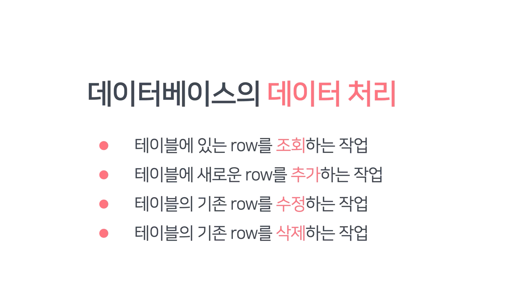
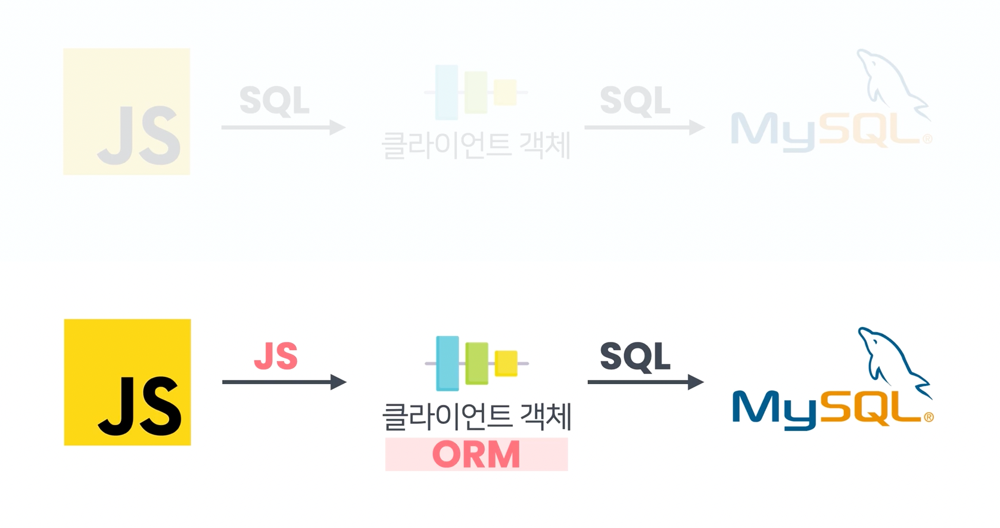
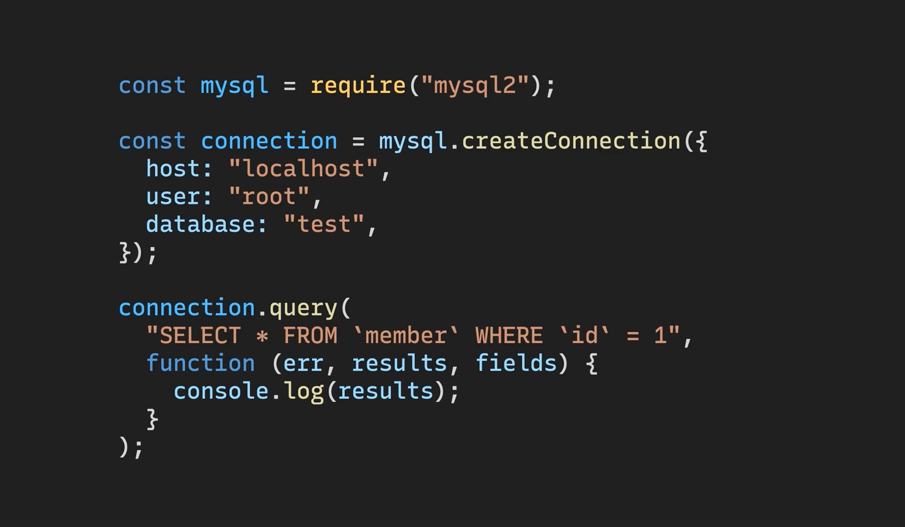
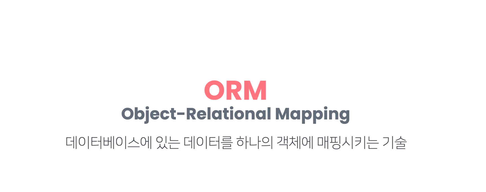
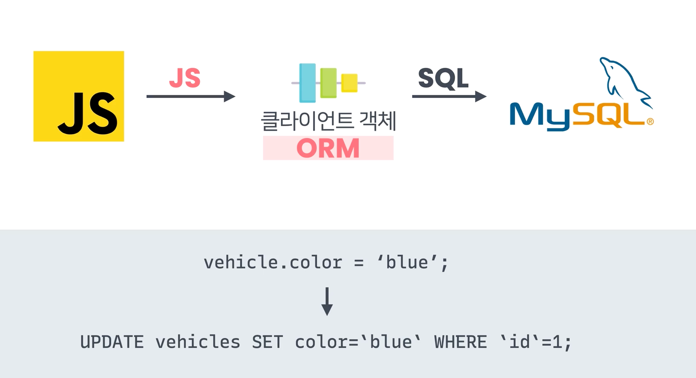
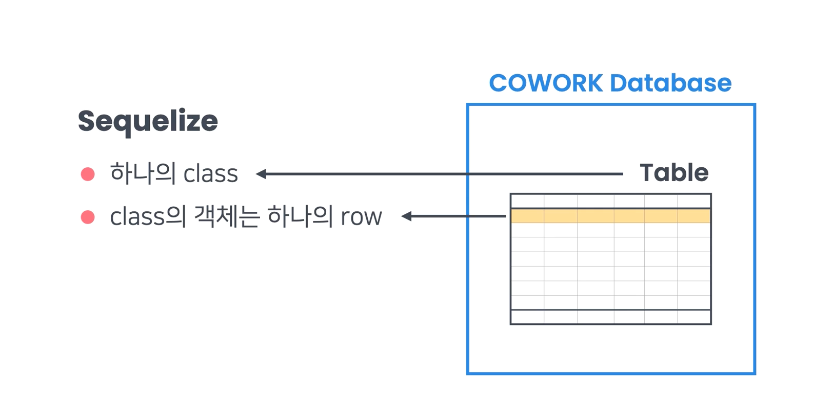
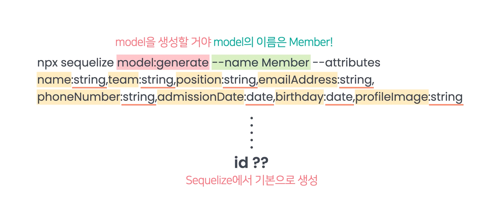

# Express

### For test

- `brew install httpie`
  - 서버 열어놓은 상태로 local에 테스트 가능. 
  - `http localhost:4000`

### For live server

- `npm install --save-dev nodemon`
- 실행방법 : npm run nodemon src/main.js

### 필요한 기능

- GET /posts
- GET /posts/:id
- POST /posts


**--save-dev 옵션의 의미**

이전 영상에서 저는 nodemon 패키지를 설치할 때

```jsx
node install nodemon --save-dev 
```

이렇게 맨 뒤에 **--save-dev**라는 옵션을 주고 설치했습니다. 이번 노트에서는

(1) 옵션없이 패키지를 설치했을 때와  (2) **--save-dev** 옵션을 주고 패키지를 설치했을 때

의 차이를 살펴보겠습니다.

# 1. --save-dev 옵션없이 설치했을 때

```jsx
npm install nodemon  
```

이렇게 --save-dev 옵션없이 nodemon 패키지를 설치했을 때, package.json 파일의 내용을 보면

```jsx
{
  "name": "cowork-api-server",
  "version": "1.0.0",
  "description": "",
  "main": "app.js",
  "scripts": {
    "start": "node app.js",
    "dev": "nodemon app.js"
  },
  "author": "",
  "license": "ISC",
  "dependencies": {
    "express": "^4.17.1",
    "nodemon": "^2.0.7" // !!!!!
  },
  "devDependencies": {
    
  }
}
```

지금 보이는 것처럼 **dependencies** 필드에 nodemon 패키지가 보인다는 것을 알 수 있습니다.

# 2. --save-dev 옵션을 주고 설치했을 때

```jsx
node install nodemon --save-dev 
```

하지만 이렇게 **--save-dev** 옵션을 주고 설치한 후에 package.json 파일을 보면

```jsx
{
  "name": "cowork-api-server",
  "version": "1.0.0",
  "description": "",
  "main": "app.js",
  "scripts": {
    "start": "node app.js",
    "dev": "nodemon app.js"
  },
  "author": "",
  "license": "ISC",
  "dependencies": {
    "express": "^4.17.1"
  },
  "devDependencies": {
    "nodemon": "^2.0.7" // !!!!!
  }
}
```

이제 dependencies 필드가 아니라 **devDependencies** 필드에 nodemon 패키지의 정보가 있다는 것을 알 수 있는데요.

nodemon 패키지의 정보가 dependencies에 있는 것과 devDependencies에 있는 것은 어떤 차이가 있는 걸까요? 이 차이를 이해하려면 조금 새로운 이야기를 시작해야합니다.

사실 우리가 어떤 프로젝트의 코드를 실행하는 경우는 크게 다음과 같은 2가지 경우로 나눌 수 있습니다.

**(1) 개발/테스트 목적의 코드 실행**: 첫 개발부터 시작해서 중간중간 코드를 제대로 작성해가고 있는 건지를 테스트하기 위한 목적에서의 코드 실행

**(2) 실제 서비스 제공을 위한 코드 실행**: 충분한 검증을 거친 코드를 서비스 제공 목적으로 배포해서 실행하기 위한 목적에서의 코드 실행

이렇게 2가지인데요. 앞으로 (1)의 용도는 '개발 용도', (2)의 용도는 '배포 용도'라고 줄여서 말할게요. 그런데 하나의 프로젝트에서, 개발 용도로 코드를 실행할 때 필요한 패키지와 배포 용도로 코드를 실행할 때 필요한 패키지들이 꼭 같은 것은 아닙니다. **즉, 각 용도마다 의존 패키지들이 달라질 수 있다는 건데요.**

예를 들어, 제가 설치해서 사용한 nodemon 패키지는 배포 용도로 쓴다기보다는 주로 개발 용도로 씁니다. nodemon 패키지는 특정 파일 내용을 수정하고 저장할 때마다 이를 감지하고 프로그램을 재실행하는 기능이 있었죠? 그런데 어차피 배포 용도로 실행되고 있는 코드는 이상이 있거나 추가할 부분이 있으면 아예 실행되던 코드를 수정하고 서버에 다시 직접 배포해야 합니다. 그래서 배포 시에는 nodemon 패키지의 기능이 굳이 필요하지 않습니다.

바로 이렇게 배포 용도로는 필요하지 않고 개발 용도로만 필요한 패키지를 설치할 때 **--save-dev** 옵션을 사용하는 건데요.

자, 그럼 이제 하나의 프로젝트에서

- 배포 용도로 필요한 패키지들은 dependencies 필드에,
- 개발 용도로만 필요한 패키지들은 devDependencies 필드에

그 정보가 기재되어야 한다는 것은 알겠습니다.(배포 용도와 개발 용도에서 모두 필요한 패키지라면 당연히 dependencies 필드에 적혀야겠죠?)  그리고 방금 위에서 본 것처럼 옵션없이 **npm install**로 설치한 패키지들은 dependencies 필드에 적히지만, --save-dev 옵션으로 설치한 패키지들은 devDependencies 필드에 적힌다는 것도 알겠구요.

그런데 사실 **옵션을 쓰나 안 쓰나 node_modules 디렉토리에 nodemon 패키지가 설치된다는 사실은 둘다 똑같습니다.** 그럼 왜 이런 구분이 필요한 걸까요?

Node.js 프로젝트를 다른 개발자와 공유할 때 node_modules 디렉토리는 용량이 너무 크기 때문에 굳이 공유할 필요가 없는데요.  package.json 파일만 공유해주고, 프로젝트를 공유받은 개발자가

```
npm install
```

을 실행해서 package.json 파일에 적혀있던 패키지들을 설치하는 것이 일반적입니다. (이 내용은 'Node.js 기본기' 토픽의 [package.json과 package-lock.json의 차이](https://www.codeit.kr/learn/3740) 레슨을 참고하시면 됩니다) 이때는 dependencies 필드와 devDependencies에 있던 모든 패키지들이 설치되는데요. 그런데 바로 이때

```jsx
npm install --production
```

이런 식으로 **--production**이라는 옵션을 주고 실행하면 이때는 **devDependencies**에 있는 패키지들(개발 용도로만 필요하고 배포 용도로는 필요하지 않은 패키지들)은 **제외**하고 **dependencies에 있는 패키지들만** node_modules 디렉토리에 설치하게 됩니다. 조금 감이 오시나요?

사실 프로젝트의 코드를 배포 용도로 실행하기 전에는 보통 이런 순서의 작업을 거칩니다.

(1) 실제 개발 중이던 프로젝트 디렉토리를 하나 더 복사 (2) 새 디렉토리에서 node_modules 디렉토리 삭제 (3) **npm install --production**를 실행해서 devDependencies 필드에 있던 패키지들은 제외하고, dependencies 필드에 있던 패키지들만 node_modules 디렉토리에 재설치 (4) 실제 서비스를 위해 코드 실행(**npm start** 등 실행)

이런 식으로 배포를 위해 필요한 패키지들만 딱 설치할 수 있는 겁니다. 그리고 나중에 이것을 하기 위해 개발 용도로만 사용할 패키지들은 **--save-dev** 옵션을 주고 설치해서 package.json 파일의 devDependencies 필드에 그 정보가 적히도록 하는 것이구요. **저는 nodemon 패키지를 실제 서비스를 위한 프로젝트 디렉토리의 node_modules 디렉토리에는 설치하지 않을 것이었기 때문에 \**--save-dev\** 옵션을 주고 설치했던 겁니다.** 이제 **--save-dev** 옵션의 의미를 아시겠죠?

자, 이대로 끝내기 전에 참고로 알아두면 좋을 두 가지만 더 배워보겠습니다.

우리가 옵션 없이 썼던 **npm install**은 사실 **npm install --save-prod**와 같은 의미입니다. 즉, **--save-prod** 옵션이 생략된 것과 같은 의미라는 건데요. **--save-dev**를 배웠으니까 **--save-prod**의 의미도 유추할 수 있겠죠? **--save-prod**는 패키지를 설치하고 그 패키지의 정보를 dependencies 필드에 저장하는 옵션입니다. 그러니까 **npm install**을 할 때 아무런 옵션도 주지 않으면 기본적으로는 **--save-prod** 옵션이 적용되어서 보통은 설치된 패키지 정보가 dependencies 필드에 적히는 겁니다. 이 사실도 기억해둡시다.

그리고 하나 더! devDependencies 필드의 패키지들은 제외하고 dependencies 필드에 있는 패키지들만 설치하기 위해 **npm install --production** 이렇게 --production이라는 옵션을 주는 방법 말고도

```jsx
NODE_ENV=production npm install
```

이런 식으로 옵션을 주는 방법도 있습니다. 사실 맨 앞의 **NODE_ENV=production**은 NODE_ENV라는 환경 변수의 값을 production으로 주라는 뜻인데요. 이 부분은 나중에 환경 변수가 뭔지를 배우고 다시 와서 살펴보도록 합시다.


# 객체의 프로퍼티 순회하기

자바스크립트에서 특정 객체가 갖고 있는 모든 프로퍼티를 확인할 수 있는 방법에는 여러 가지가 있습니다. 아래의 3가지 방법들을 살펴봅시다.

# 1. Object.keys

```jsx
app.put('/api/members/:id', (req, res) => {
  const { id } = req.params;
  const newInfo = req.body;
  const member = members.find((m) => m.id === Number(id));
  if (member) {
    Object.keys(newInfo).forEach((prop) => {
      member[prop] = newInfo[prop];
    });
    res.send(member);
  } else {
    res.status(404).send({ message: 'There is no member with the id' });
  }
});
```

이전 영상에서 저는 PUT 리퀘스트를 처리하기 위한 라우트 핸들러를 작성할 때, 리퀘스트의 바디에 있는 새로운 직원 정보 객체의 각 프로퍼티를 순회하기 위해 Object의 key라는 메소드를 사용했습니다. 이 메소드를 사용하면 특정 객체의 모든 프로퍼티를 조회할 수 있는데요. 잠깐 이 코드를 볼까요?

```jsx
const newInfo = {
  "id": 11,
  "name": "William",
  "team": "Engineering",
  "position": "Android Developer",
  "emailAddress": "zake@google.com",
  "phoneNumber": "010-xxxx-xxxx",
  "admissionDate": "2021/06/12",
  "birthday": "1995/09/27",
  "profileImage": "profile11.png"
}

console.log(Object.keys(newInfo)); // !
```

이 코드를 브라우저에서 실행해보면


이런 식으로 각 프로퍼티의 이름들이 하나의 배열에 담긴다는 것을 알 수 있습니다. 이렇게 객체의 프로퍼티를 전부 순회하게 해주는 메소드에는 다른 것도 있습니다.

# 2. Object.entries

Object의 entries라는 메소드는 각 프로퍼티의 `이름(key)-값(value) 쌍`을 담은 배열을 리턴하는 메소드입니다. 바로 확인해봅시다.

```jsx
const newInfo = {
  id: 11,
  name: 'William',
  team: 'Engineering',
  position: 'Android Developer',
  emailAddress: 'zake@google.com',
  phoneNumber: '010-xxxx-xxxx',
  admissionDate: '2021/06/12',
  birthday: '1995/09/27',
  profileImage: 'profile11.png',
};

console.log(Object.entries(newInfo)); // !
```

이 코드를 실행해보면


이렇게 [프로퍼티 이름, 프로퍼티의 값] 배열들이 담긴 하나의 배열이 리턴됩니다. 그래서 entries 메소드를 쓰면

```jsx
const newInfo = {
  id: 11,
  name: 'William',
  team: 'Engineering',
  position: 'Android Developer',
  emailAddress: 'zake@google.com',
  phoneNumber: '010-xxxx-xxxx',
  admissionDate: '2021/06/12',
  birthday: '1995/09/27',
  profileImage: 'profile11.png',
};

Object.entries(newInfo).forEach((pair) => {
  console.log(`Key: ${pair[0]} => Value: ${pair[1]}`);
});
```

이런 식으로 프로퍼티의 이름 뿐만 아니라 프로퍼티의 값도 바로 동시에 가져오는 것이 가능합니다. 이 코드를 실행하면 다음과 같이 출력됩니다.


# 3. for ... in 구문

Object의 메소드가 아니라 for ... in이라는 구문을 써서 한 객체의 프로퍼티를 순회하는 것도 가능합니다.

```jsx
const newInfo = {
  id: 11,
  name: 'William',
  team: 'Engineering',
  position: 'Android Developer',
  emailAddress: 'zake@google.com',
  phoneNumber: '010-xxxx-xxxx',
  admissionDate: '2021/06/12',
  birthday: '1995/09/27',
  profileImage: 'profile11.png',
};

for (const property in newInfo) {
  console.log(property);
}
```

이런 식으로 특정 객체의 프로퍼티를 조회할 수도 있습니다. 이 코드를 실행하면


이런 결과가 출력됩니다. 만약 프로퍼티의 값도 출력하려면

```jsx
const newInfo = {
  id: 11,
  name: 'William',
  team: 'Engineering',
  position: 'Android Developer',
  emailAddress: 'zake@google.com',
  phoneNumber: '010-xxxx-xxxx',
  admissionDate: '2021/06/12',
  birthday: '1995/09/27',
  profileImage: 'profile11.png',
};

for (const property in newInfo) {
  console.log(`Key: ${property} => Value: ${newInfo[property]}`);
}
```

이런 식의 코드를 사용하면 됩니다.


특정 객체의 프로퍼티들을 순회할 때는 위에서 설명한 3가지 방법들이 주로 쓰이는데요. 3가지 방법 다 잘 기억해둡시다.


# 코드 요약 

```js
const { request } = require("express");
const express = require("express");
const app = express();

app.use(express.json());
let members = require("./members");

app.get("/api/members", (req, res) => {
  const { team } = req.query;
  if (team) {
    const teamMembers = members.filter(m => m.team == team);
    res.send(teamMembers);
  } else {
    res.send(members);
  }
  // res.send(members);
});

app.get("/api/members/:id", (req, res) => {
  const { id } = req.params;
  const member = members.find(m => m.id == Number(id));
  if (member) {
    res.send(member);
  } else {
    res.status(404).send({ message: "There is no such member" });
  }
});

//
app.post("/api/members", (req, res) => {
  const newMember = req.body;
  members.push(newMember);
  res.send(newMember);
});

app.put("/api/members/:id", (req, res) => {
  const { id } = req.params;
  const newInfo = req.body;
  const member = members.find(m => m.id === Number(id));
  if (member) {
    Object.keys(newInfo).forEach(prop => {
      member[prop] = newInfo[prop];
    });
    res.send(member);
  } else {
    res.status(404).send({ message: "There is no member with the id" });
  }
});

app.delete("/api/members/:id", (req, res) => {
  const { id } = req.params;
  const membersCount = members.length;
  members = members.filter(member => member.id !== Number(id));
  if (members.length <= membersCount) {
    res.send({ message: "Deleted" });
  } else {
    res.status(404).sendFile({ message: "There is no member with the id" });
  }
});

app.listen(3000, () => {
  console.log("Server is listening...");
});

```


# Database






저는 이번 토픽에서 MySQL이라는 데이터베이스를 사용할 겁니다. MySQL은 많은 회사들이 활발하게 쓰고 있는  데이터베이스인데요. MySQL은 현재 Oracle이라는 회사에서 관리하고 있는 데이터베이스로 누구나 편하게 사용할 수 있는 무료 버전과 유료 버전으로 나뉘어 있습니다. 저는 무료 버전을 사용할 건데요. MySQL 데이터베이스는, 데이터베이스를 갖고 직접 작업을 수행하는 서버 프로그램이 있고 거기에 클라이언트 프로그램으로 접속하는 방식으로 사용합니다. 우리는 바로 그 서버 프로그램을 설치할 겁니다. 이것을 MySQL 서버라고 할게요.

자, 이제 MySQL 서버를 설치해봅시다.

1. [MySQL 설치 링크](https://dev.mysql.com/downloads/)로 가서 MySQL Community Server(MySQL 서버 무료 버전)을 클릭하세요.


1. DMG Archive를 다운로드받으세요.


1. 그럼 Oracle에 회원 가입하라는 창이 뜨는데요. 일단 무시하고 그 밑의 문구를 클릭해서 다운로드받으세요.


1. 다운로드받은 MySQL dmg 파일을 클릭하세요.


1. 그리고 그 안의 MySQL pkg 파일을 클릭하세요.


1. 본격적인 설치를 시작합니다. '계속' 버튼을 누르세요.


1. '사용권 계약'에 동의합시다.


1. 그대로 '설치' 버튼을 눌러서 진행합시다.


1. 여러분의 Mac 사용자 비밀번호나 지문 인식을 통해 설치를 허용합시다.


1. 설치가 진행되고 나면 이런 창이 뜹니다. 나중에 MySQL 서버가 다 설치되고 나면 우리는 MySQL 사용자 아이디와 비밀번호가 있어야 MySQL 서버에 접속할 수 있는데요. 일단 이 상태로 Next 버튼을 클릭하세요.


1. 그럼 이제 본인이 사용할 비밀번호를 직접 입력해야 합니다. 사용자 아이디는 기본적으로 'root'라는 것이 설정되고 비밀번호를 여러분이 정하는 겁니다. 실제 서비스에서 사용하는 경우라면 특히 이 비밀번호는 예측하기 어려운 것으로 설정해야 합니다. 여러분만의 비밀번호를 입력해보고 그 아래의 체크박스에 체크를 해주세요. 이것은 이 MySQL 서버를 설치하고 나면 자동으로 MySQL 서버를 실행한다는 뜻입니다. 다 했으면 Finish 버튼을 누르세요.


1. 이번에도 본인의 Mac 사용자 비밀번호를 입력하고 나면 설치가 잘 마무리됩니다. 방금 전 체크했던 설정 덕분에 MySQL 서버도 잘 실행되고 있을 겁니다. 이 상태로 다음 영상으로 가시면 됩니다.


ORM이라는 기술을 통해서, JS로 작성한 DB관련 코드를 자동으로 SQL로 변환시켜서 client객체를 통해 DBMS로 전달하는 것. 

바로 위 사진에서 첫번째 케이스가 이런 경우. 



두번째 ORM패키지 쓰는 방법. **ORM은 데이터를 하나의 객체에 매핑시키는 기술.** 



자바스크립트로 코드만 쓰면, DBMS로 전달이 되는 것. 



```shell
npm install mysql2 sequelize sequelize-cli 
```

sequelize-cli : 터미널 수행 가능. 

```shell
npx sequelize init
```

디렉토리 4개가 생성된다. 

`config` : 데이터베이스에 관한 각종 설정들이 들어가 있다. 

```js
npx sequelize db:create --env development 
```

config에 있던 세 가지 중에서  development의 정보를 사용해서 데이터베이스를 생성하겠다는 것. 


이때까지 저는

```jsx
npx nodemon app.js
npx sequelize init
npx sequelize db:create --env development
```

이렇게 맨 앞에 npx라는 키워드를 붙여서 필요한 작업들을 수행했습니다. 여기서 npx의 의미는 무엇일까요? npx는 패키지에 내장된 명령을 실행하기 위해 사용하는 키워드인데요. 이게 구체적으로 무슨 뜻인지 자세하게 설명해드릴게요.

현재 우리가 만들고 있는 이 COWORK 패키지 안에는 .bin이라고 하는 디렉토리가 있습니다. 잠깐 VSCode에서 보면,


현재 패키지가 의존하고 있는 패키지들을 담고 있는 node_modules 디렉토리 안에 .bin이라는 디렉토리가 있습니다. 클릭해서 내부를 살펴보면


이렇게 sequelize라고 하는 파일이 존재하는 것을 알 수 있습니다. 해당 파일의 내용을 보면


이런 코드들을 볼 수 있는데요. 모두 sequelize 관련 명령어들입니다. 지금 맨 윗 줄에

```jsx
#!/usr/bin/env node 
```

라고 써있는 부분이 있는데요. 이 부분은 이 파일에 있는 자바스크립트 코드들을 node라는 interpreter(명령어 해석기)로 실행하라는 뜻입니다. 그냥 쉽게 말해서 npx sequelize를 하면 이 파일이 node로 실행된다는 뜻입니다. 별로 어렵지 않죠?

그런데 여기서 한 가지 이상한 점이 있습니다. 현재 코드에서 require 함수 안에 쓰인

```jsx
"./core/yars"
"./commands/init"
"./commands/migrate"
... 
```

같은 경로들을 보면, 현재 sequelize라는 파일이 속한 .bin 디렉토리에는 이런 파일들이 없습니다. (.은 현재 디렉토리를 의미합니다) 그런데 어떻게 이것들을 require할 수 있는 걸까요?

그건 바로 현재 이 sequelize라고 하는 파일은 사실 다른 파일에 대한 바로가기 파일이기 때문입니다.

(바로가기 파일이라는 것은 Windows에서 주로 쓰이는 표현이고, macOS/리눅스와 같은 유닉스 기반 운영체제에서는 심볼릭 링크, 하드 링크라고 해서 이와 조금은 다른 개념이 존재합니다. 하지만 일단 이건 중요한 내용은 아니니 .bin 디렉토리 안의 sequelize 파일이 다른 파일을 가리키고 있는 바로가기 파일이구나 정도로만 이해하고 넘어가주세요)

sequelize 파일의 속성을 유닉스 커맨드를 사용해서 확인해볼게요.


ls -al (파일명) 명령어를 사용하면 해당 파일의 속성을 자세하게 볼 수 있습니다. (혹시 이런 명령어들에 대해 공부하고 싶다면 코드잇의 [유닉스 커맨드 토픽](https://www.codeit.kr/courses/unix-command-line)을 참조하세요) 지금 강조 표시한 부분을 보면 sequelize 파일이 어떤 다른 파일을 가리키는 것을 알 수 있습니다. 이 표시는 sequelize 파일은 바로가기 파일일 뿐이고, 실제로 실행되는 원본 파일은 지금 보이는 '../sequelize-cli/lib/sequelize' 라는 뜻입니다. 여기서 ..은 현재 디렉토리인 .bin 디렉토리를 갖고 있는 부모 디렉토리인 node_modules 디렉토리를 의미합니다. 해당 파일을 찾아봅시다.


이렇게 sequezlie-cli 패키지 안의 lib 디렉토리 안에 sequelize라는 파일이 들어있고, 파일의 내용을 보면


아까 본 sequelize 파일의 내용이 그대로 들어있습니다. 사실 이 파일이 원본이고, 아까 저는 바로가기 파일을 통해서 이 내용을 본 것입니다.

그리고


이렇게 require 함수의 인자에 있던 경로에 등장했던 'core, commands' 같은 디렉토리가 여기에는 존재하는 것을 알 수 있습니다. 각 디렉토리로 들어가면, 각 sequelize 명령에 대응되는 각각의 파일을 볼 수 있습니다.

자, 마지막으로 정리해보겠습니다.

- 우리가 npx sequelize를 실행하면 node_modules 디렉토리 안에 있는 .bin 디렉토리 안의 sequelize라는 파일을 실행하게 되는데,
- 이때 이 sequelize 파일은 바로가기 파일이라서 그 원본 파일인 node_modules 디렉토리 안에 있는 sequelize-cli 패키지(디렉토리) 안의 lib 디렉토리 안의 sequelize 파일을 node로 실행하게 됩니다.

이제 npx의 의미가 뭔지 아시겠죠? 앞으로 명령어 중에서 npx를 봐도 당황해하지 마세요! 이밖에 npx는 현재 존재하지 않는 패키지를 실행해야할 경우 이것을 임시로 설치해서 실행하는 기능도 갖고 있는데요. 이 기능은 나중에 실제로 사용하게 될 때 다시 한번 설명해드릴게요.

> npx
>
> \- 실행시킬 패키지가 로컬에 저장되어 있는지 먼저 확인한다.
>
> \- 존재한다면 실행시킨다. 
>
> \- 존재하지 않는다면 npx가 가장 최신 버전을 설치하고 실행시킨다. 


`npx sequelize db:create --env development `

# 모델과 테이블 생성하기





`npx sequelize model:generate --name Member --attributes name:string,team:string
,position:string,emailAddress:string,phoneNumber:string,admissionDate:date,birthdate:date,profileImage:string `

이제 migrations디렉토리에 명령어들 생김. 

migrate 디렉토리에 모든 파일을 적용하라는 것. 

`npx sequelize db:migrate `

# 테이블 지울려면?

`npx sequelize db:migrate:undo` => 가장 최근에 적용된 migration 하나 해지하는 것. 


# 데이터 타입과 기본값

```jsx
'use strict';
module.exports = {
  up: async (queryInterface, Sequelize) => {
    await queryInterface.createTable('Members', {
      id: {
        allowNull: false,
        autoIncrement: true,
        primaryKey: true,
        type: Sequelize.INTEGER
      },
      id: {
        type: Sequelize.INTEGER
      },
      name: {
        type: Sequelize.STRING
      },
      team: {
        type: Sequelize.STRING
      },
      position: {
        type: Sequelize.STRING
      },
      emailAddress: {
        type: Sequelize.STRING
      },
      phoneNumber: {
        type: Sequelize.STRING
      },
      admissionDate: {
        type: Sequelize.DATE
      },
      birthday: {
        type: Sequelize.DATE
      },
      profileImage: {
        type: Sequelize.STRING
      },
      createdAt: {
        allowNull: false,
        type: Sequelize.DATE,
        defaultValue: Sequelize.fn('now')
      },
      updatedAt: {
        allowNull: false,
        type: Sequelize.DATE,
        defaultValue: Sequelize.fn('now')
      }
    });
  },
  down: async (queryInterface, Sequelize) => {
    await queryInterface.dropTable('Members');
  }
};
```

이전 영상에서는 Members 테이블을 생성하는 이런 migration 파일을 봤습니다. 이때

1. 각 프로퍼티(컬럼)의 데이터 타입을 지정하고
2. createdAt, updatedAt 프로퍼티에 defaultValue라는 속성을 주었는데요.

이 두 작업에 관한 내용들을 간단히 정리해보겠습니다.

# 1. 데이터 타입

제가 각 프로퍼티에 설정했던 데이터 타입들은 결국 데이터베이스의 테이블의 각 컬럼의 데이터 타입으로 적용됩니다.

이때

Sequelize.STRING은 문자열 타입으로, 데이터베이스에서 VARCHAR(255)라고 하는 타입으로 변환되고

Sequelize.INTEGER는 정수형 타입으로 데이터베이스에서 INTEGER라고 하는 타입으로 변환되고

Sequelize.FLOAT은 실수형 타입으로 데이터베이스에서 FLOAT이라고 하는 타입으로 변환되고

Sequelize.DATE은 날짜형 타입으로 데이터베이스에서 DATETIME이라고 하는 타입으로 변환됩니다.

지금 Sequelize에서의 데이터 타입들과, 데이터베이스의 데이터 타입 이름이 같을 때도 있고, 다를 때도 있다는 점에 유의하세요. 혹시 더 다양한 종류의 데이터 타입들이 궁금하다면 [Sequelize 공식 페이지의 이 링크](https://sequelize.org/v5/manual/data-types.html)를 참조하세요.

# 2. 기본값

```jsx
// ...      
      createdAt: {
        allowNull: false,
        type: Sequelize.DATE,
        defaultValue: Sequelize.fn('now')
      },
      updatedAt: {
        allowNull: false,
        type: Sequelize.DATE,
        defaultValue: Sequelize.fn('now')
      }
// ...
```

저는 이렇게 createdAt, updatedAt 프로퍼티에 defaultValue 속성을 주었는데요. defaultValue는 말 그대로 기본값이라는 뜻입니다. 이렇게 defaultValue 속성을 주게 되면, 테이블의 createdAt, updatedAt 컬럼에도 이 속성이 적용됩니다.

만약 테이블에 어떤 row를 새롭게 삽입할 때 특정 값을 설정해주지 않으면, 이 defaultValue에 있는 값이 들어가게 되는데요. 지금 두 프로퍼티 모두 defaultValue 속성에 Sequelize.fn('now')라고 써있죠? 이것은 MySQL 데이터베이스에서 사용할 수 있는 now라는 함수를 의미합니다. Sequelize ORM에서는 이렇게 데이터베이스에서 지원하는 함수를 나타내기 위해 Sequelize.fn('함수 이름') 형식의 코드를 사용합니다. 사실 이 부분은 여러분이 SQL을 써본 적이 있어야 좀더 자연스럽게 이해할 수 있기 때문에 일단은 이 정도로만 이해하고 넘어갑시다.


# Seed 데이터 넣기 

Members 테이블에 직원 정보 넣어보자. 

이것도 `sequelize-cli`로 할 수 있다. 

`npx sequelize seed:generate --name initialMembers`

추가

그럼 이제 `seeders ` 디렉토리에 파일이 하나 생긴다. 

`sequelize db:seed:all`


# 이때까지의 작업 정리

이때까지 저는

(1) 자바스크립트 코드 상의 Member 모델과 (2) COWORK 데이터베이스에 있는 Members 테이블을

연동하기 위해 필요한 작업들을 순차적으로 수행했습니다.

다음 영상부터 본격적으로 Member 모델로 Members 테이블에 관한 작업을 수행해보기 전에 이때까지 제가 한 작업을 정리해보겠습니다. 혹시 이전 영상들에서 중간에 길을 잃은 분들은 아래의 내용을 참고해서 빠뜨린 작업을 수행해보세요.

**1. MySQL 서버 설치 및 MySQL 서버 실행한 상태로 두기**

**2. Sequelize를 사용하기 위해 필요한 패키지들 설치**

```jsx
npm install mysql2 sequelize sequelize-cli
```

*sequelize-cli는 Sequelize로 데이터베이스 작업을 하기 위한 필수 요건은 아니지만 이 패키지가 제공하는 다양한 명령어를 사용해서 프로젝트를 세팅하는 것이 좋습니다.

**3. Sequelize를 사용하는 프로젝트의 이상적인 구조를 만들기 위해 필요한 디렉토리 및 파일 생성**

```jsx
npx sequelize init
```

- config, migrations, models, seeders 디렉토리 생성
- config/config.json 파일 생성
- models/index.js 파일 생성

**4. config.json 파일 중 development 객체에 MySQL 서버 접속 정보 설정**

```jsx
// ./config/config.json
...
development: {
    username: 'root',
    password: '123123123',
    database: 'COWORK',
    host: '127.0.0.1',
    dialect: 'mysql',
  },
...
```

**5. COWORK 데이터베이스 생성**

```shell
npx sequelize db:create --env development
```

- config.json 파일의 development 객체의 내용대로 MySQL 서버에 접속해서 COWORK 데이터베이스를 생성함
- --env development 옵션을 주지 않아도 기본으로 development 옵션이 적용되기 때문에 생략해도 됨

**6. Members 테이블 생성 마이그레이션 파일 및 Member 모델 파일 생성**

```shell
npx sequelize model:generate --name Member --attributes name:string,team:string,position:string,emailAddress:string,phoneNumber:string,admissionDate:date,birthday:date,profileImage:string 
```

- migrations 디렉토리에 (생성일자 및 시간)-create-member.js 파일이 생성됨(데이터베이스에 Members 테이블을 생성하는 코드가 담겨있는 파일)
- models 디렉토리에 member.js 파일이 생성됨(나중에 Members 테이블을 제어하기 위해 연동해서 사용할 Member 모델의 코드가 담겨있는 파일)
- id 프로퍼티(컬럼)를 sequelize-cli가 자동으로 코드에 추가해줌
- (생성일자 및 시간)-create-member.js 파일에서 createdAt, updatedAt 프로퍼티에 defaultValue 속성 주기

**7. 데이터베이스에 Members 테이블 생성**

```shell
npx sequelize db:migrate
```

- migrations 디렉토리에 있는 모든 마이그레이션 파일들의 내용을 파일명에 있는 '생성일자 및 시간' 순서대로 수행하는 명령, 현재는 6.에서 생성된 마이그레이션 파일 하나만 있기 때문에 해당 파일의 내용만 수행

**8. Members 테이블에 넣을 seed 데이터 생성**

```shell
npx sequelize seed:generate --name initialMembers
```

- Members 테이블에 넣을 seed 데이터 삽입 코드가 있는 initialMembers라는 이름의 파일을 생성
- (생성일자 및 시간)-initialMembers.js 파일이 생성됨
- 코드에 실제로 넣을 seed 데이터에 해당하는 JSON 형식의 직원 정보 배열 추가

**9. Members 테이블에 Seed 데이터 추가**

```jsx
npx sequelize db:seed:all
```

**10. Member 모델 코드에 빠져있는 id 프로퍼티 추가**

```jsx
// ./models/member.js 
class Member extends Model {}
  Member.init(
    {
      id: {
        allowNull: false,
        autoIncrement: true,
        primaryKey: true,
        type: DataTypes.INTEGER,
      },
...
```


# 모델 객체의 실제 모습

```jsx
app.get('/api/members/:id', async (req, res) => {
  const { id } = req.params;
  const member = await Member.findOne({ where: { id } });
  if (member) {
    res.send(member); // !
  } else {
    res.status(404).send({ message: 'There is no member with the id!' });
  }
});
```

이전 영상에서는 이런 코드로 특정 직원 정보를 조회했습니다. 그런데 잠깐 코드에서 `res.send(member)` 이 부분에 집중해봅시다. 이 코드가 리스폰스를 보내주기 때문에 저는


이렇게 생긴 직원 정보를 볼 수 있었습니다. 그런데 사실 member 객체 자체가 이렇게 딱 깔끔하게 생긴 객체는 아닙니다. 이게 무슨 말일까요? 잠깐 코드를 이렇게 바꿔보겠습니다.

```jsx
app.get('/api/members/:id', async (req, res) => {
  const { id } = req.params;
  const member = await Member.findOne({ where: { id } });
  if (member) {
    console.log(member); // 추가한 코드
    res.send(member);
  } else {
    res.status(404).send({ message: 'There is no member with the id' });
  }
});
```

그리고 서버를 재실행한 다음, 다시 1번 직원 정보를 조회하는 GET 리퀘스트를 보내고, 터미널을 보면


우리가 생각했던 것과는 조금 다른 모습의 'Member 모델(클래스)로 생성한 객체(앞으로는 그냥 'Member 모델 객체'라고 하겠습니다)'가 보입니다. 지금 보면 dataValues라는 프로퍼티 안에 실제로 의미있는 정보들이 있고 다른 속성들에는 여러 가지 부가 정보들이 있습니다. 이것들은 다 뭘까요? 사실 지금 보이는 각 프로퍼티들은 **이 특정 Member 모델 객체와 Members 테이블의 row 간의 연동에 관해서 Sequelize에서 관리하는 각종 부가 정보들인데요.** 각각의 프로퍼티가 무슨 의미인지 굳이 알 필요는 없지만 Member 모델 객체가 우리가 생각했던 것처럼 딱 필요한 실제 데이터만 갖고있는 객체는 아니라는 점을 기억하고 있어야 나중에 ORM을 사용할 때 실수할 일이 없습니다.

그렇다면 `res.send(member)` 이 코드는 어떻게 이렇게 여러 프로퍼티를 갖고 있는 Member 모델 객체에서 딱 dataValues 프로퍼티에 해당하는 것만 리스폰스에 담아서 보내주는 걸까요? 여기서 잠깐 새로운 메소드 하나를 소개하겠습니다. 바로 Member 모델 객체의 `toJSON`이라는 메소드인데요.

```jsx
app.get('/api/members/:id', async (req, res) => {
  const { id } = req.params;
  const member = await Member.findOne({ where: { id } });
  if (member) {
    console.log(member.toJSON()); // 수정한 코드
    res.send(member);
  } else {
    res.status(404).send({ message: 'There is no member with the id' });
  }
});
```

이렇게 코드를 수정하고 서버 재실행 후 다시 접속해보면


이제는 실제 데이터 부분만 잘 출력되는 것을 알 수 있습니다.

그런데 왜 모델 객체의 toJSON 메소드를 호출하면, 이렇게 되는 걸까요? 왜냐하면 Member 모델 객체의 toJSON 메소드는 위에서 본 dataValues 객체를 리턴하도록 코드가 작성되어 있기 때문입니다. 시간 여유가 있는 분들은 직접 코드를 분석해보는 시간을 가져도 좋습니다. res 객체의 send 메소드는 내부적으로 Member 모델 객체의 toJSON 메소드를 호출해서 그 결과를 리스폰스에 담습니다. 그래서 저는 리스폰스에서는 깔끔하게 원하는 데이터만 볼 수 있었던 겁니다.

혹시 이번 노트의 내용이 어렵다면, 일단 Member 모델 객체가 실제로는 우리가 원하는 데이터만 들어있는 깔끔한 모습의 객체는 아니라는 사실만 잘 기억합시다.


# build 와 save 대신 create

이전 영상에서는 새로운 직원 정보를 추가하기 위해 지금 코드에서 보이는 것처럼

```jsx
app.post('/api/members', async (req, res) => {
  const newMember = req.body;
  const member = Member.build(newMember);
  await member.save();
  res.send(member);
});
```

Member 모델의 build 메소드로 저장할 Member 모델 객체를 생성했고, 해당 객체의 save 메소드를 호출해서 실제로 Members 테이블의 새 row로 추가했습니다.

그런데 이렇게 메소드 2개를 쓰지 않고, 단 하나의 메소드로도 똑같은 작업을 수행할 수 있습니다. 바로 create이라는 메소드를 사용하면 됩니다.

```jsx
app.post('/api/members', async (req, res) => {
  const newMember = req.body;
  const member = await Member.create(newMember);
  res.send(member);
});
```

이렇게 써도 같은 코드입니다. **즉, build + save 조합을 create 메소드 하나로 대신할 수 있는 것이죠.** 개발자에 따라 create 메소드로 한번에 row를 추가하는 경우도 있기 때문에 잘 기억해두세요.

딱히 어떤 방법이 더 나은 건 아니지만 아래 코드처럼 중간에 모델 객체에 어떤 수정을 하고 싶다면

```jsx
app.post('/members', async (req, res) => {
  const newMember = req.body;
  const member = Member.build(newMember);
  member.name = 'Mike'; // name 프로퍼티 변경
  await member.save();
  res.send(member);
});
```

build, save 메소드를 사용하고, 굳이 그럴 필요가 없다면 그냥 create 메소드 하나를 사용하면 됩니다.


# 모델의 주요 메소드 정리

이때까지 Members 테이블의 직원 정보를 다루기 위해 사용했던 Member 모델의 메소드들을 정리해봅시다.

참고로 모델은 클래스이고 모델 객체는 해당 클래스로 만든 객체를 의미합니다. 이 용어 구분을 항상 잘 기억합시다.

# 1. findAll 메소드

```jsx
const members = await Member.findAll();
```

테이블에 있는 모든 row들을 조회할 때 findAll 메소드를 사용합니다. 이때 만약 특정 조건을 만족하는 row들만 조회하려면

```jsx
const teamMembers = await Member.findAll({ where: { ~ } });
```

이름 식으로 where 프로퍼티를 가진 조건 객체를 넣어주면 됩니다.

# 2. findOne 메소드

```jsx
const member = await Member.findOne({ where: { ~ } });
```

테이블에 있는 특정 row 하나를 조회할 때 사용합니다. 보통 findOne 메소드는 지금 보이는 id 컬럼처럼 특정 row의 고유값을 가진 컬럼을 그 조건으로 설정하는 경우가 많습니다. 만약 where 조건을 만족하는 row가 여러 개라면 가장 첫 번째 row만 리턴합니다.

# 3. build, save 메소드

```jsx
const member = Member.build(newMember);
await member.save();
```

테이블에 새로운 row를 추가할 때 사용합니다. build 메소드로 하나의 row에 대응하는 모델 객체를 생성하고, 해당 모델 객체의 save 메소드를 호출합니다. 참고로 build 메소드는 다른 메소드들과 다르게 비동기 실행 함수는 아니기 때문에 앞에 await을 붙여줄 필요가 없습니다.

이 방법 말고도 create 메소드를 써서

```jsx
await Member.create(newMember);
```

좀더 간편하게 row를 추가할 수도 있습니다.

# 4. update 메소드

```jsx
const arr = await Member.update(newInfo, { where: { ~ } });
```

원하는 특정 row들을 수정하는 메소드입니다. 보통 모든 row를 수정하는 경우는 많지 않기 때문에 where 조건을 설정해주는 게 좋습니다. 이때 update 메소드가 리턴하는 Promise 객체는 그 작업 성공 결과로 배열 하나를 가지는데 해당 배열의 첫 번째 요소에는 갱신된 row 수가 담깁니다.

# 5. destroy 메소드

```jsx
const deletedCount = await Member.destroy({ where: { ~ } });
```

원하는 row를 삭제하는 메소드입니다. destroy 메소드가 리턴하는 Promise 객체는 그 작업 성공 결과로 삭제된 row 수를 가집니다.

이번 토픽에서 사용했던 모델의 여러 메소드들에 대해 배워봤습니다. 물론 이것 말고도 여러가지 메소드들이 많지만 일단 이 정도만 배워도 간단한 데이터 처리 작업은 할 수 있습니다. 그리고 지금까지는 모델의 static 메소드로 작업들을 처리했지만 이전 실습에서 봤던 것처럼 특정 모델 객체의 인스턴스 메소드로도 원하는 작업을 처리하는 경우도 있다는 것을 꼭 기억합시다. 나중에 모델이나 모델 객체의 또다른 메소드들도 배울 거지만 혹시 또다른 기능을 하는 메소드들이 궁금한 분들은 [Sequelize 공식 API 문서](https://sequelize.org/api/v6/class/src/model.js~model)를 살펴보세요.