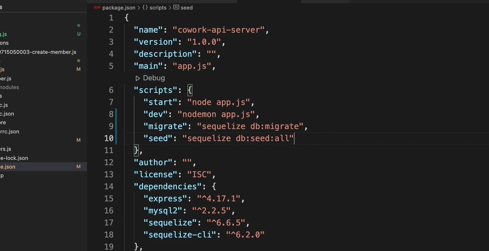

# Heroku 사용하기

### 배포


두가지 모두 쉽지 않음. Heroku가 제일 간편한 편임. 위 두가지 방법 아니여도 배포 할 수 있게 해준다. 


# 환경 변수

Heroku에 회원가입을 하고 앱을 잘 생성하셨나요? 이제 다음 영상에서는 본격적으로 API 서버를 배포하기 전에 필요한 각종 사전 작업들을 수행할 겁니다. 그런데 다음 영상을 보기 전에 반드시 알고 넘어가야하는 개념이 있습니다. 그건 바로 **환경 변수(Environment Variables)**라는 것입니다. 환경 변수란 '실행되고 있는 프로그램이 참조할 수 있는, 현재 실행 환경에서 제공되는 변수들'을 의미하는데요.

일단 추상적인 설명을 하기보다는 바로

- 환경 변수를 설정하고 프로그램을 실행한 뒤에
- 설정된 환경 변수의 값을 코드에서 읽어오는 방법을

보여드리겠습니다. 보통 우리는 코드를 실행하기 위해서

```shell
node app.js 
```

이런 명령어를 실행했었죠? 그런데 만약

```shell
ID=codeitTeacher PASSWORD=hello123 node app.js 
```

라고 쓰고 실행하면, 실행될 프로그램에서는 이제 ID와 PASSWORD라는 환경 변수를 참조할 수 있게 됩니다. 이 환경 변수의 값을 가져오는 코드는

```shell
process.env.ID
process.env.PASSWORD  
```

이렇게 생겼는데요. Node.js 환경에서는 **process라는 객체의 env 객체**에서 환경 변수의 값들을 찾을 수 있습니다. 자, 실제 모습을 보여드리겠습니다. 이런 코드가 있는 example.js라는 파일이 있다고 해봅시다.


이 상태에서 만약 그냥

```shell
node example.js
```

로 그냥 실행을 하면


ID나 PASSWORD라는 환경 변수가 없기 때문에 둘다 undefined가 출력됩니다. process 객체의 env 객체에 그런 프로퍼티가 없기 때문이죠.

하지만


이런 식으로 환경 변수를 설정하고 실행하면 각 환경 변수에 지정한 값이 잘 출력되는 것을 알 수 있습니다.

그런데 언제 이런 환경 변수를 사용할까요? 환경 변수는 다양한 목적으로 쓰이지만 코드에 공개되면 안되는 기밀 정보(비밀번호 등)나, 현재 코드 실행의 용도(개발용, 서비스 배포용 등) 정보 등을 프로그램에 제공하려고 할 때 이런 식으로 환경 변수로 설정해서 코드를 실행할 때가 많습니다. 일단 이번 토픽은 환경 변수 자체에 대해서 자세히 배우는 토픽은 아니니까 **이런 식으로 환경 변수를 주고 코드에서 읽어올 수 있다는 점만 확실하게 기억하고 다음 영상으로 가보도록 합시다.**


# 필요한 사전 작업 수행하기

### Heroku에 MySQL 데이터베이스 설치

사실 Heroku에서는 데이터베이스 설치하는 것이 아닌, 그냥 준비된 데이터베이스 가져다 쓰기만 하면 된다. 


MySQL 만든 것. 

이제 settings로 가서 접속정보 만들 것. 


환경변수 설정할 것

`CLEARDB_DATABSE_URL` 연필모양 눌러보면 그 안에, 유저네임 패스워드 호스트 DB 다 있는데 이걸 환경변수로 설정해 놓는 것. 


헤로쿠가 이걸 알아서 해줄 것. 

이제 다시 vscode로 가서 `config.json`으로 가자

일단, 이걸 `config.js` 로 Javascript파일로 설정한다. 

production을 heroku에서 자동으로 사용할 환경변수 값들로 바꿨음. 

```js
  production: {
    username: process.env.DB_USERNAME,
    password: process.env.DB_PASSWORD,
    database: process.env.DB,
    host: process.env.HOST,
    dialect: "mysql"
  }
};
```

이거 실제로 사용하게 하려면 다른 곳도 고쳐야 한다. 지금은 항상 development 쓰도록 되어 있다. 이걸, 서비스 제공일때는 다르게 쓰도록 해놔야지. 


```js

const env = process.env.NODE_ENV || "development";
const {
  username,
  password,
  database,
  host,
  dialect
} = require("../config/config")[env];

```

이렇게 고쳤음. `NODE_ENV`. 이 환경변수는 이제 실행할때 우리가 넣어줄 거임. 개발 용도라면, 'development', 제품 용도면 'production'을 넣고 실행할 것. 환경변수가 있으면, 그 환경변수로 설정하고 그런 값이 없으면 기본적으로  'development'로 가겠다는 것. `const env = process.env.NODE_ENV || "development";`

**참고로 헤로쿠는 자동으로 NODE_ENV를 Production으로 지정하고, 내 코드를 실행하게 된다.**


그리고, `package.json도 가야한다.  ` members테이블 생성할 떄, migrate, seed넣을때 헤로쿠에서도 똑같이 해줘야 하잖아. 명령어 설정해 놓는 것. 




마지막, 포트번호 변경. 

