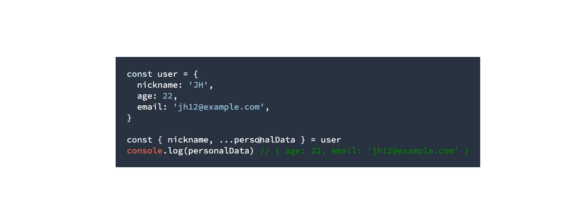

# Node.jS


- root 권한 

  ```
  1. su ab180snpadmin
  2. 패스워드 입력
  
  - 나올때는 exit
  
  ```

  

- 노드 버전관리 [tj/n](https://github.com/tj/n)

  ```
  sudo npm install -g n
  ```

  

- 각종 패키지

  - vscode에서 `npm init -y` 하면, package.json을 만들어 준다. 

    ```js
    {
      "name": "test",
      "version": "1.0.0",
      "description": "",
      "main": "test.js",
      "scripts": {
        "test": "echo \"Error: no test specified\" && exit 1"
      },
      "keywords": [],
      "author": "",
      "license": "ISC"
    }
    ```

    패키지의 메타데이터를 저장하는 파일. 현재 폴더가 하나의 패키지인 것. 

    사실 현재는 별로 필요가 없음. 

    ```
    {
      "scripts": {
        "test": "echo \"Error: no test specified\" && exit 1"
      }
    }
    ```

    script에는 말 그대로 npm에서 쓰게 될 것 쓰면 됨. 

    터미널에서, `npm run test` 이렇게 쓰면 test에 써있는 스크립트가 실행되는 것. 

    ```
    {
      "scripts": {
        "test": "echo \"Hello, World!\""
      }
    }
    ```

    각종 패키지들

    ```js
    npm install --save-dev prettier 
    npm install --save-dev eslint
    ```

    ```js
    "prettier": "^2.7.1"
    ```

    `^` 를 써놓으면, 실제 2.7.1이 정확하게 아니여도 설치되게 해줌. 로컬에서 실제 다른 버전이 설치될 수도 있음. lock파일에 가보면, 실제 설치된 버전이 됨. 그래서, lock파일을 push해줘야 함. 

    

    

    **Type Checking** - Type Script(JS로 컴파일링 되는 언어)

    ```js
    // Formatting Linking
    //
    console.log("Hello, World!");
    console.log("Hi");
    
    const someString = "Hello";
    result = Math.log(someString);
    console.log(result);
    
    ```

    이런 경우 실제 에러가 나기 전까지는 이 에러를 알 방법이 없음. 

    ```shell
    npm install --save-dev typescript
    ```

    그리고, main.js의 맨 위에, 

    `*// @ts-check*`  이것만 써주면 된다. 
    
    node 환경에서도 `Type Script`의 도움을 받을 수 있다. 
    
    ```shell
    npm install --save-dev @types/node 
    ```
    
    **Typescript 설정파일**
    
    우리는 자바스크립트로 프로젝트 진행하면서, Type Script한테 Type 체킹만 받을 것임.  
    
    `jsconfig.json`
    
    ```json
    {
      "compilerOptions": {
        "strict": true
      },
      "include": ["main/**/*"]
    }
    ```
    
    


# Javascript 기초

#### 동시성 모델 

실행모델 : event loop, call stack, callback queue

자바스크립트의 이벤트 루프 모델은 여러 스레드를 사용합니다. 그 중 우리가 작성한 자바스크립트 코드가 실행되는 스레드를 메인스레드 라고 부른다. 

한 Node.js 프로세스에서 메인 스레드는 하나이며, 한 순간에 한 줄씩 실행한다. 그러나, 그 외의 일(file I/O, network 등)를 하는 워커스레드는 여럿이 있을 수 있습니다. 


- 콜스택

  - 콜 스택이란, 지금 시점까지 불린 함수들의 스택. 아래부터 하나씩 쌓이다가 위에부터 하나씩 빼가는 자료구조. 

  

  함수를 실행하다 보면, 함수가 부르는 다른 함수들이 있고, 또 그 함수가 다른 함수를 부르고 하게 됨. 콜스택이 하나씩 쌓여간다. 리턴을 하게 되면 위에부터 하나씩 빠지다가 전부다 빠지면 다시 빈 상태가 된다. 

  


**추측인데 지금 콜백만을 말하는 것 같다.** 

이벤트 루프가 다음 콜백을 처리하려면 지금 처리하고 있는 콜백의 실행이 완전히 끝나야 합니다. call stack이 완전히 빌 때까지 처리한다는 것과 동일합니다. 콜스택이 완전히 빌때까지 가야 다음 콜백을 처리할 수 있다. **한 *콜백*을 처리하는 동안 새로운 콜백을 처리하는 것은 존재하지 않는다는 것.** 

- 콜백큐는 콜백들이 쌓이는 큐. 큐는 맨 처음 들어온게 맨 처음 나가게 되는 자료구조. 
  - 콜백은 브라우저나 Node가 어떤 일이 발생하면(Event) 메인 스레드에 이를 알려주기 위해(callback) 사용됩니다. 이벤트에는 파일 처리 완료, 네트워크 작업의 완료, 타이머 호출 등이 있습니다. 
  - 


- 
  - 메인 함수 자체가 한줄 한 줄 씩 콜스택에 들어간다. 
    - 그럼 SetTimeOut에 있는 애는 이제 콜백 큐에 쌓여있고 메인함수 쭉 실행 되겠지. 그리고 메인함수 다 실행 된 다음에 콜스백이 비면? 
    - 정확히 말하면, settimeout에 셋팅된 시간이 지마고 콜백 큐에 딱 넣는 것. 
    - 다음 콜백큐에서 기다리던 SetTimeOut의 콜백이 들어오지. 
- 


### Scope, Hoisting

- var는 딱 변수의 선언 부분만, `var x` 딱 위로 딸려 올라간다. 

  - x라는 값이 선언은 되어 있는데 초기화가 안되어 있는 것. x를 참조는 할 수 있는 것. 

  

  - 
    - 당연하지만, 그냥 
      - 아예 선언부분 자체가 없다면 `reference error`가 발생하겠지. 
  - 그렇다면 아래의 케이스는?
    - var 뿐만 아니라, function도 호이스팅의 대상이다. 
    - 근데, var 변수랑 약간 다른게, 초기화는 안됬었는데 여기서는 초기화까지 되네?
    - 함수는 선언하는 자체가 아래 정어리라서 선언부가 통으로 올라간 것. 변수는 선언과 초기화가 다른 것인데 함수는 그냥 이게 통으로 선언인 것. 함수는 애초에 선언밖에 없다. 
    - 

  - 아래같은 상황에서, x가 램의 어디에 있는 어떤 값을 사용해야 하는지를 어떻게 판단할 수 있을까?

    

    - **js의 경우 lexical scope이라는 것을 활용한다. 그게 바로 자바스크립트의 binding 방법이다.** lexical scope란 안쪽에서는 바깥쪽 변수에 모두 접근할 수 있다고 하는 것.  

      - 안쪽 스코프에서 위는 다 보인다. 그 반대는 안된다. 

    - 그럼 아래 케이스는?

      - 바깥쪽에서는 안쪽을 볼 수가 없으니깐 binding이 안된다. 

      

      

      **var는 block 대상이 아니다.**

      var의 경우는 block과 상관없이 서로 같은 위치가 된다. 

       

- **[closure](https://opentutorials.org/course/743/6544) = function + environment**

  - **이것만 기억하자 : closure는 function이 하나 생길 때마다 하나씩 생깁니다. closure는 변수와 scope의 합이다** 

  - environment는 함수 자신을 둘러싼, 접근할 수 있는 **모든 scope**를 뜻합니다. 

  - and는 higher-order function이다. 즉, 다른 함수를 내포하고 있는 함수를 뜻한다. 

  - #### 

  - 다음 예시를 보자. 

    - 즉, saltAnd와 waterAnd는 서로 다른 클로져를 형성하고 있다. 함수는 print로 같지만, 환경은 서로 다른 것. 
    - 

  - 아래 코드의 실행 과정에서 클로져는 총 몇개가 생겼을까?

    - foo를 실행했으니깐, 그 순간 2개의 함수가 더 생성되지. 클로져 총 3개가 생성되는 것. 
    - 

    - foo를 두번 호출했다면?
    - 이미 선언된 함수처럼 보이지만, 사실은 서로 다른 함수. 새로 실행될때 새로운 맥락에서 다시 정의되는 거잖아. 
    - 

    - 

  - CounterA와 CounterB에는 각각의 count와 result가 답겨져 있겠지. 
    - 
  - 모든 함수가 선언될 때 마다 closure가 같이 선언되는 것이다. 
    - 


- **Prototype**

  - prototype은 유전자. 

  - 자바스크립트에서 상속을 구현하는 개념. 

  - Prototype Chain : object에서 특정 프로퍼티에 접근하려고 하면, 위에서부터 접근하려고 한다. 

    object.toString을 하면, 일단 아래 사진에서 name 있는 레벨에서는 존재하지 않지. 아래로 타고 내려가면서 결국 toString을 찾게 되는 것. 

    

  - ```js
    function Student(name){
      this.name = name;
      
    }
    
    Student.prototype.greet = function greet(){
      return `Hi, ${this.name}`
    }
    
    const me = new Student('Noel')
    console.log(me.greet())
    
    ```

    위처럼 함수도 추가할 수 있다. 

  - prototype은 유전자라서 부모만 가지고 있고, 자식이 직접 가지고 있지는 않다. 

    - [Youtube](https://www.youtube.com/watch?v=wUgmzvExL_E)
    - 아래 상황에서, nunu는 분명 객체에 안나오는데, 출력은 된다. 
      - How? `nunu`가 가지고 있지 않으면, nunu부모 유전자를 뒤진다. 부모도 없으면, 부모의 부모의 유전자도 계속 본다. 
    - 

  - ```js
    function Person(name){
      this.name = name;
    }
    Person.prototype.greet = function greet(){
      return `Hi, ${this.name}`
    }
    
    
    
    function Student(name){
      this.__proto__.constructor(name)
    }
    
    Student.prototype.study = function study(){
      return `${this.name} is studying!`
    }
    
    Object.setPrototypeOf(Student.prototype, Person.prototype)
    
    const me = new Student('Noel')
    console.log(me.greet())
    console.log(me.study())
    console.log(me instanceof Student) //True
    console.log(me instanceof Person) //True
    
    const anotherPerson = new Person('Foo')
    console.log(anotherPerson instanceof Student) // False
    console.log(me instanceof Person) // True
    
    console.log([] instanceof Array, [] instanceof Object)
    
    
    ```

    ```js
    // Class
    
    class Person2 {
      constructor(name){
        this.name = name;
      }
      greet(){
        return `Hi, ${this.name}`
      }
    }
    
    class Student2 extends Person{
      constructor(name){
        super(name)
      }
      study(){
        return `${this.name} is studying`
      }
    }
    
    const me2 = new Student2('Noel')
    console.log(me.study())
    console.log(me.greet())
    ```

    

- **Moden Javascript**

  - 

    

    

​		

​		


let과 const의 예측가능성과 유지보수성이 var보다 훨씬 띄어나다. 가능하다면, const만 쓰고 필요한 경우에 한해 let을 쓰고, var는 절대 쓰지 말자. 


- **Spread Operator**
  - 


기존에 있던 값들을 덮어씌우는 것이 가능하다. 아래 예시에서는 host와 password만 덮어씌워지고, 나머지는 그대로 가는 것. 여기서 위치가 중요하다. 아래서, 만약 `...overides` 가 앞에 오면, 그 뒤에 내용이 오히려 override된 것을 덮어씌우게 된다. 


Destructuring도 사용할 수 있다. 




남은 원소들 다 묶어서 받아오기. 맨 앞만 head, 나머지는 rest로 가져오기. 


```js


const ary = [1, 2, 3, 4, 5]
const [head, ...rest] = ary


console.log(head, rest)
console.log(head, ...rest)


const personalData = {
  email : 'abc@def.com', 
  password: "****"
}

const publicData = {
  nickname : "foo"
}

const overrides = {
  email: 'fff@fff.com', 
}

const user = {
  ...personalData,
  ...publicData,
  ...overrides
}

console.log(user)


const shouldOverride = true

const user2 = {
  ...({
    email : 'abc@def.com', 
    password: "****"
  }),
  ...({nickname : "foo"}),
  ...(shouldOverride ? {
    email: 'fff@fff.com', 
  } : null)
}


function foo(head, ...rest){
  console.log(head)
  console.log(rest)
}

foo(1, 2, 3, 4, 5)
```


- **modern javascript**

  - ```js
    
    
    const people = [
      {
        age : 20, 
        city: "Seoul", 
        pet : ['cat', 'dog']
      }, 
      {
        age: 40, 
        city: 'Busan'
      }, 
      {
        age:30, 
        city: 'Daugu', 
        pet : ['cat', 'dog']
      }, 
      {
        age: 36, 
        city : "Seoul"
      }, 
      {
        age: 27, 
        city : "Busan", 
        pet: "cat"
      }, 
      {
        cat: 24, 
        city: "Seoul", 
        pet: "dog"
      }
    ]
    
    // A. 30대 미만이 한명이라도 사는 도시. 
    // B. 각 도시별로 개와 고양이를 키우는 사람의 수
    
    ```


- **Promise**
  - 비동기 처리
  - callback 헬. 